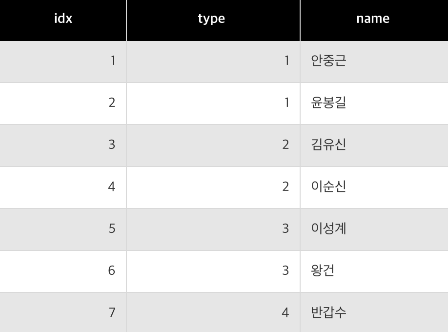
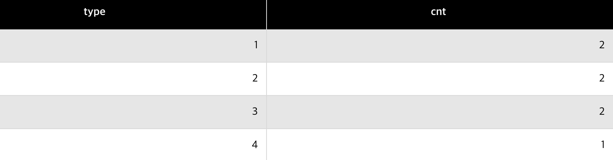

# group by, having
: 유형별로 데이터를 가져오고싶다고 가정해보자, 단순히 `COUNT`함수를 사용하여 데이터를 조회하면 전체 개수만을 가져온다. 유형별로 개수를 알고싶을 때는 컬럼에 데이터를 그룹화 할 수 있는 `GROUP BY`를 사용한다.

**GROUP BY는 중복을 없애주고 정렬을 해준다**

`GROUP BY`를 사용하면 두가지를 기억하자  
- 특정 컬럼을 그룹화하는 **GROUP BY**
- 특정 컬럼을 그룹화한 결과에 조건을 거는 **HAVING**

> **WHERE과 HAVING의 차이점!**  
WHERE은 그룹화 하기 전 이고  
HAVING은 그룹화 후에 조건이다.

- 컬럼 그룹화
```sql
SELECT {컬럼} FROM {테이블} GROUP BY {그룹화 할 컬럼};
```

- 조건 처리 후에 컬럼 그룹화
```sql
SELECT {컬럼} FROM {테이블} WHERE {조건식} GROUP BY {그룹화 할 컬럼};
```

- 컬럼 그룹화 후에 조건 처리
```sql
SELECT {컬럼} FROM {테이블} GROUP BY {그룹화 할 컬럼} HAVING {조건식};
```

- 조건 처리 후, 컬럼 그룹화 후 조건 처리
```sql
SELECT {컬럼} FROM {테이블} WHERE {조건식} GROUP BY {그룹화 할 컬럼} HAVING {조건식};
```

- `ORDER BY`(정렬)가 존재하는 경우
```sql
SELECT {컬럼} FROM {테이블} [WHERE 조건식]
GROUP BY {그룹화할 컬럼} [HAVING 조건식] ORDER BY {컬럼1 [, 컬럼2, 컬럼3 ...]};
```

### 예제 쿼리
- 예제 테이블


- type을 그룹화하여 name 개수 조회 (컬럼 그룹화)
```sql
SELECT type, COUNT(name) AS cnt FROM member GROUP BY type;
```
- 결과
