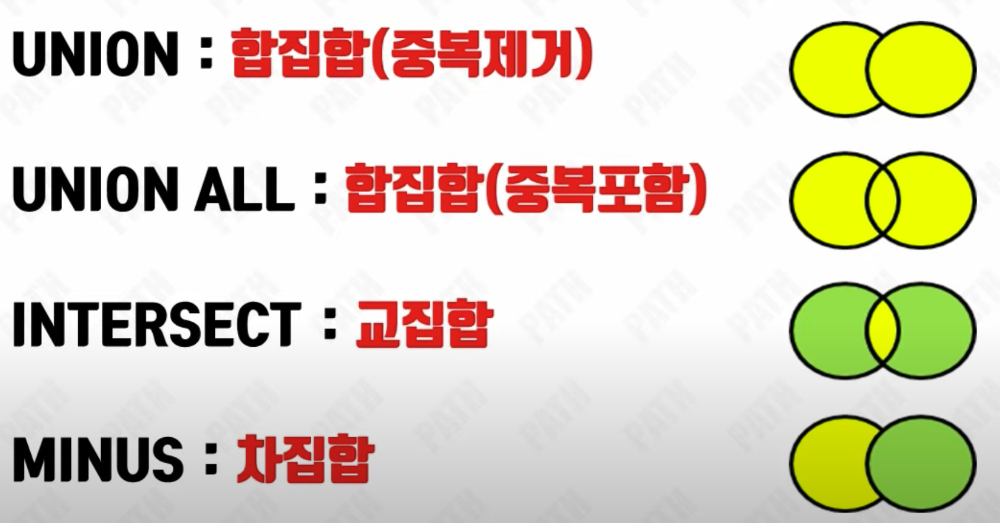
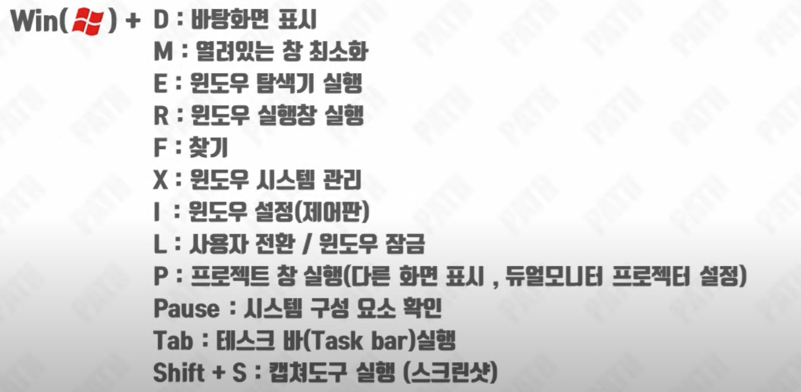
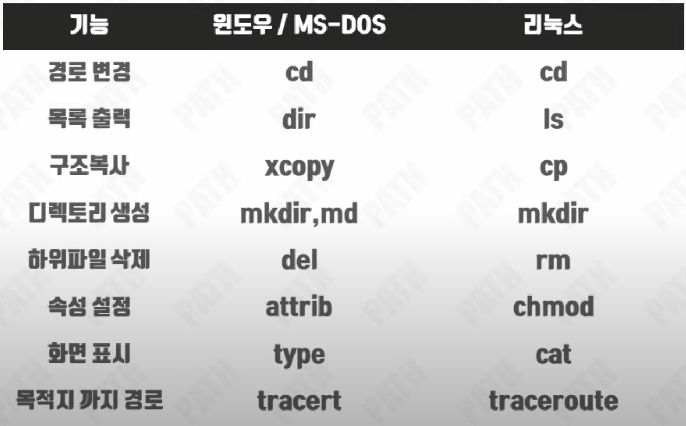
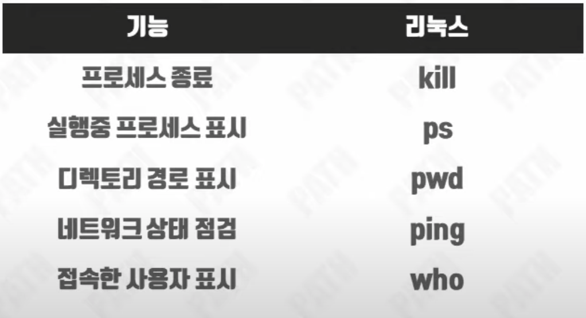
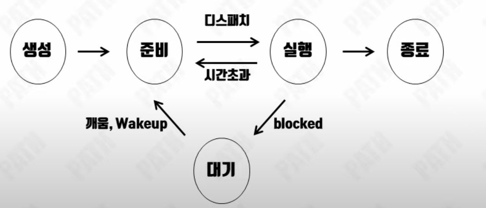
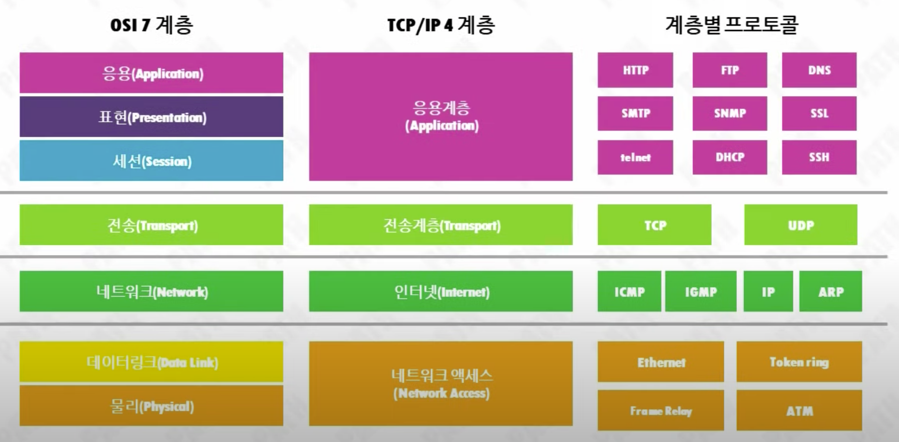
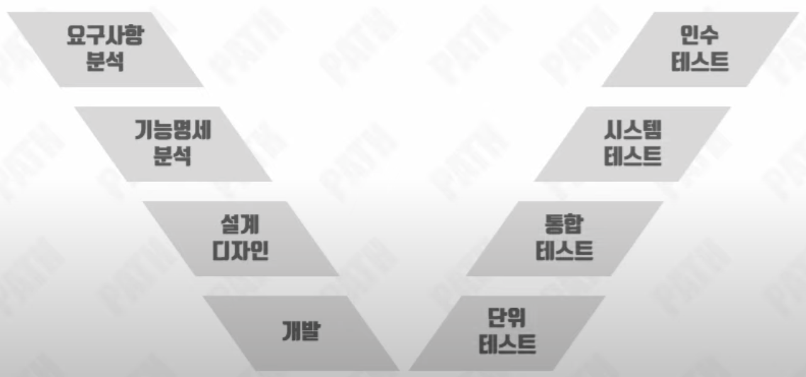

# 정보처리 기능사 실기 정리

<details>
<summary>데이터베이스</summary>
<div markdown="1">

### DBA : 데이터베이스 관리자
> DataBase Administractor : DBMS를 사용하여 DB 관리하는 사람 혹은 그룹

### DBMS : 데이터베이스 관리 시스템
> DataBase Management System : DBA가 사용하는 데이터베이스 관리 시스템   
> `ex) MySQL : 오라클사의 RDBMS`

### 데이터베이스 : 자료(Data)의 모임
> 특징 : 실시간 접근성, 지속적인 변화, 동시공유, 상호참조, 데이터 논리적 독립성   
> `데이터베이스 정규화 : 불필요한 데이터 제거`

### 데이터베이스 설계
> 요구조건 분석 -> 개념적설계 -> 논리적 설계 -> 물리적 설계 -> 구현

### 스키마 : 데이터베이스 전반적인 명세
```
개념스키마 : 조직적 관점 / 논리스키마
외부스키마 : 개인의 관점 / 서브스키마
내부스키마 : 시스템 프로그래머의 관점
```

### Degree(차수) : 속성의 개수
> 속성(attribute), 필드(field)

### Cardinality(기수) : 튜플의 개수
> 튜플(Tuple), 레코드(record)

### 트랜잭션 : 하나의 작업 수행을 위한 연산들의 집합
> ACID : 원자성(Atomicity), 일관성(Consistency),
>        독립성(lsolation), 지속성(Durability)

### SQL : 데이터베이스 질의어
> Structured Query Language : 정의어(DDL), 조작어(DML), 제어어(DCL)

### DDL : 데이터베이스 정의(Definition) 언어
> 생성 : **CREATE** TABLE 테이블명   
> 변경 : **ALTER** TABLE 테이블명 **ADD** 컬럼명 데이터타입   
> 제거 : **DROP** TABLE 테이블명 [CASCADE/RESTRICT]   
> 초기화 : **TRUNCATE** 테이블명   

### CREATE
```sql
CREATE 컬럼명 FROM 테이블 WHERE 조건문

CREATE VIEW 뷰이름 AS SELECT 컬럼1, 컬럼2 ~ FROM 테이블 WHERE 조건문  
```
* VIEW : 유도된 가상 테이블

### ALTER
```sql
ALTER TABLE 테이블명 ADD 컬럼명 데이터타입

ALTER TABLE 테이블명 MODIFY 컬럼명 데이터타입

ALTER TABLE 테이블명 DROP 컬럼명
```
* ALTER ADD : ALTER문의 열 **추가**
* ALTER MODIFY : ALTER문의 타입 **변경**
* ALTER DROP : ALTER문의 열 **삭제**

### Condition
```sql
DROP TABLE 테이블명 RESTRICT

DROP TABLE 테이블명 CASCADE

SELECT DISTINCT 컬럼명 FROM 테이블명
```
* `REDTRICT` : **참조시 삭제 취소**
* `CASCADE` : **참조 삭제**
* `DISTINCT` : **중복 제거**

### DML : 데이터베이스 조작(Manipulation)언어
> 검색 : **SELECT** 컬럼명 **FROM** 테이블명   
> 갱신 : **UPDATE** 테이블명 **SET** 컬럼명 = 수정값   
> 삭제 : **DELETE** [**FROM**] 테이블명   
> 삽입 : **INSERT** **INTO** 테이블명 **VALUES** 입력값1, 입력값2 ~

### etc
```sql
SELECT 컬럼명 FROM 테이블명 WHERE 조건문

SELECT 컬럼명 FROM 테이블명 ORDER BY 컬럼명 ASC

SELECT 컬럼명 FROM 테이블명 GROUP BY 컬럼명 HAVING 조건문

SELECT 컬럼명 FROM 테이블1 LEFT JOIN 테이블2 ON 테이블1.컬럼명 = 테이블2.컬럼명
```
* `WHERE` : SQL 기본 조건문
* `ORDER BY` : 정렬(**ASC : 오름차순** / **DESC : 내림차순**)
* `GROUP BY` : 그룹(조건 작성시 HAVING)
* `JOIN` : INNER JOIN / OUTER JOIN(LEFT/RIGHT/FULL)

### SELECT 작성 순서
```
SELECT -> FROM -> WHERE -> GROUP BY -> HAVING -> ORDER BY
```

### SELECT 실행 순서
```
FROM -> WHERE -> GROUP BY -> HAVING -> SELECT -> ORDER BY
```

### DCL : 데이터베이스 제어(Control)언어
> 완료 : **COMMIT**
> 취소 : **ROLLBACK**
> 권한부여 : **GRANT** SELECT ON 테이블명 **TO** 컬럼명
> 권한제거 : **REVOKE** SELECT ON 테이블명 **FROM** 컬럼명

### 집합


### 키
* 기본키 : 후보키 중 선정된 키 / **중복불가**
* 후보키 : 유일성 만족 / 최소성 만족
* 슈퍼키 : 유일성 만족 / 최소성 불만족
* 대체키 : 기본키로 선택되지 못한 후보키
* 외래키 : 다른 테이블의 행 식별 키

### 데이터베이스 이상현상 (Anomaly : 아노말리)
> 데이터 불일치 현상
> 삽입이상 / 삭제이상 / 갱신이상

### 관계 대수 : 정보 유도 절차적 언어

### 관계 해석 : 정보 명시 비절차적 언어


</div>
</details>

<hr>

<details>
<summary>운영체제</summary>
<div markdown="2">

### 운영체제(Operating System)
> 컴퓨터 하드웨어와 사용자간에 위치
> 하드웨어 및 소프트웨어의 자줜등을 관리

### 운영체제의 목적
> 처리능력(Throughput), 반환시간(Turn around Time),  
> 사용가능도(Availability), 신뢰도(Reliability)

### 운영체제의 발전 과정
```
일괄 -> 실시간 -> 다중프로그래밍 -> 시분할 -> 다중처리 -> 범용 시스템 -> 분산처리
```

### 윈도우(Windows) : 선점형 멀티테스킹, GUI, PNP, NTFS
> 마이크로소프트 개발 / GUI : 그래픽 사용자 인터페이스 지원 / PNP : Plug & Play

### 도스(DOS) : CLI(CUI)
> CLI : 문자기반 유저 인터페이스(혹은 CUI)

### 유닉스(Unix) : 다중사용자, 멀티테스킹, CLI, 시분할
> 쉘(Shell) : 명령어 번역기  
> 커널(Kernel) : 운영체제의 핵심 / 자원을 통제

### 리눅스(Linux) : 오픈소스 운영체제
> 유닉스를 기반으로 개발

### PNP : Plug & Play
> 외부 장치 연결 시, 자동으로 해당 프로그램을 찾아 실행하는 기능

### 핫 스왑(Hot Swap) : [전원 ON] 장치연결 O
> 시스템 전원이 켜진 상태에서, 외부 장치를 안전하게 연결 및 제거하는 기능

### 핫 플러그(Hot Plug) : [전원 OFF] 장치연결 O
> 새로운 장치를 연결할 시, 시스템 전원이 꺼진 상태에서 사용하는 기능

### 아이노드(i-node) : 자료구조(Unix)
> 정규파일, 디렉터리 등 파일 시스템에 관한 정보 보유

### 심볼릭 링크, 소프트 링크 : 바로가기(Unix)
> 링크파일 삭제시, 원본유지 (윈도우 운영체제의 바로가기와 동일)

### 하드링크 : 원본가 동기화된 바로가기(Unix)
> 링크파일 삭제시, 원본삭제

### FAT12, FAT16, FAT32 파일 시스템 (windows)
> 연결리스트 형태의 자료구조 / 긴 검색시간

### NTFS파일 시스템 (windows)
> FAT과 HPFS의 단점을 개선

### UFS파일 시스템(Unix)
> EXT2 : UFS에서 불필요한 구조들을 제거한 유닉스 파일 시스템  
> EXT3 : EXT2에서 저널링 기능을 추가한 유닉스 파일 시스템

### 가상화(Virtualization)
> 단일 호스트에서 다수의 서로 다른 운영체제를 구동지원하는 기능

### 하이퍼바이저(Hypervisor)
> 단일 호스트에서 다수의 운영체제를 가상으로 구동 지원하는 플랫폼

### 윈도우 대표 단축기


### 윈도우 & 도스 vs 리눅스 명령어


### 리눅스 명령어


### 프로세스(Process) : 실행중인 프로그램
> 프로세스 상태전이  



### 프로세스 스케줄링 : 자원들의 우선순위를 관리
> 선점형 : 이미 실행중인 프로세스라도 강제로 빼앗아 선택하여 사용할 수 있음  
> - RR(라운드로빈), SRT, 다단계 큐, 다단계 피드백 큐  
---
> 비선점형 : 실행중인 프로세스를 빼앗아 사용할 수 없음 순서대로 실행  
> - FIFO(FCFS), SJF, HRN, 우선순위

</div>
</details>

<hr>

<details>
<summary>네트워크</summary>
<div markdown="3">

### IPv4 : 32bit  .(옥텟)  유니/멀티/브로드캐스트
> 10진수로 구성   
`ex) 192.182.0.32`

### IPv6 : 128bit  :(콜론)  멀티/애니/유티캐스트
> 16진수로 구성
`ex) fe80:0230:e8f8:7707:a5bb::a41a:1111` (**0은 생략가능**)

### OSI 7계층 : 네트워크 통신을 계층으로 나눈 참조모델
* 응용 계층 : HTTP, FTP, DNS ~
* 표현 계층 : JPG, MPEG, AFP ~
* 세션 계층 : NetBIOS, SSH ~
* 전송 계층 : TCP, UDP ~
* 네트워크 계층 : IP, RIP, ARP, ICMP ~
* 데이터링크 계층 : 이더넷, PPP, HDLC ~
* 물리 계층 : RS:232, RS:449 ~

### TCP/IP 4계층 : 인터넷 정보교환 프로토콜 계층
* 응용 계층 : HTTP, FTP, DNS ~
* 전송 계층 : TCP, UDP ~
* 인터넷 계층 : IP, RARP, ARP ~
* 네트워크 계층 : 이더넷, Token Ring, PPP ~



### 네트워크 단말 장치
* 허브 : 하나의 **대역폭 분배 장치**(스위칭 허브, 더미허브) ; 물리계층
* 리피터 : 네트워크 전송 신호 **증폭** ; 물리계층
* 라우터 : 네트워크 상 **최적의 경로** 제공 ; 네트워크 계층
* 브리지 : **같은 구조** 네트워크 **연결** ; 데이터링크계층
* 게이트웨이 : **다른 구조** 네트워크 **연결** ; 세션계층(전 계층 사용)

### 프로토콜(Protocol) 기본요소
1. **구문(Syntax)** : 데이터 형식 규정
2. **의미(Semantic)** : 오류 제어 정보 규정
3. **시간(Timing)** : 속도 조정 규정

### TELNET : 원격 통신 프로토콜 (비암호화로 위험성이 높음)

### SSH : 원격 통신 프로토콜 (암호화로 위험성이 낮음)

### ARP : 논리주소(IP)로 물리주소(MAC) 검색

### RARP : 물리주소(MAC)로 논리주소(IP) 검색

### TCP : 데이터 (검수)전송 프로토콜

### UDP : 데이터 (비검수)전송 프로토콜

### FTP : 파일 전송 프로토콜

### HTTP : 웹 데이터 전송 프로토콜

### 노드(Node) : 단말 접합점
> 단말을 이어주는 분기와의 접합점

### 애드훅 네트워크(Adhoc Netword) : 자율 구조 네트워크
> 노드에 의해 자율적으로 구성된 기반 구조 없는 네트워크

</div>
</details>

<hr>

<details>
<summary>애플리케이션 테스트</summary>
<div markdown="4">

### V-모델
> 소프트웨어에 개발 프로세스인 폭포수 모델의 확장된 형태



### 결함(Defect)
> 프로그램과 명세서 간의 차이, 업무 내용 불일치  
> 기대 결과와 실제 관찰 결과 간의 차이

### 결함(Defect) 심각도 : 결함이 전체 시스템에 미치는 영향의 척도
> High - 프로세스를 진행할 수 없을 정도의 결함 / 시스템 다운  
> Medium - 시스템 흐름에 영향을 미치는 결함 / 보안 관련 오류  
> Low - 상황에 맞지 않는 결과 및 화면 구성 결함 / 에러 메세지 미출력

### 결함(Defect) 검사
* **Fixed** : 결함 수정
* **Assigned** : 결함 할당
* **Open** : 결함 보고(분석 전)
* **Closed** : 수정 후 결함 미발견
* **Deferred** : 수정 연기
* **Carified** : 비결함

### 결함(Fault) : 의도와 다른 동작 & 결과
> 개발자가 설계한 의도와 다른 동작과 결과를 발생시키는 것

### 결함(Fault) 관리 프로세스 7과정
> 관리계획 - 기록 - 검토 - 수정 - 재확인 - 상태추적 - 최종분석

### 에러(Error) : 개발 중 발생한 부정확한 결과

### 오류(Fault) : 프로그램 버전간의 차이로 발생

### 실패(Failure) : 프로그램 버전간의 실행 결과의 차이

### 휴먼에러(Human Error) : 원인이 인간의 실수인 에러

### 코드 인스펙션 : 자동화 도구 사용, 결함 발견/수정

### 워크스루 : 코드 품질 평가. 개선 목적 검토

### 살충제 패러독스 : 동일한 테스트의 비정상적인 결함 검수

### 테스트 케이스 : 요구사항 준수 여부 확인용 입력값

### 스텁 : 하위 모듈 테스트 진행
> 상위 모듈은 있지만 하위 모듈이 없을 때 진행하는 하향식 테스트

### 드라이버 : 상위 모듈 테스트 진행
> 하위 모듈은 있지만 사위 모듈이 없을 때 진행하는 상향식 테스트

### 유스케이스 : 사용자 시스템 동작 시나리오
> 시스템 요구사항을 알아내는 과정이자 동작을 표현한 시나리오

### 유스케이스 다이어그램 : 시스템 간 상호작용 표현
> 시스템 범위, 엑터, 유스케이스, 관계

### 블랙박스 테스트 : 사용자 관점 / 명세기반
> 균등분할 / 한계값 테스트 / 원인효과 그래프 테스트 / 비교테스트

### 화이트박스 테스트 : 개발자관점 / 내부구조 & 동작검사
> 기초경로 테스트 / 제어흐름 테스트 / 조건 테스트  
> 루프 테스트 / 데이터 흐름 테스트 / 분기 테스트 

### 테스트 오라클 : 사전 정의된 참 값을 대입 비교
1. 참 오라클(True Oracle) : 기대 결과 생성 후 오류 검출
2. 샘플링 오라클(Sampling Oracle) : 특정 입력 값의 기대 결과 제공
3. 휴리스틱 오라클(Heuristic Oracle) : 확률/직관, 추정에 의한 예상결과
4. 일관성 검사 오라클(Consistent Oracle) : App. 변경 전후의 값 동일 여부 검증

### 소프트웨어 아키텍처(Software Architecture)
> 소프트웨어의 골격이 되는 기본 구조  
> 구성 요소 가으이 관계를 표현하는 시스템 구조체  
> 설계 기본 원리 : 모듈화 / 추상화 / 단계적 분해 / 정보 은닉

### Java : 썬 마이크로시스템즈 개발 객체지향 프로그래밍 언어

### C언어 : B언어에서 파생된 프로그래밍 언어

### xUnit : 테스트 프레임워크(Java:Junit, C++:CppUnit)

### JSON : XML의 단점을 보완한 JSP기반 독립형 언어

</div>
</details>

<hr>

[참고한 영상](https://www.youtube.com/watch?v=Nwyudyk4EtE&ab_channel=%EB%B9%84%EC%8A%A4%EC%84%9C%EB%AF%BC)