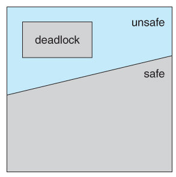
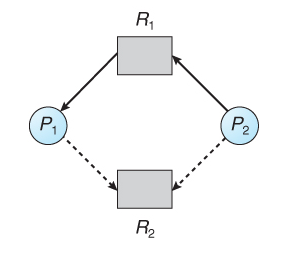
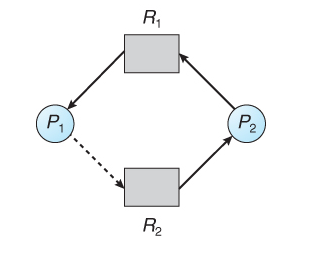
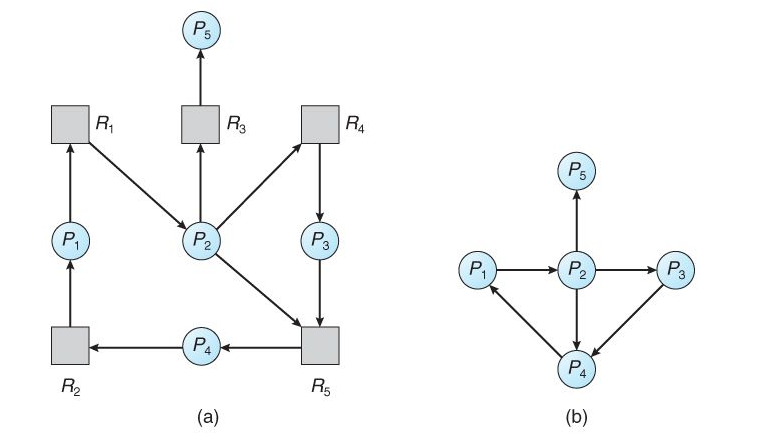

# 교착상태란? (deadlock)
교착상태란 **두 개 이상의 작업이 서로 상대방의 작업이 끝나기만을 기다리고 있기 때문에 결과적으로 아무것도 완료되지 못하는 상태**를 가리킨다.  

예시를 들어보면  
하나의 사다리가 있고 두명의 사람중 한사람은 사다리 위, 또 한사람은 사다리 아래 있다고 가정해보자  
이 때 아래에 있는 사람은 위로 올라가려하고  
위에 있는 사람은 아래로 내려오고려고 한다면  
두 사람은 서로 상대방이 비켜줄 때 까지 하염없이 기다리고만 있을 것이다.  
결과적으로 아무도 사다리를 내려오거나 올라가지 못하게 되는 상황이 발생하는데 이 현상이 deadlock 교착 상태라고 한다.

### 그럼 이걸 어떻게 해결해야되는데 ?
> 일반적으로 교착 상태를 해결하는 방법에는 세가지가 있다.  

1. 교착상태 예방(Prevention) 또는 회피(Avoidance)
    * 교착 상태가 되지 않도록 합니다.

2. 교착상태 탐지(Detection) 및 복구(Recovery)
    * 교착 상태가 탐지되면 시스템에 문제가 발생하지 않도록 조치를 취한다.

3. 교착상태 무시(Ignore)
    * 교착상태가 정말 드물게 발생하는경우 교착상태 예방 또는 탐지와 관련된 지속된 오버헤드 및 성능저하를 발생시키는 것 보다 교착상태가 발생하도록 하고 필요에 따라 재부팅 하는 것이 더 나을 수 있다. (Unix 및 Window를 포함한 대부분의 운영체제가 사용하는 방법이다.)

### 💉교착상태를 예방하는 방법 (Deadlock Prevention)
> 교착상태 예방 방법은 교착상태가 되지 않도록 하는 방법입니다.  
다음 네가지 필수 조건 중 하나 이상을 부정하여 방지할 수 있습니다.

#### 상호 배제(Mutual Exclusion) 부정  
* 읽기 전용 파일과 같은 고유 자원을 사용합니다.

#### 점유 및 대기(Hold and Wait) 부정
* 프로세스 대기를 없애기 위해서 프로세스가 실행되기 전에 필요한 모든 자원을 할당합니다. (자원 낭비가 발생한다)
* 자원을 점유하지 않고 있을 대에만 다른 자원을 요청할 수 있도록 합니다. (기아 상태가 될 수 있음)

#### 비선점 (No Preemption) 부정
* 모든 자원에 대한 선점을 허용합니다.
* 프로세스가 할당받을 수 없는 자원을 요청하는 경우, 기존에 가지고있던 자원을 모두 반납하고 새 자원과 이전 자원을 얻기 위해 대기하도록 합니다. (자원 낭비가 발생한다.)

#### 순환 대기(Circular Wait)부정
* 자원에 고유한 번호를 할당하고, 번호 순서대로 자원을 요구하도록 합니다. (자원 낭비가 발생한다.)

### 🥷교착 상태를 회피하는 방법 (Deadlock Avoidance)
교착상태 회피는 교착 상태가 발생하기전에 교착상태를 예상하여 안전한 상태(safe state)에서만 자원 요청을 허용하는 방법입니다.  
자원을 신중하게 할당하면 교착상태를 회피할 수 있습니다.  

#### 교착상태를 회피하기 위해서는 다으모가 같은 가정이 필요합니다.
* 프로세스 수가 고정되어 있어야 한다.
* 자원의 종류와 수가 고정되어 있어야 한다.
* 프로세스가 요구하는 자원 및 최대 자원의 수를 알아야 한다.
* 프로세스는 반드시 자원을 사용 후 반납해야 한다.

교착상태 회피 방법은 이러한 가정들이 필요하기 때문에 현실성이 부족합니다.  
또한 자원 요청이 있을 때 마다 교착상태 회피 알고리즘을 사용한다는 것은 상당한 오버헤드 입니다.

### 🪖Safe state
safe sequence가 존재하여 모든 프로세스가 정상적으로 종효할 수 있는 상태를 말합니다.  
* safe sequence : 교착상태를 발생시키지 않고 자원을 할당하는 순서

### ⚠️Unsafe state
교착상태가 될 수 있는 상태입니다.
불안정 상태라서 반드시 교착 상태가 발생하는 것은 아닙니다.

* safe state & unsafe state & deadlock 관계

## 교착 상태 회피를 위한 알고리즘
> 자원 유형마다 인스턴스가 하나 있는 경우 자원 할당 그래프 알고르짐을 사용하여 교착상태를 회피할 수 있습니다.

교착상태 회피를 위해 다음과 같은 알고리즘을 사용합니다.

### 자원할당 그래프 알고리즘 (Resource-Allocation Graph Algorithm)
자원 유형마다 인스턴스가 하나 있는 경우 자원 할당 그래프 알고리즘을 사용하여 교착상태를 회피할 수 있습니다.

#### 방법
* 자원할당 그래프에 예약 간선을 추가합니다.
    * 예약간선(claim edge) : 향후 요청할 수 있는 자원을 가리키는 점선으로 표시된 간선
* 프로세스 시작전에 모든 예약 간선들을 자원할당 그래프에 표시합니다.
* 프로세스는 예약 간선으로 설정한 자원에 대해서만 요청할 수 있고 주기가 형셩되지 않을 때에만 자원을 할당 받습니다.

#### ex)
다음 그래프에서 프로세스 P2가 자원 R2를 요청하여 자원을 할당받는다면

다음과 같이 주기(cycle)가 발생하므로 자원 요청을 승인할 수 없습니다.

반대로 프로세스 P1이 자원 R2를 요청하여 자원을 할당받는다면 주기가 발생하지 않아 자원을 요청하여 할당받을 수 있습니다.

### 은행원 알고리즘 (Banker's Algorithm)
각 자원 유형마다 다수의 인스턴스를 갖는 경우 은행원 알고리즘으로 교착상태를 회피할 수 있습니다.

#### 방법
* 프로세스 시작시 자신이 필요한 각 자원의 최대(Max) 개수를 미리 선언합니다.
* 각 프로세스에서 자원 요청이 있을 때 요청을 승인하면 시스템이 안정한 상태(safe state)로 유지되는 경우에만 자원을 할당합니다.
* 불안정 상태(unsafe state)가 예상되면 다른 프로세스가 끝날 때까지 대기를 합니다.

### 교착 상태 탐지 (Detection)
교착상태 탐지는 탐지 알고리즘을 사용하여 교착상태가 발생했는지 탐지합니다.  
교착상태가 탐지되었다면 복구기법을 통해 교착상태를 복구합니다.  
이 방식은 지속적으로 확인하는 작업이 필요하기 때문에 성능저하가 발생하게 됩니다.

## 교착상태 탐지 알고리즘
### 대기 그래프(wati-for graph)
각 자원 유형마다 인스턴스가 하나가 있는 경우 자원 할당 그래프를 변형한 대기 그래프(wait-for graph)를 사용하여 교착 상태를 탐지합니다.

  

(a) 자원할당 그래프, (b) 대기 그래프

자원할당 그래프에서 자원을 제거 후 간선들을 결합하여 대기 그래프로 표현을 할 수 있습니다.  
대기 그래프에서는 Pi -> Pj는 프로세스 Pi가 Pj프로세스가 보유하고 있는 자원을 기다리고 있음을 나타냅니다.  
대기 그래프에 주기(cycle)가 있다면 교착상태를 의미합니다.  

주기적으로 대기 그래프에 주기가 있는지 탐지 알고리즘을 호출하여 교착상태를 탐지합니다.

### 은행원 알고리즘(Banker's Algorithm)
각 자원 유형마다 인스턴스가 여러개 있는 경우 은행원 알고리즘을 사용하여 교착상태를 탐지합니다.  
교착상태 회피에서 사용하는 은행원 알고리즘과는 약간의 차이가 있습니다.

#### 방법
* 각 프로세스의 자원요청(Request) 개수를 사용합니다.
* 현재 상태가 안전상태(safe state)인지 확인합니다.
* 불안정상태(unsafe state)라면 교착상태라고 판단합니다.

### 🌈탐지 알고리즘 호출 주기?
탐지 알고리즘은 오버헤드가 있기 때문에 얼마나 자주 교착상태가 발생하는지  
얼마나 많은 프로세스가 교착상태에 연루되어 있는지에 따라 호출 빈도를 조절해야합니다.  

예를 들어 다음과 같습니다.
* 자원을 요청했는데 즉시 할당되지 못하는 시점에 호출
* 주기적으로 일정 시간마다 호출
* CPU 이용률이 특정 값 이하로 떨어지는 시점에 호출

## 교착상태 복구(Recovery)
교착 상태가 발생했다면 교착 상태를 일으킨 프로세스를 종료하거나,  
할당된 자원을 해제함으로써 복구를 합니다.

복구 방식에는 크게 두가지가 있습니다...

### 프로세스 종료
교착상태에 있는 프로세스를 종료하는 방식입니다.  
프로세스 종료에는 두가지 방법이 있습니다.
1. 교착상태의 프로세스를 모두 중지
2. 교착 상태가 제거될 때 까지 한 프로세스씩 중지

### 자원 선점
교착상태에 있는 프로세스가 점유하고 있는 자원을 선점하여 다른 프로세스에게 할당하여 해당 프로세스를 일시정지 시키는 방법입니다.  

자원 선점에 있어서 다음 사항들을 고려해야 합니다.
1. 희생자 선택(selection of a victim)
* 최소의 피해를 줄 수 있는 프로세스를 선택합니다.

2. 롤백(rollback)
* 선점 된 프로세스를 문제 없던 이전 상태로 롤백해야 합니다.
* 보통 가장 안전한 방법은 프로세스를 중지시키고 재시작하는 것 입니다.

3. 기아상태(starvation)
* 한 프로세스가 계속 선점되어 기아상태가 되는것을 방지해야합니다.
* 한가지 방법은 우선 순위를 사용하여 선점될 때마다 프로세스 우선순위를 높이는 것 입니다.