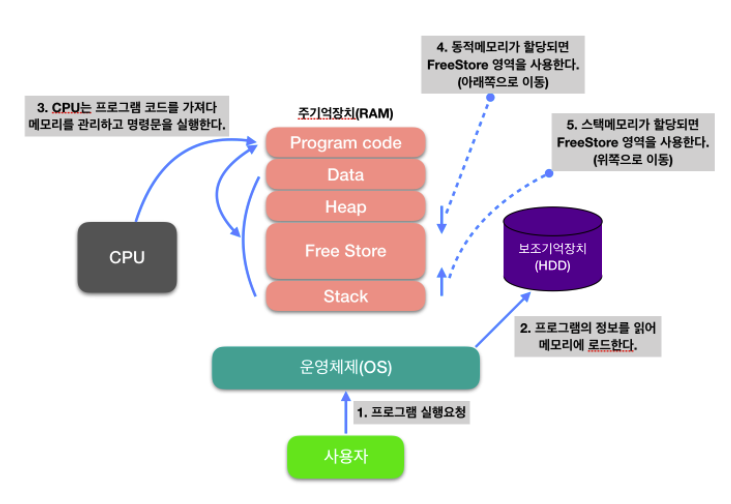
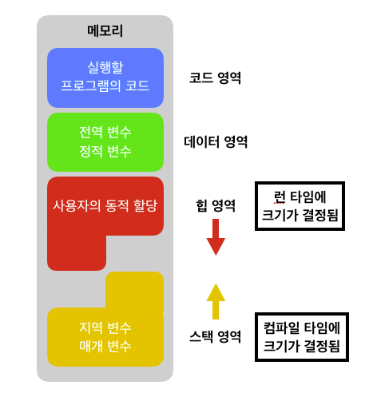
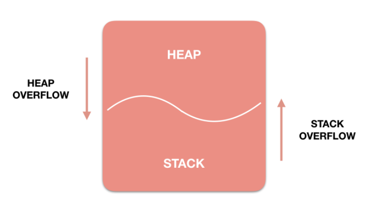

# 메모리 구조

메모리 영역에 관해 이야기 하기 전에 어떤식으로 프로그램이 실행되는지 과정을 살펴보자

> 프로그램의 정보를 읽어 메모리에 로드되는 과정을 볼 수 있을텐데,  
프로그램이 실행하게되면 OS는 `메모리(RAM)에 공간을 할당`해준다.  
할당해주는 메모리 공간은 `4가지(Code, Data, Stack, Heap)`가 있다.

### 코드(Code) 영역
우리가 작성한 **소스코드**가 들어가는 부분.  
즉, 실행할 프로그램의 코드가 저장되는 영역으로 **텍스트(code)영역**이라고도 부른다.  
코드영역은 실행파일을 구성하는 명령어들이 올라가는 메모리 영역으로 함수, 제어문, 상수 등이 여기에 지정된다.

### 데이터(Data) 영역
전역변수와 static변수가 할당되는 영역  
프로그램 시작과 동시에 할당되고, 프로그램이 종료되어야 메모리가 소멸되는 영역

### 스택(Stack) 영역
프로그램이 자동으로 사용하는 임시 메모리 영역이다.  
함수 호출 시 생성되는 지역 변수와 매개변수가 저장되는 영역이고,  
함수 호출이 완료되면 사라진다.
> * 스택 영역에 저장되는 함수의 호출 정보를 스택 프레임(Stack Frame)이라고 한다.  
> * 컴파일 시 스택영역의 크기가 결정된다.

### 힙(Heap) 영역
프로그래머가 할당/해제하는 메모리 공간이다.  
Java에서는 가비지 컬렉터가 자동으로 해제한다.  
이 공간에 메모리 할당하는 것을 동적할당(Dynamic Memory Allocation)이라고도 부른다.  

예를들어 `클래스, 클로저`가 이 부분에 해당된다.  
`런타임 시`에 크기가 결정된다.

위의 **Heap과 Stack영역은 사실 같은 공간을 공유**한다.  
**Heap이 메모리 위쪽 주소부터 할당**되면 **Stack은 아래쪽부터 할당**되는 식이다.  
그래서 **각 영역이 상대 공간을 침범하는 일이 발생할 수 있는데** 이를 각각 `Heap Overflow`, `Stack Overflow`라고 칭한다.  
> Stack영역이 크면 클수록 Heap 영역이 작아지고, Heap영역이 크면 클수록 Stack영역이 작아진다.