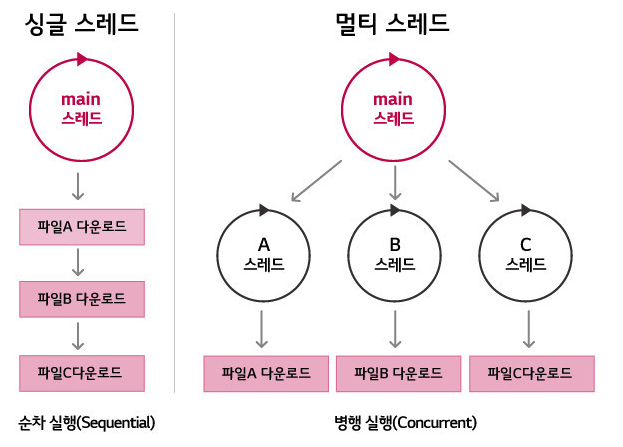

# 멀티 스레드란?
일반적으로 하나의 프로세스는 하나의 스레드를 가지고 작업을 수행하게 됩니다.  
하지만 멀티스레드란 하나의 프로세스 내에서 둘 이상의 스레드가 동시에 작업을 수행하는 것을 의미합니다.  
또한, 멀티 프로세스는 여러개의 CPU를 사용하여 여러 프로세스를 동시에 수행하는것을 의미합니다.

멀티스레드와 멀티프로세스 모두 여러 흐름을 동시에 수행한다는 공통점을 가지고 있습니다.  
멀티 프로세스는 각 프로세스가 독립적인 메모리를 가지고 별도로 실행되지만, 멀티 프로세스는 각 스레드가 자신이 속한 프로세스의 메모리를 공유한다는 점이 다릅니다.  

멀티 스레드는 각 스레드가 자신이 속한 프로세스의 메모리를 공유하므로, 시스템 자원의 낭비가 적습니다.  
또한, 하나의 스레드가 작업을 할 때 다른 스레드가 별도의 작업을 할 수 있어 사용자와의 응답성도 좋아집니다.

