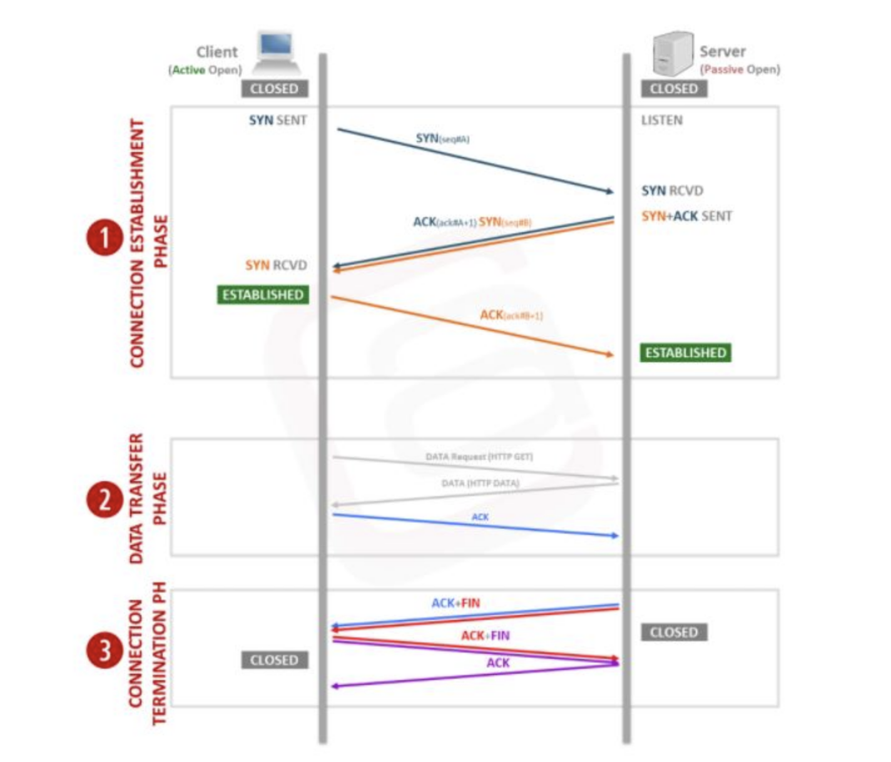
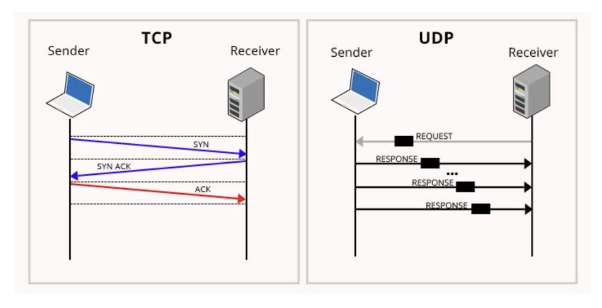

# Stateful과 Stateless
## Stateful
상태정보를 저장하는 형태, 세션 상태에 기반하여 server의 응답이 달라진다.  

예시로는 Stateful protocol이 있으며 여기엔 TCP가 속한다.  
TCP는 연결할 때 3 way handshake가 일어납니다.  
이 과정에서 데이터를 전송하여 server가 client의 세션 정보를 저장해놓는다.

## Stateless
상태정보를 저장하지 않는 형태, server의 응답이 client와의 세션 상태와 독립적이다.  

예시로는 Stateless protocol인 UDP/HTTP가 여기에 속한다.  
UDP는 TCP와 달리 Client으ㅢ 세션 상태와 관계없이 요청에 대한 응답만을 수행하고, server가 client의 정보를 저장하지 않는다.

