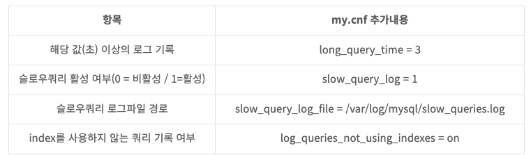
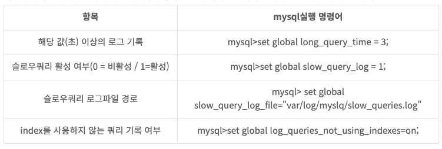

# Slow Query란 ?
DBMS가 Client로부터 요청받은 Query를 수행할 때 일정시간 이상 수행되지 못한 Query입니다.  

즉, 길어야 1 ~ 2초 걸리는 쿼리가 예상보다 오래 걸리는 경우를 뜻합니다.

언제든지 값이 정상적이지 않을거라는 예외상황이 발생이 되니 로그르 잘 대고 확인하면 됩니다.

### 쿼리 로그 쌓는 법
Mysql 기준
slow query는 my.cnf파일 내에서 설정합니다.
my.cnf의 경로는 주로 /etc/my.cnf를 사용합니다.  
편집기를 통해 다음의 내용을 입력합니다.
my.cnf로 수정할 경우 mysql 서비스 재시작이 필요합니다.



이렇게 항목을 추가하거나 혹은 아래의 명령어를 통해 서비스를 재시작하지 않고 적용이 가능합니다.


```
Tinme = 쿼리 요청 시각
Query_time = 쿼리 수행 시간
Lock_time = 락이 걸린 시간
Rows_sent = 쿼리 결과 row 수
Rows_examined = 쿼리 대상 row 수
```