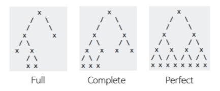
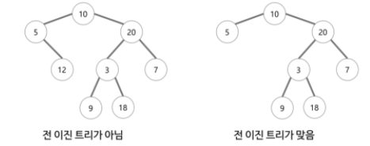
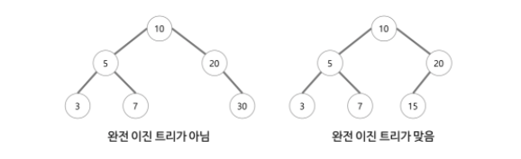
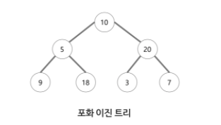
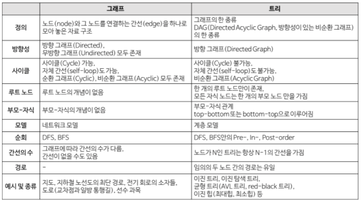

# 이진 탐색 트리

이진 탐색 트리는 다음과 같은 속성이 있는 이진 트리 자료구조이다.
* 각 노드에 값이 있다.
* 값들은 전순서가 있다.
* 노드의 왼쪽 서브트리에는 그 노드의 값보다 작은 값들을 지닌 노드들로 이루어져 있다.
* 노드의 오른쪽 서브트리에는 그 노드의 값보다 큰 값들을 지닌 노드들로 이루어져 있다.
* 좌우 하위 트리는 각각이 다시 이진 탐색 트리여야 한다.

> 전순서?  
순서론에서, 전순서 집합(全順序集合, 영어: totally ordered set, toset)는 임의의 두 원소를 비교할 수 있는 부분 순서 집합이다. 실수에서는 순서를 줄 수 있지만 허수와 복소수에서는 순서를 줄 수 없다.

## 전 이진 트리, 완전 이진 트리, 포화 이진 트리

### 전 이진트리(Full Binary Tree 또는 Strictly Binary Tree)

* 모든 노드가 0개 또는 2개의 자식 노드를 갖는 트리

### 완전 이진 트리(Complete Binary Tree)

* 트리의 모든 높이에서 노드가 꽉 차 있는 이진 트리. 즉, 마지막 레벨을 제외하고 모든 레벨이 완전히 채워져 있다.
* 마지막 레벨은 꽉 차 있지 않아도 되지만 노드가 왼쪽에서 오른쪽으로 채워져야 한다.
* 또 다른 정의는 가장 오른쪽의 잎 노드가 제거된 포화 이진 트리다.
* 완전 이진 트리는 배열을 사용해 효율적으로 표현 가능하다.

### 포화 이진 트리(Perfect Binary Tree)

* 전 이진 트리이면서 완전 이진 트리인 경우
* 모든 말단 노드는 같은 높이에 있어야 하며, 마지막 단계에서 노드의 개수가 최대가 되어야 한다.
* 모든 내부 노드가 두개의 자식 노드를 가진다.
* 모든 말단 노드가 동일한 깊이 또는 레벨을 갖는다.

### 그래프와 트리의 차이
