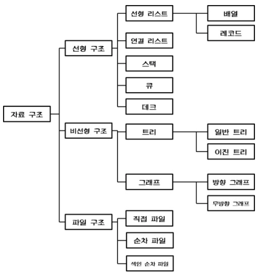

# 자료구조란?
사전적인 의미로는 자료(Data)의 집합을 의미하며  
각 원소들이 논리적으로 정의된 규칙에 의해 나열되며 자료에 대한 처리를 효율적으로 수행할 수 있도록 자료를 구분하여 표현한 것

### 자료구조를 사용하는 목적?
1. 자료를 더 효율적으로 저장, 관리
2. 실행시간 단축
3. 메모리 용량 절약

### 자료구조의 선택 기준 ?
> 자료의 처리를 보다 효율적으로 하기 위해서는 아래와 같은 사항을 고려하여 선택, 사용해야 합니다.

- 자료의 처리 시간
- 자료의 크기
- 자료의 활용빈도
- 자료의 갱신 정도
- 프로그램의 용이성

### 자료구조의 특징
1. 효율성  
2. 추상화
3. 재사용성

### 자료구조의 분류
