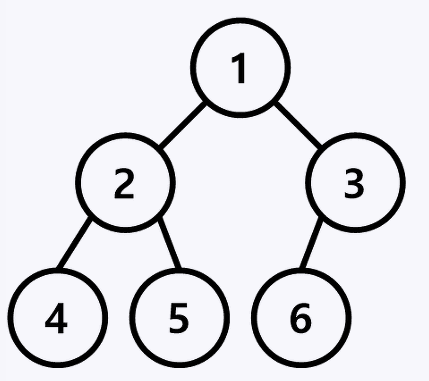

# 선형 자료구조, 비선형 자료구조

### 선형 자료구조 (linear)
* **선형 자료구조**란 하나의 자료 뒤에 하나의 자료가 존재하는 것이다.
* 자료들 간의 앞뒤 관계가 1:1의 선형 관계
* 배열과 리스트가 대표적이고 더 나아가서 스택, 큐도 이에 해당된다

### 비선형 자료구조 (non-linear)
* **비선형 자료구조**란 하나의 자료 뒤에 여러개의 자료가 존재할 수 있는 것이다.  
* 자료들 간의 앞 뒤 관계가 1:N, 또는 N:M의 관계
* 트리와 그래프가 대표적이며 계층적 구조를 나타내기에 적절하다.

