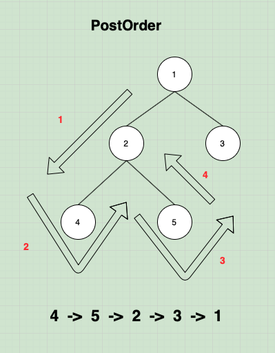

# 트리의 순회

###  InOrder(중위순회) 
> 왼쪽 자식 -> 루트 노드 -> 오른쪽 자식 순서로 방문
1. 왼쪽 자식 노드
2. 현재 노드
3. 오른쪽 자식 노드

아래와 같은 트리가 존재할 때 왼쪽 자식이 노드가 없을 때 까지 방문  
그 후엔 필요에 따라 출력

### PreOrder(전위순회)
> 루트노드 -> 왼쪽 자식 노드 -> 오른쪽 자식 순서로 방문
1. 현재노드
2. 왼쪽 자식 노드
3. 오른쪽 자식 노드

   
(현재 노드를 출력하고 왼쪽 자식 노드 -> 오른쪽 자식 노드 순서로 방문하며 출력)

### PostOrder(후위순회)
> 루트 노드 -> 왼쪽 자식 노드 -> 오른쪽 자식 순서로 방문
1. 현재노드
2. 왼쪽 자식 노드
3. 오른쪽 자식 노드

  
(노드가 존재하지 않을 때 까지 현재 노드의 왼쪽 자식 -> 오른쪽 자식 현재 노드 순서로 순회)

### DFS/BFS
> 위 3가지 모두 DFS/BFS 안에 있다  

[[DFS/BFS에 대한 좋은 자료]](https://devuna.tistory.com/32)