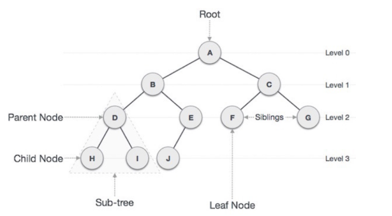

# 트리 (Tree)

### 개념 
> 트리는 노드로 이루어진 자료구조이다.

1. 트리는 하나의 루트 노드를 갖는다
2. 루트 노드는 0개 이상의 자식 노드를 갖고있다.
3. 그 자식 노드 도한 0개 이상의 자식 노드를 갖고있고, 이는 반복적으로 정의된다.

* 노드들과 노드들을 연결하는 간선(edge)들로 구성되어 있다.
    * 트리에는 사이클이 존재할 수 없다.
    * 노드들은 특정 순서로 나열될 수도 있고 그럴 수 없을 수도 있다.
    * 각 노드는 부모 노드로의 연결이 있을 수도 있고 없을 수도 있다.
    * 각 노드는 어떤 자료형으로도 표현 가능하다.

        ```java
        class Node {
        public String name;
        public Node[] children;
        }
        ```

* 비선형 자료구조로 계층적 관계를 표현한다.
> ex) 디렉터리 구조, 조직도
* 그래프의 한 종류
    * 사이클이 없는 하나의 연결 그래프(Connected Graph)
    * 또는 DAG(Directed Acyclic Graph, 방향성이 있는 비순환 그래프)의 한 종류이다.

### 관련 용어



* `루트 노드(root node)` : 부모가 없는 노드, 트리는 하나의 루트 노드만을 가진다.
* `단말 노드(leaf node)` : 자식이 없는 노드, ‘말단 노드’ 또는 ‘잎노드’ 라고도 부른다.
* `내부(internal)` 노드: 단말 노드가 아닌 노드
* `간선(edge)`: 노드를 연결하는 선 (link, branch 라고도 부름)
* `형제(sibling)` : 같은 부모를 가지는 노드
* `노드의 크기(size)` : 자신을 포함한 모든 자손 노드의 개수
* `노드의 깊이(depth)` : 루트에서 어떤 노드에 도달하기 위해 거쳐야 하는 간선의 수
* `노드의 레벨(level)` : 트리의 특정 깊이를 가지는 노드의 집합
* `노드의 차수(degree)` : 하위 트리 개수 / 간선 수 (degree) = 각 노드가 지닌 가지의 수
* `트리의 차수(degree of tree)` : 트리의 최대 차수
* `트리의 높이(height)` : 루트 노드에서 가장 깊숙히 있는 노드의 깊이

### 특징
* 그래프의 한 종류, 최소 연결 트리 라고도 불림
* 계층모델
* DAG(Directed Acyclic Graph, 방향성이 있는 비순환 그래프)의 한 종류
    * loop나 circuit이 없다. 당연히 self-loop도 없다.
    * 즉, 사이클이 없다.
* 노드가 N개인 트리는 항상 N-1개의 간선을 가진다
    * 즉 간선은 항상 (정점의 개수 - 1) 만큼을 가진다
* 루트에서 어떤 노드로 가는 경로는 유일하다.
    * 임의의 두 노드간의 경로도 유일하다. 즉, 두개의 정점 사이에 반드시 1개의 경로만을 가지는 것.
* 한개의 루트 노드만이 존재하며 모든 자식노드는 한개의 부모 노드만을 가진다.
    * 부모-자식 관계이므로 흐름은 top-bottom 아니면 bottom-top으로 이루어진다.
* 순회는 Pre-order, In-order 아니면 Post-order로 이루어진다. 이 3가지 모두 DFS/BFS 안에 있다
* 트리는 이진트리, 이진탐색트리, 균형트리(AVL 트리, red-black트리), 이진 힙(최대힙, 최소힙) 등이 있다.
