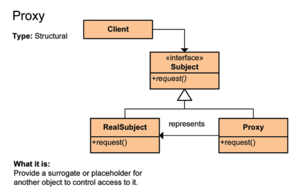
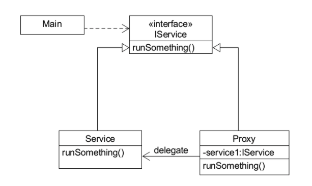

# 프록시 패턴

> Proxy는 우리 말로 대리자, 대변인 이라는 뜻입니다.  
대리자, 대변인은 다른 누군가를 대신해서 그 역할을 수행하는 존재입니다.  
프로그램에서 봤을 때도 똑같습니다.  
프록시에서 어떤 일을 대신 시키는 것 입니다.

구체적으로 인터페이스를 사용하고 실행시킬 클래스에 대한 객체가 들어갈 자리에 대리자 객체를 대신 투입해  
클라이언트 쪽에서 실제 실행시킬 클래스에 대한 객체를 통해 메서드를 호출하고 반환값을 받는지,  
대리자 객체(프록시 객체)를 통해 메서드를 호출하고 반환값을 받는지 전혀 모르게 처리하는 것 입니다.

**프록시는 흐름 제어만 할 뿐 결과값을 조작하거나 변경시키면 안됩니다.**  

### 프록시 패턴의 특징
* 대리자는 실제 서비스와 같은 이름의 메서드를 구현한다. 이때 인터페이스를 사용한다.  
* 대리자는 실제 서비스에 대한 참조변수를 갖는다 (합성)
* 대리자는 실제 서비스의 같은 이름을 가진 메서드를 호출하고 그 값을 클라이언트에게 돌려준다.
* 대리자는 실제 서비스의 메서드 호출 전후에도 별도의 로직을 수행할 수도 있다.

### 프록시 패턴의 장단점
* 장점
1. 기본 객체의 리소스가 무거운 경우, 프록시 객체에서 간단한 처리를 하거나 기본 객체를 캐싱 처리함으로써 부하를 줄일 수 있다. (ex : 이미지 등)
2. 실제 객체의 public, protected 메소드들을 숨기고 인터페이스를 통해 노출시킬 수 있다.
3. 로컬에 있지 않고 떨어져 있는 객체를 사용할 수 있다.
4. 프록시는 개본 객체와 요청 사이에 있기 때문에 일종의 방패(보안)의 역할도 한다.

* 단점
1. 객체를 생성할 때 한 단계를 거치게 되므로, 빈번한 객체 생성이 필요한 경우 성능이 저하될 수 있다.
2. 프록시 내부에서 객체 생성을 위해 스레드가 생성, 동기화가 구현되야 하는 경우 성능이 저하될 수 있다.
3. 로직이 난해해져 가독성이 떨어질 수 있다.

### 프록시 디자인 패턴 테이블


클라이언트가 어떤 일에 대한 요청(`RealSubject의 request()메서드 호출`)을 하면  
Proxy가 대신 RealSubject의 `request()`메서드 호출을 하고 그 반환 값을 클라이언트에게 전달합니다.

### 프록시 패턴 간단 예제


Main에서 Service의 `runSomething()` 메서드를 직접 호출하지 않고 Proxy에게 대신 시킵니다.  
그럼 Proxy는 Service의 인스턴스를 가지고 있으면서 직접 Service의 `runSomthing()` 메서드를 호출하고 그 반환값을 요청자 Main에게 넘겨줍니다.

```java
// IService.java

public interface IService {
    String runSomething();
}
```

```java
// Service.java

public class Service implements IService {

    @Override
    public String runSomething() {
        return "서비스입니다.";
    }
}
```

```java
// Proxy.java

public class Proxy implements IService {

    IService service1;

    @Override
    public String runSomething() {
        System.out.println("호출에 대한 흐름 제어가 주 목적, 반환 결과를 그대로 전달");

        service1 = new Service();
        return service1.runSomething();
    }
}
```

```java
// Main.java

public class Main {

    public static void main(String[] args) {
        // 직접 호출하지 않고 프록시를 호출함
        IService proxy = new Proxy();
        System.out.println(proxy.runSomething());
    }
}
```

> 구조 ?
```
Client -> Proxy -> RealSubject
```

> 실행 결과
>
> 호출에 대한 흐름 제어가 주 목적, 반환 결과를 그대로 전달  
> 서비스입니다.


위 코드를 보면 인터페이스를 중간에 두어 구체 클래스들에게 영향이 받지 않게 설계되었습니다.  
또 직접 접근하지 않고 Proxy를 통해서 한번 더 우회해서 접근하도록 되어있습니다. (제어 흐름을 조정하기 위함)  
OCP(개방 폐쇄 원칙), DIP(의존관계 역전 원칙) 설계 원칙이 녹아져 있음을 확인할 수 있습니다.

Proxy는 결국 직접 실행 메서드를 호출하는 것을 피하면서 취하고 싶었던 것은 흐름제어라고 했습니다.  
흐름 제어가 왜 필요할까요 ?  
예시로 배틀그라운드 게임을 생각해보면 유저가 죽고 나서 다시 살아날 때 까지 로딩시간이 걸립니다.  
데이터가 큰 이미지나 그래픽을 로딩하는데 시간이 걸리기 때문입니다.  
이럴 경우 유저는 짜증이 나겠죠. 그 시간동안 아무것도 안하고 기다려야 하니까요.  
이럴 때 프록시는 제어 흐름을 통해 큰 데이터가 로딩 될 때 까지 현재까지 완료된 것을 우선적으로 보여줍니다.  
즉 배틀그라운드에서 비행기 타기 전 사람들이 어느 한정된 공간에서 캐릭터를 움직일 수 있게라도 해주는 것입니다.