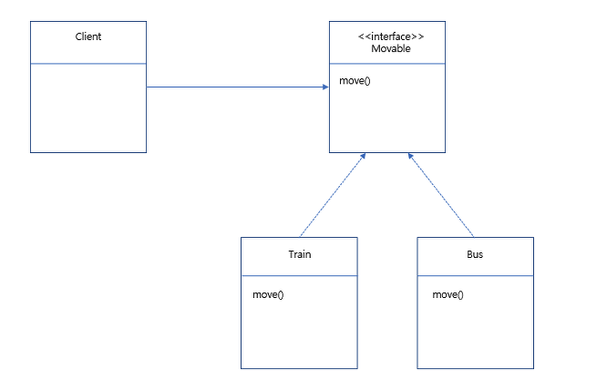
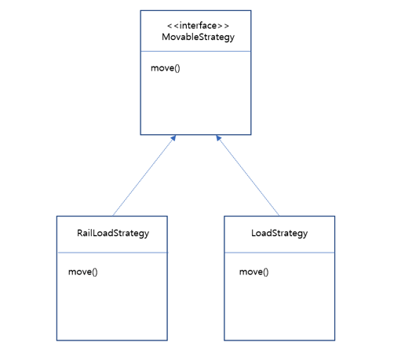
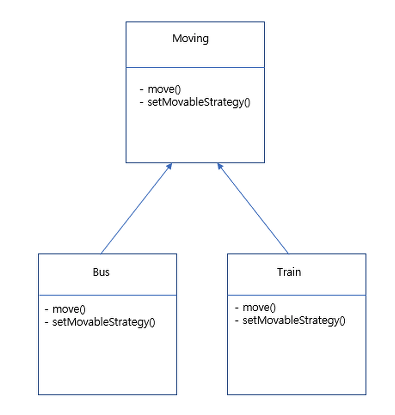

# 전략 패턴
객체들이 할 수 있는 행위 각각에 대해 전략 클래스를 생성하고,  
유사한 행위들을 캡슐화하는 인터페이스를 정의하여,  
**객체의 행위를 동적으로 바꾸고 싶은 경우 집접 행위를 수정하지 않고 전략을 바꿔주기만 함으로써 행위를 유연하게 확장하는 방법**을 말합니다.

> 간단히 말해서 **객체가 할 수 있는 행위들을 각각 전략으로 만들어놓고,
동적으로 행위의 수정이 필요한 경우 전략을 바꾸는 것 만으로 행위의 수정이 가능하도록 만든 패턴**입니다.

### 전략 패턴의 사용 이유
예를들어 기차(Train)와 버스(Bus) 클래스가 있고,  
이 두 클래스는 `Movable` 인터페이스를 구현했다고 가정하겠습니다.  
그리고 Train과 Bus 객체를 사용하는 Client도 있습니다.



이 구조를 코드로 표현한다면

```java
public interface Movable {
    public void move();
}
```

```java
public class Train implements Movable{
    public void move(){
        System.out.println("선로를 통해 이동");
    }
}
```

```java
public class Bus implements Movable{
    public void move(){
        System.out.println("도로를 통해 이동");
    }
}
```

```java
public class Client {
    public static void main(String args[]){
        Movable train = new Train();
        Movable bus = new Bus();

        train.move();
        bus.move();
    }
}
```
기차는 선로를 따라 이동하고, 버스는 도로를 따라 이동합니다.  
그러다 시간이 흘러 선로를 따라 움직이는 버스가 개발되었다고 가정해봅시다.

그러면 Bus의 move() 메서드를 다음과같이 바꿔주기만 하면 되겠죠?
```java
public void move(){
    System.out.println("선로를 따라 이동");
}
```

그런데 이렇게 수정하는 방식은 **SOLID원칙중 OCP에 위배**됩니다.  
OCP에 의하면 기존의 `move()`를 수정하지 않으면서 행위가 수정되어야하지만,  
지금은 Bus의 `move()`메서드를 직접 수정했습니다.

또한 지금과 같은 방식의 변경은 **시스템이 확장이 되었을 때 유지보수를 어렵게** 합니다.  
예를 들어, 버스와 같이 도로를 따라 움직이는 택시, 자가용, 고속버스, 오토바이 등이 추가된다고 할 때, 모두 버스와 같이 `move()` 메서드를 사용합니다.  
만약에 새로 개발된 선로를 따라 움직이는 버스와 같이 선로를 따라 움직이는 택시, 자가용, 고속버스 등이 생긴다면  
택시, 자가용, 고속버스의 `move()` 메서드를 일일이 수정해야 할 뿐더러, 같은 메서드를 여러 클래스에서 똑같이 정의하고 있으므로 메서드의 중복이 발생하고 있습니다.  

즉, 지금과 같은 수정 방식의 문제점은 다음과 같습니다.
* OCP 위배
* 시스템이 커져서 확장이 될 경우 메서드의 중복문제 발생  

따라서 이를 해결하고자 전략 패턴을 사용하려고 합니다.

### 전략 패턴을 구현해보자
위와같이 선로를 따라 이동하는 버스가 개발된 상황에서 시스템이 유연하게 변경되고 확장될 수 있도록 전략패턴을 사용해봅시다.   

1. 먼저 전략패턴을 생성하는 방법입니다.

현재 운송수단은 선로를 따라 움직이든지, 도로를 따라 움직이든지 두가지 방식이 있습니다.  
즉, **움직이는 두 방식에 대해 Strategy클래스를 생성**하도록 합니다. (`RailLoadStrategy`, `LoadStrategy`)

그리고 이 두 클래스는 `move()` 메서드를 구현하여, 어떤 경로로 움직이는지에 대해 구현합니다.

또한 두 전략 클래스를 캡슐화하기 위해 `MovableStrategy` 인터페이스를 생성합니다.  
이렇게 캡슐화를 하는 이유는 운송수단에 대한 전략 뿐만 아니라,  
다른 전략들 (예를 들어, 주유방식에 대한 전략 등)이 추가적으로 확장되는 경우를 고려한 설계입니다.



이를 코드로 표현하면 ..
```java
public interface MovableStrategy {
    public void move();
}
```

```java
public class RailLoadStrategy implements MovableStrategy{
    public void move(){
        System.out.println("선로를 통해 이동");
    }
}
```

```java
public class LoadStrategy implements MovableStrategy{
    public void move() {
        System.out.println("도로를 통해 이동");
    }
}
```

2. 다음으로는 운송 수단에 대한 클래스를 정의할 차례입니다.

기차와 버스같은 운송수단은 `move()` 메서드를 통해 움직일 수 있습니다.  
그런데 **이동 방식을 직접 메서드로 구현하지 않고, 어떻게 움직일 것인지에 대한 전략을 설정하여, 그 전략의 움직임 방식을 사용하여 움직이도록 합니다.**  

그래서 전략을 설정하는 메서드인 `setMovableStrategy()`가 존재합니다.



이를 코드로 표현한다면 ..
```java
public class Moving {
    private MovableStrategy movableStrategy;

    public void move(){
        movableStrategy.move();
    }

    public void setMovableStrategy(MovableStrategy movableStrategy){
        this.movableStrategy = movableStrategy;
    }
}
```

```java
public class Bus extends Moving{

}
```

```java
public class Train extends Moving{

}
```

3. 이제 Train과 Bus 객체를 사용하는 Client를 구현할 차례입니다.

Train과 Bus 객체를 생성한 후에, 각 운송수단이 어떤 방식으로 움직이는지 설정하기 위해 `setMovableStrategy()` 메서드를 호출합니다.

그리고 전략패턴을 사용하면 프로그램 상으로 로직이 변경되었을 때,  
**얼마나 유연하게 수정을 할 수 있는지** 살펴보기 위해 선로를 따라 움직이는 버스가 개발되었다는 상황을 만들어 버스의 이동방식 전략을 수정했습니다.
```java
public class Client {
    public static void main(String args[]){
        Moving train = new Train();
        Moving bus = new Bus();

        /*
            기존의 기차와 버스의 이동 방식
            1) 기차 - 선로
            2) 버스 - 도로
         */
        train.setMovableStrategy(new RailLoadStrategy());
        bus.setMovableStrategy(new LoadStrategy());

        train.move();
        bus.move();

        /*
            선로를 따라 움직이는 버스가 개발
         */
        bus.setMovableStrategy(new RailLoadStrategy());
        bus.move();
    }
}
```