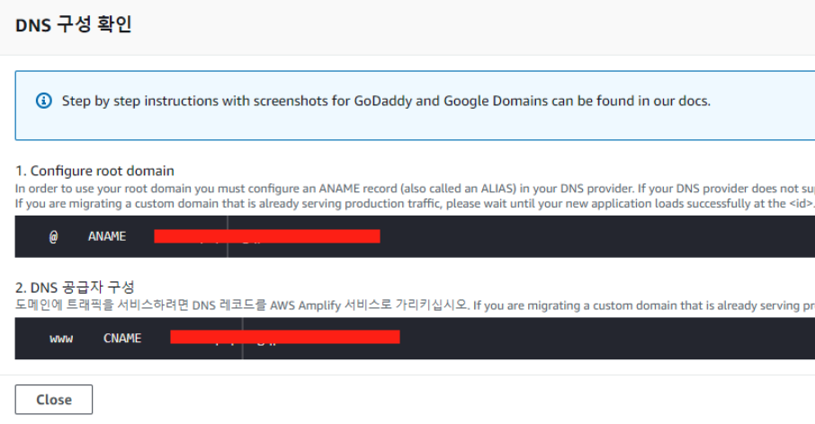
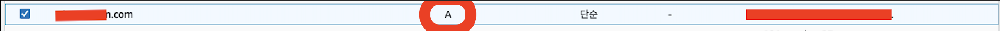
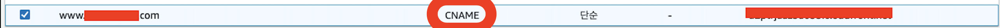
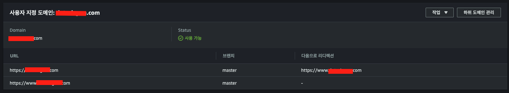

# Amplify에서 구입한 도메인 연결하기
> 필자는 Router53을 사용하는 중이기 때문에 Router53을 사용한다고 가정하고 글을 사용하겠습니다.

Amplify에서 도메인 연결하는 방법은 Router53을 사용한다면 정말 쉽고 간단하다.

AWS Amplify -> 도메인 관리 -> 도메인 추가에 들어가면 Router53을 사용중이기 때문에 자동으로 뜨게됩니다.

선택 후 하위도메인에 `www` 등 추가해준 뒤  
저장.. 

후 도메인 설정을 위해 추가 작업을 해주어야 합니다.

작업 -> DNS 레코드 보기를 누르면

DNS 공급자를 제공해주는 CDN 주소로 변경하여야 합니다.

Router53에서
A레코드와 CNAME 레코드를 위의 값에 맞게 추가해줍니다.

이후 Amplify 도메인관리에 들어가보면

도메인이 추가된걸 확인할 수 있습니다.