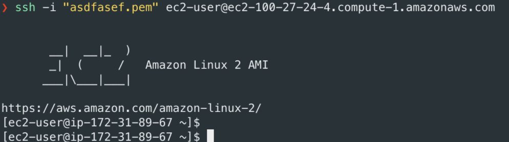

# EC2를 이용하여 Hello World 올리기 (Spring-boot)

## 1. 인스턴스 생성하기
- EC2 들어가기
- 인스턴스 시작 누르기
- Amazon Machine Image(AMI) 선택에서 원하는 것을 선택한다
- 인스턴스 유형 선택(프리티어)
- 기본값으로 설정하고 넘어가준다
- 보안그룹 구성  
    | SSH | 위치무관(어디서나 접속) |   
    | HTTP(HTTP통신을 이용한 BE서버추가) | 위치무관 |  
    | 사용자지정 TCI | 포트번호 | 위치무관 |  

- 검토 및 시작을 누른 후 시작하기를 누른다
- 키페어 없으면 -> 생성(따로 폴더에 저장, 남에게 넘어가지 않게한다)  
있으면 -> 선택
- 추가완료

## 2. Mac과 instance연결
- 터미널 open
- keypair이 있는 주소로 이동한다
- keypair 권한변경
> 읽기만 가능한 권한으로 변경
```
chmod 400 keypairname.pem
```
- AWS instance를 선택 후 연결하기를 누른다  
또는   
```
ssh -i "keypairname.pem" ec2-user@ec2-100-27-24-4.compute-1.amazonaws.com
```
- 터미널에 이렇게 뜨면 성공이다


## 3. 가상환경에서 배포 환경 구축하기(AWS Linux)
> sudo yum update로 업데이트 하여도 좋습니다^^
- git install하기
```
sudo yum install git
```

- git version확인
```
git --version
```

- JAVA8, 11설치
```
sudo yum install -y java-1.8.0-openjdk-devel.x86_64

sudo yum install java-11-amazon-corretto-headless
```

- JAVA11로 바꾸기
```
sudo alternatives --config java
```
:설치했던 11버전으로 변경
- JAVA version 확인
```
java -version
```

- git과 JAVA 가 잘 설치 되었다면 프로젝트를 clone할 디렉토리를 생성한다
```
mkdir app

mkdir app/git

cd ~/app/git
```
- clone할 레파지토리의 HTTPS주소 복사

- 터미널에서 git clone으로 프로젝트 생성
```
git clone 복사한HTTPS주소
```

- ls로 clone이 잘 되었는지 확인한다

- 터미널에서 프로젝트로 이동
```
cd project_name(clone한 레포)
```

- 프로젝트가 잘 복제되었는지 Test
```
./gradlew test
```
> 권한문제로 허가가 거부되어 테스트가 진행되지않았다면 권한을 부여해준다
```
chmod +x gradlew
```
> 그리고 다시 테스트를 하는 명령어를 입력한다

## 4. 프로젝트 build
- 프로젝트 빌드하기
```
./gradlew build
```
: 빌드에 성공하면
app/git/projectname/build/libs/ 디렉토리에 jar파일이 생성된다

- build/libs 주소로 이동
```
cd build/libs
```

- jar 파일 실행
```
java -jar jar-file-name
```

## 5. 접속
: 스프링부트는 포트8080에서 열렸다
- EC2인스턴스 DNS주소 복사

- 접속
```
DNS-adress:8080
```

- 접속을 성공했을 것 이다