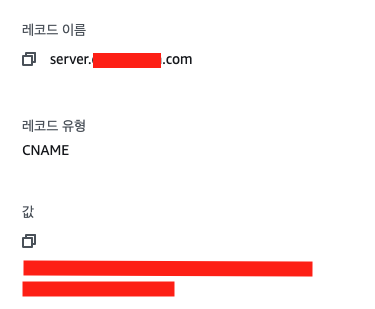
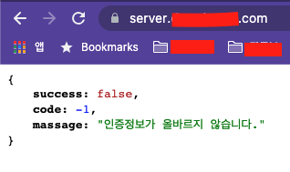

# AWS Elastic Beanstalk 환경에서 서브 도메인을 설정하는 방법

### 먼저 서브도메인이란 ?
내가 구입 한 도메인이 `domain.com` 이라고 한다면 메인 도메인 앞에 붙여쓰는 것들을 서브 도메인이라고 한다.  
대표적으로 `www.`이 있다.  
`www.domain.com`은 `domain.com`의 서브도메인이라는 것이다.
그런데 인터넷이 처음 개발되던 때와는 달리 Word Wide Web(월드 와이드 웹)을 뜻하는 www와 메인도메인을 똑같은 취급을 하게 되어 보통은 어느한쪽으로 자동연결해준다.

그래서 내가 서브도메인을 왜 만드려고 하냐면

클라이언트에는 도메인을 연결 해 놓은 상태이고  
클라이언트에서 `server.domain.com`의 주소로 API요청을 보내게 하려고 서브도메인을 설정하려고 하는 상황이다. 

방법은 간단하다. (나의 Aws 환경은 Elastic Beanstalk을 사용중이다.)

1. Router53에서 레코드 추가
2. 레코드 이름에 앞에 붙여 쓸 서브도메인을 입력
3. 유형은 CNAME으로 지정한다.
4. 값은 Elastic Beanstalk에서 생성해준 주소를 넣어주면 된다.

> 이렇게 생성이 된 모습을 확인할 수 있다.

> 접속도 잘 되는 모습을 확인할 수 있다 !