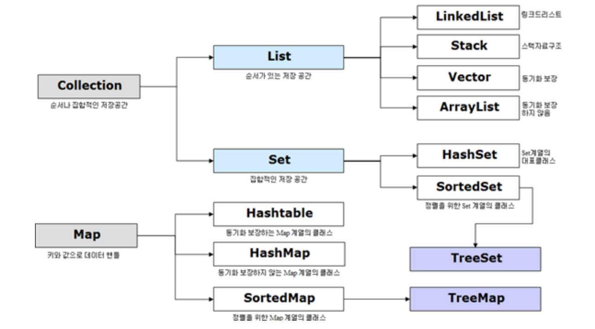

# Collection
자바에서 Collection이란 데이터의 **집합**, **그룹**을 의미하며  
`Java Collection Framwork`는 이러한 데이터, 자료구조인 컬렉션과   
이를 구현하는 클래스를 정의하는 인터페이스를 제공한다.

다음은 Java컬렉션 프레임워크의 상속구조이다.


상위 인터페이스를 크게 세 분류로 나누면  
`List`, `Set`, `Queue`

`Map`같은 경우는 Collection인터페이스를 상속받고있진 않지만 Collection으로 분류된다.

### Set 인터페이스
> `순서를 유지하지 않는 데이터의 집합`으로, **데이터의 중복을 허용하지 않는다.**

* HashSet
1. 가장빠른 임의 접근 속도
2. 순서를 예측할 수 없음

```java
import java.util.HashSet;

public class CollectionSet {

	public static void main(String[] args) {
		
			HashSet<String> hs = new HashSet<String>(); // HashSet 선언
		
			hs.add("배태현");
			hs.add("안녕하세요");
			hs.add("배태현");
			hs.add("얼굴");

			System.out.println(hs);

			
	}
}
//결과 [배태현,얼굴,안녕하세요]
// 배태현을 두번 넣었음에도 한번만 값이 넣어져있다. (HashSet의 특성인 중복값 무시)
```

* TreeSet
1. 정렬방법을 지정할 수 있음

```java
import java.util.TreeSet;

public class CollectionSet {

	public static void main(String[] args) {
		
			TreeSet<String> ts = new TreeSet<String>();
			
			   	ts.add("apple");
		        ts.add("airplane");
		        ts.add("alien");
		        ts.add("disc");
		        ts.add("dance");
		        
		        System.out.println(ts.headSet("b"));
		        System.out.println(ts.subSet("a", "al"));
		        System.out.println(ts.tailSet("c"));
			
	}

}
//결과 : [airplane,alien,apple] ts.headSet("b") 시작이 b 보다 작은 a로 시작하는 데이터들
//		 [airplane]  ts.subSet("a", "al") a ~ al 사이에 있는 데이터 from ~ to 
//		 [dance,disc] ts.tailSet("c") headSet의 반대 시작이 c 보다 큰 d부터 시작하는 데이터들
```

#### HashSet VS TreeSet
1. 구현방식
* HashSet은 해싱을 이용하여 구현
* TreeSet은 이진탐색트리를 이용하여 구현

2. 속도비교
* HashSet > TreeSet
* 해싱이 이진탐색트리보다 빠르다

3. 정렬기능
* TreeSet > HashSet
* 이진탐색트리를 이용했기때문에 데이터 정렬이 가능(Comparator 이용)

4. 성능
* HashSet > TreeSet > LinkedHashSet

> 사용예시  
웹사이트에서 하루에 접속하는 사람수를 구하고자한다.  
접속하는 IP를 세면 되겠죠.  
하지만 한 사람이 여러번 접속하게 된다면 한 IP가 여러번 찍히게 될겁니다.  
이걸 한번으로 카운트해줘야 접속자 수를 제대로 셀 수 있겠죠.  
이럴 때 사용하는게 `Set`입니다. (중복 무시 특성)  
**수학**의 **집합** 개념입니다.

### List 인터페이스
> 순서가 있는 데이터의 집합으로 **데이터의 중복을 허용한다.**

1. LinkedList
* 양방향 포인터 구조로 데이터의 삽입, 삭제가 빈번할 경우 데이터의 위치정보만 수정하면 되기에 유용하다.
* 스택, 큐, 양방향 큐 등을 만들기 위한 용도로 쓰임

2. Vector
* 과거에 대용량 처리를 위해 사용했으며, 내부에서 자동으로 동기화 처리가 일어나 비교적 성능이 좋지않고 무거워서 잘 쓰이지 않는다.

3. ArrayList
* 단방향 포인터구조로 각 데이터에 대한 인덱스를 가지고있어 조회기능에 성능이 뛰어남

### Map 인터페이스
> 키(Key), 값(Value)의 쌍으로 이루어진 데이터의 집합으로  
순서는 유지되지 않으며 키(Key)의 중복값을 허용하지 않으나 값(Value)의 중복값은 허용한다.

1. HashTable
* HashMap보다는 느리지만 동기화 지원
* null 불가

2. HashMap
* 중복과 순서가 허용되지 않으며, null값이 올 수 있다.

3. TreeMap
* 정렬된 순서대로 키(Key)와 값(Value)을 저장하여 검색이 빠르다.