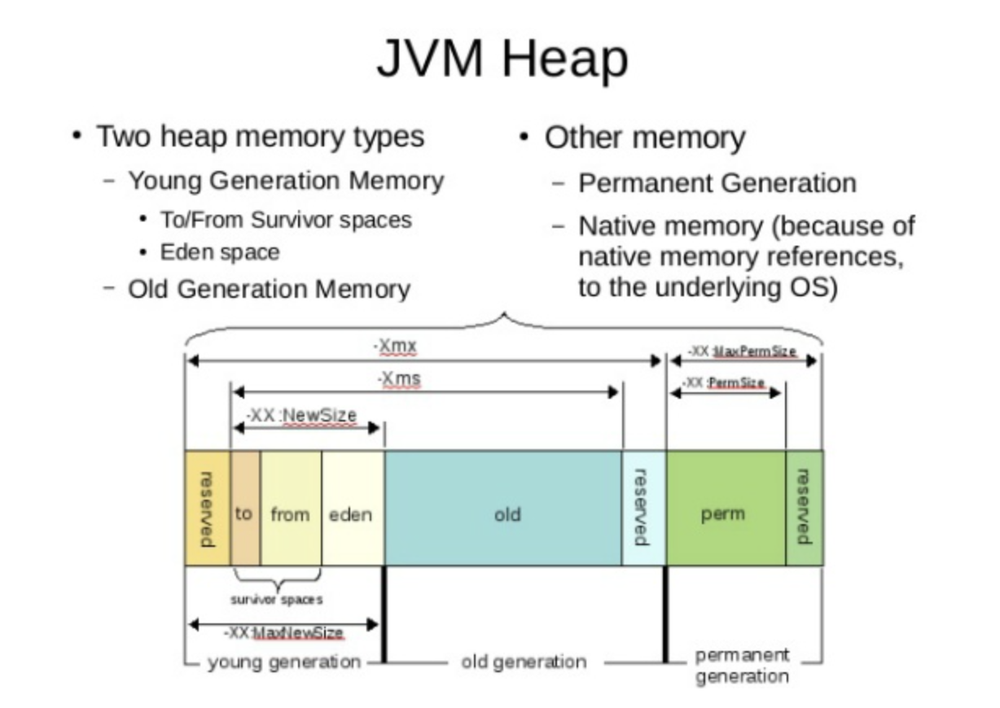
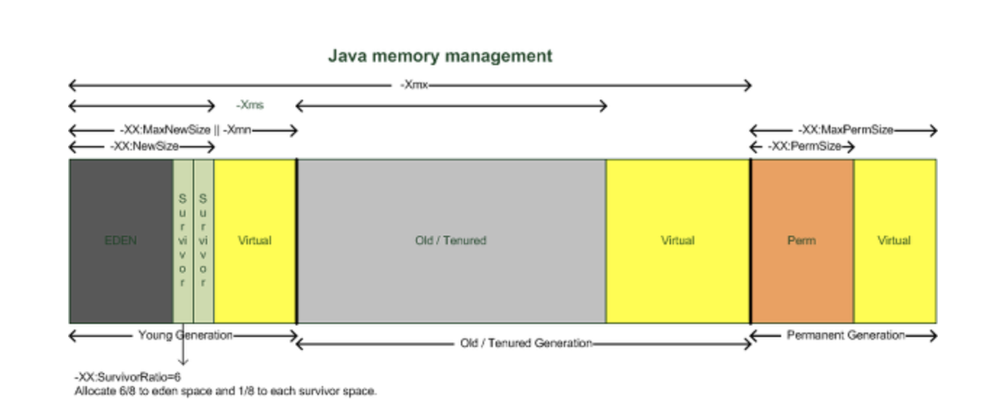
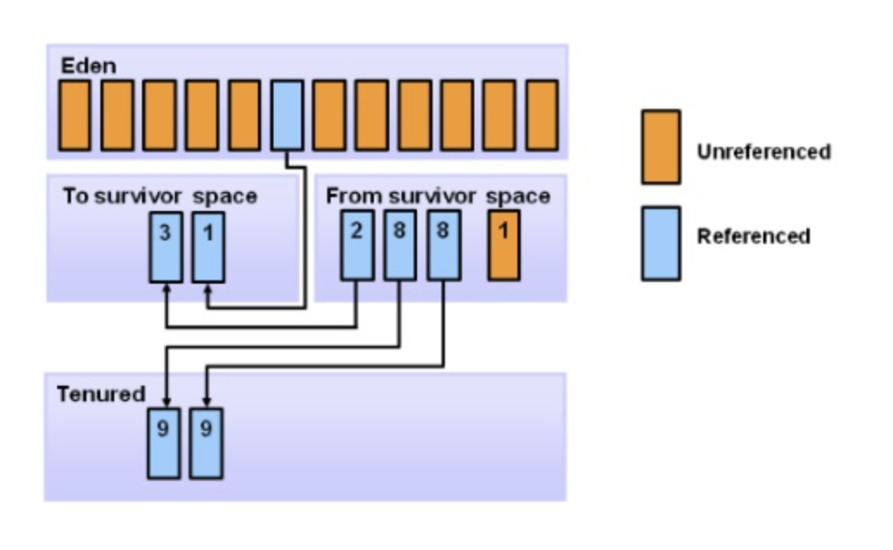

# Garbage Collector란? (GC)

`Garbage Collection` 자바에서 쓰레기는 객체입니다.   
하나의 객체는 메모리를 점유하고, 필요하지 않으면 메모리에서 해제되어야 합니다. 메모리 점유는 다음과 같이 쉽게 할 수 있습니다.

이러한 코드에서 a라는 객체가 만들어져 메모리의 한부분을 점유하게 되고,  
특정 메소드 호출한 후 수행이 완료되어 해당 객체가 더이상 필요없는 객체, 쓰레기가 됩니다.   
이 **쓰레기 객체를 효과적으로 처리하는 작업을 GC**라고 합니다.

> Java나 Kotlin에서는 이러한 메모리 누수 방지를 위해 가비지컬렉터(Garbage Collector, GC)가 주기적으로 검사하여 메모리를 청소해준다.  
물론 Java에서도 `System,gc()`를 이용하여 호출할 수 있지만,  
해당 메소드를 호출하는 것은 시스템 성능에 매우 큰 영향을 미치기 때문에 절대 호출해선 안된다.

유닉스 서버든 윈도우 기반 서버든 풀(Full) GC를 수행하는 시점에는 해당 WAS의 컨테이너에서 서비스가 처리되지 않는다는 단점이 있습니다.  
다시 이야기하면 **GC를 많이하면할수록 응답 시간에 많은 영향을 끼친다는 것**입니다.   
그러므로 **자신이 만든 자바 프로그램의 성능을 생각하는 자바 엔지니어라면, GC가 어떻게 처리되는지 기본 지식은 갖고 있어야 겠죠?**

### GC의 원리를 알아보자
1. 메모리 할당
2. 사용중인 메모리 인식
3. 사용하지 않는 메모리 인식

GC를 해도 **더이상 사용 가능한 메모리 영역이 없는데 계속 메모리를 할당**하려고 하면, `OutOfMemoryError`가 발생하여 WAS가 다운될 수도 있습니다.  
행(Hang) 즉, 서버가 요청을 처리 못하고 있는 상태가 됩니다.

JVM의 메모리는 크게 `클래스 영역, 자바 스택, 힙, 네이티브 메소드 스택`의 4개 영역으로 나뉩니다.  
**가비지 컬렉터에서는 힙 메모리를 다루게 됩니다**.  
즉 **자바 가비지 컬렉터가 인식하고 할당하는 자바 메모리 영역은 힙 영역**인것입니다.

JVM Heap은 `Young, Old, Perm` 세 영역으로 나뉩니다.  
이중 `Perm`은 **거의 사용되지 않는 영역으로 클래스와 메소드 정보와 같이 자바 언어 레벨에서 사용되지 않습니다**.  
`Young, Old`영역 그리고 `Young`영역은 `Eden`영역와 두개의 `Survivor`영역으로 나뉩니다.  
우리가 고려해야 할 자바의 메모리 영역은 총 4개의 영역으로 나뉜다고 볼 수 있습니다.  
>  ( Young (1. Eden, 2. Survivor 1, 3. Survivor 2), Old (4. 메모리) )

일단 메모리에 객체가 생성되면, `Eden 영역에 객체가 지정`됩니다.   
**Eden 영역에 데이터가 어느 정도 쌓이면, 이 영역에 있던 객체가 어디론가 옮겨지거나 삭제**됩니다.  
`이 때 옮겨가는 위치가 survivor 영역`입니다.  
**두개의 Survivor 영역 사이에 우선 순위가 있는 것은 아닙니다.**  
**하지만, 이 두 개의 영역 중 한 영역은 반드시 비어 있어야 합니다.**  
`그 비어있는 영역에 Eden 영역에 있던 객체가 할당`됩니다.

Eden에서 survivor 둘 중 하나의 영역으로 할당 되고,  할당된 Survivor 영역이 차면, GC가 되면서  
Eden 영역에 있는 객체와 꽉 찬 Survivor 영역에 있는 객체가 비어 있는 Survivor 영역으로 이동합니다.  
그러다가 더 큰 객체가 생성되거나,  
**더 이상 Young 영역에 공간이 남지 않으면 객체들은 Old 영역으로 이동**하게 됩니다.

### GC의 종류
* 마이너 GC : Young 영역에서 발생하는 GC
* 메이저 GC : Old 영역이나 Perm 영역에서 발생하는 GC

이 두가지 GC가 어떻게 상호 작용하느냐에 따라서 GC 방식에 차이가 나며,  성능에도 영향을 줍니다.  
**GC가 발생하거나 객체가 각 영역에서 다른 영역으로 이동할 때 애플리케이션의 병목이 발생하면서 성능에 영향**을 주게 됩니다.  
그래서 핫 스팟(Hot Spot) JVM에서는 스레드 로컬 할당 버퍼(TLABs: Thread-Local Allocation Buffers)라는 것을 사용합니다.  
이를 통해 **각 스레드별 메모리 버퍼를 사용하면 다른 스레드에 영향을 주지 않는 메모리 할당 작업이 가능**합니다.

### 4가지 GC 방식
> `JDK 5.0이상`에서 지원하는 GC 방식에는 네가지가 있습니다. 
WAS나 자바 애플리케이션 수행시 옵션을 지정하여 선택할 수 있습니다.

1. Serial Collector (이하 시리얼 콜렉터)
2. Parallel Collector (이하 병렬 콜렉터)
3. Parallel Compacting Collector (이하 병렬 컴팩팅 콜렉터)
4. Concurrent Mark-Sweep (CMS) Collector (이하 CMS 콜렉터)

> [🙏참고하였습니다🙏](https://12bme.tistory.com/57)