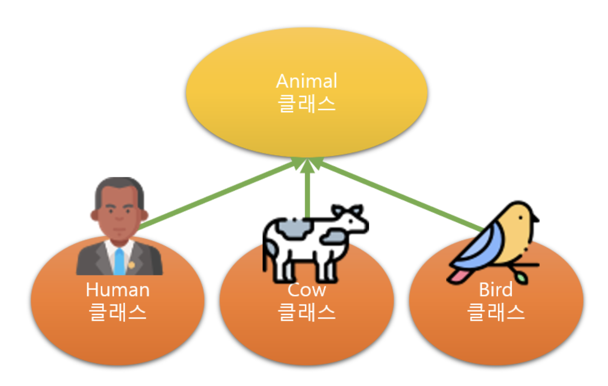

# IS-A 관계
객체지향 프로그래밍은 상속을 사용합니다.  
상속은 언제 사용할까요 ?  
상속은 `IS-A` 관계에서 사용하는 것이 가장 효율적입니다.

### IS-A 관계

IS-A 관계는 일반적인 개념과 구체적인 개념의 관계입니다.  
* 사람은 동물이다. (Person `is a` Animal)
* 소는 동물이다. (Cow `is a` Animal)
* 새는 동물이다. (Bird `is a` Animal)  

위와 같은 관계입니다.  
즉, 일반 클래스를 구체화 하는 상황에서 상속을 사용합니다.

상속을 사용하면 많은 장점이 있지만,   
`하위 클래스가 상위 클래스에 종속`되기 때문에   
**이질적인 클래스 간에는 상속을 사용하지 않는 것이 좋습니다.**   
단순히 코드를 재사용할 목적으로   
**서로 관련이 없는 개념의 클래스를 상속 관계로 사용하는 것은 추천하지 않습니다.**

### 상속은 코드 재사용이 아닙니다.
**상속을 코드 재사용의 개념으로 이해하면 안됩니다.**  
코드를 재사용할 수 있다고 마구잡이로 잘못 사용하는 경우가 있습니다.  
**상속을 사용하면 클래스간 결합도가 높아져 상위 클래스를 수정해야 할 때 하위 클래스에 미치는 영향이 매우 큽니다.**  
때문에 `상속은 IS-A 관계에서 사용`해야 합니다.
