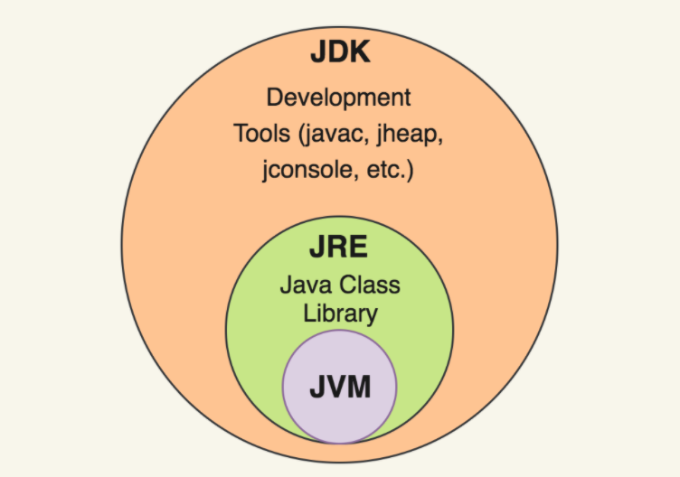

# JVM - JRE - JDK의 차이점
### JVM
* `Java Virtual Machine`의 약어
* 자바 가상머신이라고도 불린다
* 자바 프로그램을 **컴파일 해서 나온 결과인 바이트코드를 실행시켜주는 가상머신**이다.
> 어플리케이션을 실행시켜주는 가상머신을 사용함으로써,   
윈도우/리눅스/맥 등 다양한 환경에서   
언제나 동일하게 실행되도록 할 수 있다는 장점을 가지고 있다.

한번 컴파일 됐으면 운영체제에 따라 다시 컴파일 할 필요가 없는 `WORA(Write Once Run Anywhere)`를 만족한다

### JRE
* `Java Runtime Enviromment`의 약자로, **자바 실행 환경을 의미**한다.
* JVM을 동작하는데에 필요한 각종 자바 라이브러리를 담고있다.

### JDK
* `Java Development Kit`의 약자로, 자바 개발 키트를 의미한다.
* JRE와 javac등의 컴파일러, 디버거 등을 포함하는 프로그램이다
* 오라클사에서 제공하는 오라클 JDK와 오픈소스로 개발된 OpenJDK가 있으나, 일반적으로 사용되는것은 오라클 JDK이다.

### 포함관계 도식도

### 💡총정리
JVM을 사용하기 위한 라이브러리가 JRE이며,   
일반적인 자바 프로그램을 실행하기 위해 사용되는것이 JRE이다.  
JDK는 JRE를 포함하고있으며, 컴파일러와 디버거 등이 포함된 버전이다.

