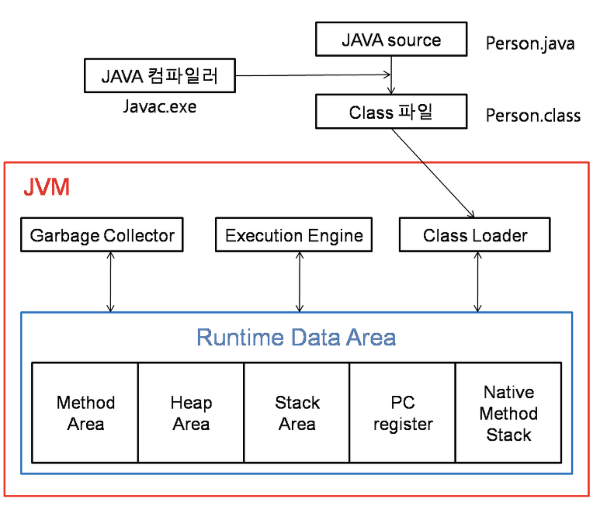
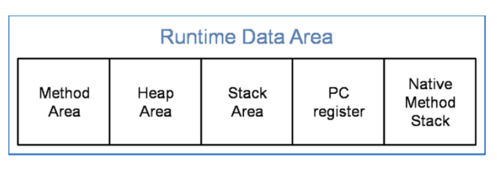
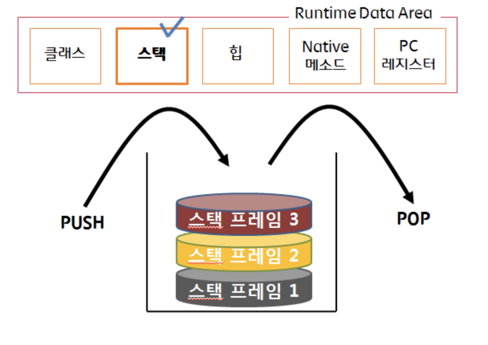

# JVM 메모리 구조
아래는 자바 프로그램의 실행단계입니다.  
JVM의 구조는 크게 보면,  
`Garbage Collector, Execution Engine, Class Loader, Runtime Data Area로` 4가지로 나눌 수 있습니다.

자바 소스파일은 자바 컴파일러에 의해 바이트코드 형태인 클래스파일이 됩니다.  
그리고 이 클래스 파일은 클래스 로더가 읽어 들이면서 JVM이 수행됩니다.  

## Class Loader
**JVM내로 클래스 파일을 로드하고, 링크를 통해 배치하는 작업을 수행하는 모듈**입니다.  
`런타임시에 동적으로 클래스를 로드`합니다.

## Execution Engine
**클래스 로더를 통해 JVM내의 Runtime Data Area에 배치된 바이트 코드들을 명령어 단위로 읽어서 실행**합니다.  
최초 JVM이 나왔을 당시에는 인터프리터 방식이였기 때문에 속도가 느리다는 단점이 있었지만 JIT컴파일러 방식을 통해 이 점을 보완하였습니다.  
JIT는 바이트 코드를 어셈블러 같은 네이티브 코드로 바꿈으로써 실행이 빠르지만 역시 변환하는데 비용이 발생하였습니다.  
이 같은 이유로 **JVM은 모든 코드를 JIT 컴파일러 방식으로 실행하지 않고, 인터프리터 방식을 사용하다가 일정한 기준이 넘어가면 JIT 컴파일러 방식으로 실행**합니다.

## Garbage Collector
**Garbage Collector(GC)는 힙 메모리 영역에 생성된 객체들 중에서 참조되지 않은 객체들을 탐색 후 제거하는 역할**을 합니다.  
이때, GC가 역할을 하는 시간은 언제인지 정확히 알 수 없습니다.

## Runtime Data Area
**JVM의 메모리 영역으로 자바 애플리케이션을 실행할 때 사용되는 데이터들을 적재하는 영역**입니다.  
이 영역은 크게 `Method Area, Heap Area, Stack Area, PC Register, Native Method Stack`로 나눌 수 있습니다.

### Method Area
**모든 쓰레드가 공유하는 영역**
메소드 영역은 `클래스, 인터페이스, 메소드, 필드, static변수` 등의 바이트코드를 보관한다,

### Heap Area
**모든 쓰레드가 공유**한다.  
`new` 키워드로 **생성된 객체와 배열이 생성되는 영역**입니다.  
또한, **메소드 영역에 로드된 클래스만 생성이 가능하고 Garbage Collector가 참조되지 않는 메모리를 확인하고 제거하는 영역**입니다.

### Stack Area
**메서드 호출 시마다 각각의 스택 프레임(그 메서드만을 위한 공간)이 생성**된다.  
그리고 **메서드 안에서 사용되는 값들을 저장하고, `호출된 메서드의 매개변수, 지역변수, 리턴 값 및 연산 시 일어나는 값`들을 임시로 저장**합니다.  
마지막으로, **메서드 수행이 끝나면 프레임별로 삭제**합니다.

### PC Register
**쓰레드가 시작될 때 생성**,  
**생성될 때마다 생성되는 공간으로 쓰레드마다 하나씩 존재**합니다.  
`쓰레드가 어떤 부분을 무슨 명령으로 실행해야할 지에 대한 기록을 하는 부분`으로 **현재 수행중인 JVM 명령의 주소를 갖습니다**.

### Native method stack
**자바 외 언어로 작성된 네이티브 코드를 위한 메모리 영역**

