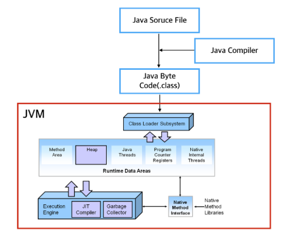

# JVM 이란 ?
`Java Virtual Machine`의 줄임말이며 **Java Byte Code를 OS에 맞게 해석**해주는 역할을 한다.  
Java compiler는 `.java`파일을 `.class`라는 Java Byte Code로 변환시켜준다.  
Byte Code는 기계어가 아니기 때문에 OS에서 바로 실행되지 않는다.  
이 때 JVM은 OS가 Byte Code를 이해할 수 있도록 해석해준다.  

> 하지만 JVM의 해석을 거치기 때문에 C언어 같은 네이티브 언어에 비해 속도가 느렸지만 JIT(Just In Time)컴파일러를 구현해 이 점을 극복했다.

**Byte Code는 JVM위에서 OS상관없이 실행된다.**  

이런점이 Java의 가장 큰 장점이라고 할 수 있다.
OS에 종속적이지 않고 Java파일 하나만 만들면 어느 디바이스든 JVM위에서 실행할 수 있다.

#### JVM의 구조
JVM은 크게 `Class Loader`, `Runtime Data Areas`, `Excution Engine` 3가지로 구성되어 있습니다.

* Class Loader  
Runtime 시점에 클래스를 로딩하게 해주며 클래스의 인스턴스를 생성하면 클래스 로더를 통해 메모리에 로드하게 된다.

* Runtime Data Areas  
JVM이 프로그램을 수행하기 위해 OS로 부터 별도로 할당받은 메모리 공간을 말하며,
Runtime Data Areas는 크게 5가지 영역으로 나눌 수 있다.
    1. PC register `Java는 Platform에 종속받지 않는다`
    2. Java Virtual Machine Stack `Thread 시작시 생성, 다른 Thread에는 접근 불가능`
    3. Native Method Stack
    4. Method Area `클래스, 인터페이스, 메서드, 필드, static등 바이크 코드 보관`
    5. Heap `ClassTaehyeon taehyeon = new ClassTaehyeon();`

* Execution Engine  
Load 된 Class의 ByteCode를 실행하는 Runtime Module이 바로 Excution Engine이다.   
Class Loader를 통해 JVM내의 Runtime Data Areas에 배치된 바이트 코드는 Execution Engine에 의해 실행되며, 실행 엔진은 자바 바이트 코드를 명령어 단위로 읽어서 실행합니다.

