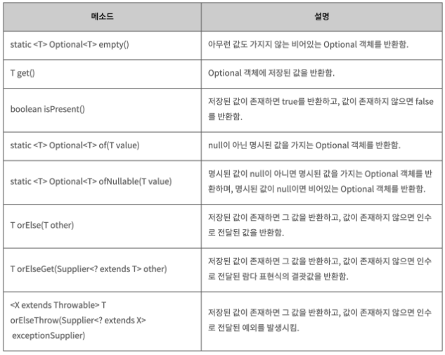

# Optional 이란?
### NPE
개발을 할 때 가장 많이 발생하는 예외 중 하나가 바로  
NPE(NullPointerException)이다.  
NPE를 피하기 위해서는 null을 검사하는 로직을 추가해야하는데,   
null 검사를 해야하는 변수가 많은 경우 코드가 복잡해지고 로직이 상당히 번거롭다.  
그렇기 때문에 null 대신 초기값을 사용하길 권장하기도 한다.

### Optional
Java8에서는 `Optional<T>` 클래스를 사용해 NPE를 방지할 수 있도록 도와준다.  
`Optional<T>`는 **null이 올 수 있는 값을 감싸는 Wrapper 클래스**로, 참조하더라도 NPE가 발생하지 않도록 도와준다.  
Optional 클래스는 아래와 같은 value에 값을 저장하기 때문에 null이더라도 바로 NPE가 발생하지 않으며,   
클래스이기 때문에 각종 메소드를 제공해준다. 

### Optional을 생성하기
* 빈 객체 생성하기
```java
Optional<String> optional = Optional.empty();

System.out.println(optional); //Optional.empty
System.out.println(optional.isPresent()); //false
```

만약 어떤 데이터가 null이 올 수 있는 경우에는 해당 값을 Optional로 감싸서 생성할 수 있다.  
그리고 `orElse` 또는 `orElseGet`메소드를 이용해서 값이 없는 경우라도 안전하게 값을 가져올 수 있다.
```java
// Optional의 value는 값이 있을 수도 있고 null일 수도 있다.
Optional<String> optional = Optional.ofNullable(getName());
String name = optional.orElse("anonymous"); //값이 없다면 "anonymous"를 리턴
```

### Optional 정리
Optional은 null 또는 실제 값을 value로 갖는 wrapper로 감싸서 NPE로 부터 자유로워지기 위해 나온 Wrapper클래스이다.   
따라서 Optional을 반환하는 메소드는 절대 null을 갖는 value를 반환해서는 안된다.  
또한 Optional은 값을 Wrapping하고 다시 풀고, null일 경우에는 대체하는 함수를 호출하는 등의 오버헤드가 있으므로 성능이 저하될 수 있다.  
그렇기 때문에 메소드의 반환값이 절대 null이 아니라면 Optional을 사용하지 않는것이 성능저하가 적다.  
즉, Optional은 메소드의 결과가 null이 될 수 있으며, 클라이언트가 이 상황을 처리해야할 때 사용하는 것이 좋다.

### orElse와 orElseGet 차이
* `orElse` : null이드느 아니든 항상 호출된다.
* `orElseGet` : null일 때만 호출된다.

이와 예외로 `orElseThrow`는  
최종적으로 **연산을 끝낸 후에도 Optional객체가 비어있다면 예외 공급자 함수를 통해 예외를 발생**시킨다.

### Optional 메소드
