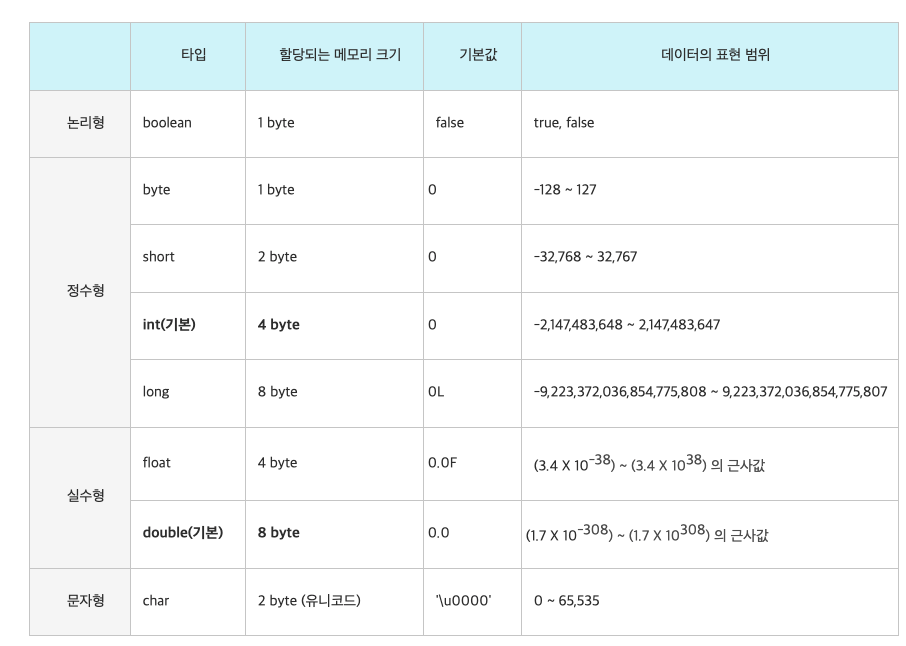

# Primitive Type과 Reference Type

## Primitive type (기본형 타입)
* 총 8가지의 기본형 타입을 미리 정의하여 제공한다.
* 기본값이 있기 때문에 null이 존재하지 않는다. 만약 기본형 타입에 null을 넣고 싶다면 Wrapper class를 활용해야한다.
* 실제 값을 저장하는 공간으로 스택 영역에 저장된다.
* 만약 컴파일 시점에 담을 수 있는 크기를 벗어나면 에러를 발생시키는 컴파일 에러가 발생한다. 주로 문법상의 에러가 대부분이다.

## Reference type (참조형 타입)
* 기본형 타입을 제외한 타입들이 모두 참조형 타입이다.  
* 빈 객체를 의미하는 null이 존재한다.
* 값이 저장되어있는 곳의 주소값을 저장하는 공간으로 스택 영역에 메모리 주소만 저장하고 실제 인스턴스는 힙 영역에 저장된다.