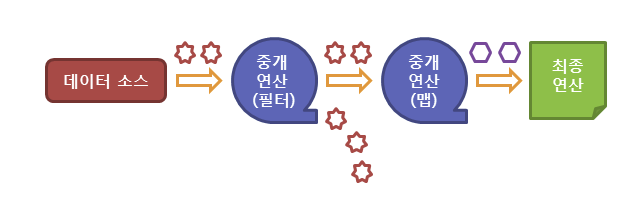

# Stream API 이란?
Java8 부터 지원하는 Stream은 **컬렉션, 배열등에 대해 저장되어있는 요소들을 하나씩 참조하며 반복적인 처리를 가능케하는 기능**이다.  
이러한 Stram을 이용한다면 불필요한 for문과 그 안에서 이루어지는 if문 등의 분기처리를 쓰지 않고도 깔끔하고 직관적인 코드로 변형할 수 있다.

### Stream 특징
1. Stream은 데이터를 변경하지 않는다.
    * Stream은 원본 데이터로부터 데이터를 읽기만 할 뿐, 원본데이터 자체를 변경하지 않는다. 
2. Stream은 일회용이다.
    * Stream은 한번 사용하면 닫혀서 재사용이 불가능하다. 필요하다면 정렬된 결과를 컬렉션이나 배열에 담아 반환할 수 있다.
3. Stream은 작업을 내부 반복으로 처리한다.
    * Stream을 이용한 작업이 간결할 수 있는 비결중 하나가 바로 내부반복이다.     
    내부 반복이라는 것은 반복문을 메서드의 내부에 숨길 수 있다는 것을 의미한다.(반복문이 코드상에 노출되지 않는다 -> 코드가 깔끔해진다.)

### Stream의 구조
> Stream의 구조는 크게 세가지로 볼 수 있다.

1. Stream 생성
2. 중개 연산
3. 최종 연산

이렇게 세가지로 구성되며 중개연산은 연산결과를 Stream형태로 반환하기 때문에 연속적으로 연결해서 사용할 수 있다.  

정리해보면 `데이터소스객체집합.Stream생성().중개연산().최종연산();`이다.



```java
String[] intArray = { "hello world", "red", "green", "blue", "hello" };

Set<String> set = Arrays.asList(intArray) //intArray List로 변경
                .stream() // stream 생성
                .filter(e -> e.startsWith("hello")) //중개연산 (hello로 시작하는 단어)
                .collect(Collectors.toSet()); //최종연산 (중개연산을 통해 가공된 stream을 모아준다)

set.forEach(e -> System.out.println(e));
// hello world
// hello
```

### Stream 생성
> Stream API는 다음과 같은 다양한 데이터 소스에서 생성할 수 있다.
1. 컬렉션
2. 배열
3. 가변 매개변수
4. 지정된 범위의 연속된 정수
5. 특정 타입의 난수들
6. 람다 표현식
7. 파일
8. 빈 스트림

```java
// 컬렉션에서 스트림 생성
ArrayList<Integer> list = new ArrayList<Integer>();
list.add(4);
list.add(2);
list.add(3);
list.add(1);
Stream<Integer> stream = list.stream();
stream.forEach(System.out::println); // forEach() 메소드를 이용한 스트림 요소의 순차 접근
// 4
// 2
// 3
// 1


// 배열에서 스트림 생성
String[] arr = new String[]{"넷", "둘", "셋", "하나"};
Stream<String> stream1 = Arrays.stream(arr);
stream1.forEach(e -> System.out.print(e + " "));
System.out.println();

// 배열의 특정 부분만을 이용한 스트림 생성
Stream<String> stream2 = Arrays.stream(arr, 1, 3);
stream2.forEach(e -> System.out.print(e + " "));
// 넷 둘 셋 하나
// 둘 하나


// 가변 매개변수에서 스트림 생성
Stream<Double> stream = Stream.of(4.2, 2.5, 3.1, 1.9);
stream.forEach(System.out::println);
// 4.2
// 2.5
// 3.2
// 1.9


// 지정된 범위의 연속된 정수에서 스트림 생성
IntStream stream1 = IntStream.range(1, 4);
stream1.forEach(e -> System.out.print(e + " "));
System.out.println();
IntStream stream2 = IntStream.rangeClosed(1, 4);
stream2.forEach(e -> System.out.print(e + " "));
// 1 2 3
// 1 2 3 4

// 특정 타입의 난수로 이루어진 스트림 생성
IntStream stream = new Random().ints(4);
stream.forEach(System.out::println);
// 1072176871
// -649065206
// 133298431
// -616174137


// 람다 표현식에서 스트림 생성 (짝수만으로 이루어진 무한 스트림 생성 예제)
IntStream stream = Stream.iterate(2, n -> n + 2); // 2, 4, 6, 8, 10, ...


// 파일
String<String> stream = Files.lines(Path path); // 라인단위로 접근


// 빈 스트림 생성
Stream<Object> stream = Stream.empty();
System.out.println(stream.count()); // 스트림의 요소의 총 개수를 출력함.
// 0
```

### 중개연산
중개연산은 Stream을 전달받아 Stream으로 반환하므로 중개연산을 연속으로 사용할 수 있다.  
또한, Stream의 중개연산은 필터-맵(filter-map)기반의 API를 사용함으로 지연(lazy) 연산을 통해 성능을 최적화할 수 있다.  

대표적인 중개연산과 그에 따른 메소드  
1. Stream 필터링 : `filter`, `distinct()`
2. Stream 변환 : `map()`, `flatMap()`
3. Stream 제한 : `limit()`, `skip()`
4. Stream 정렬 : `sorted()`
5. Stream 연산 결과 확인 : `peek()`

```java
// filter, distinct
IntStream stream1 = IntStream.of(7, 5, 5, 2, 1, 2, 3, 5, 4, 6);
IntStream stream2 = IntStream.of(7, 5, 5, 2, 1, 2, 3, 5, 4, 6);

// 스트림에서 중복된 요소를 제거함.
stream1.distinct().forEach(e -> System.out.print(e + " ")); // 7 5 2 1 3 4 6

// 스트림에서 홀수만을 골라냄.
stream2.filter(n -> n % 2 != 0).forEach(e -> System.out.print(e + " ")); // 7 5 5 1 3 5


// map, flatMap
Stream<String> stream = Stream.of("HTML", "CSS", "JAVA", "JAVASCRIPT");
stream.map(s -> s.toLowerCase()).forEach(System.out::println); // 해당 스트림의 요소들을 주어진 함수에 인수로 전달하여, 그 반환값들로 이루어진 새로운 스트림을 반환
/*
 * html
 * css
 * java
 * javascript
 */

String[] arr = {"I study hard", "You study JAVA", "I am Developer"};
Stream<String> stream = Arrays.stream(arr);
stream.flatMap(s -> Stream.of(s.split(" +"))).forEach(System.out::println); // 여러 문자열이 저장된 배열을 각 문자열에 포함된 단어로 이루어진 스트림으로 변환
/*
 * I
 * study
 * hard
 * You
 * study
 * JAVA
 * I
 * am
 * Developer
 */


// limit, skip
IntStream stream1 = IntStream.range(0, 10);
IntStream stream2 = IntStream.range(0, 10);
IntStream stream3 = IntStream.range(0, 10);

stream1.skip(4).forEach(n -> System.out.print(n + " ")); // 4 5 6 7 8 9 (스트림의 첫번째 요소부터 전달된 개수만큼 요소를 제외한 나머지 요소만으로 이루어진 새로운 스트림)

stream2.limit(5).forEach(n -> System.out.print(n + " ")); // 0 1 2 3 4 (첫번째 요소부터 전달된 개수만큼의 요소만으로 이루어진 새로운 스트림)

stream3.skip(3).limit(5).forEach(n -> System.out.print(n + " ")); // 3 4 5 6 7 


// sorted
Stream<String> stream1 = Stream.of("JAVA", "HTML", "JAVASCRIPT", "CSS");
Stream<String> stream2 = Stream.of("JAVA", "HTML", "JAVASCRIPT", "CSS");
stream1.sorted().forEach(s -> System.out.print(s + " ")); // CSS HTML JAVA JAVASCRIPT (해당 스트림을 주어진 비교가(comparator)를 이용하여 정렬)

stream2.sorted(Comparator.reverseOrder()).forEach(s -> System.out.print(s + " ")); // JAVASCRIPT JAVA HTML CSS (역순으로 정렬)


// peek
// 이 메소드는 원본 스트림에서 요소를 소모하지 않으므로, 주로 연산과 연산 사이에 결과를 확인하고 싶을 때 사용합니다. (개발자가 디버깅용도로 많이 사용함)
```
> 대표적인 중개 연산 메소드  

|메소드|설명|
|:---|:---|
|Stream`<T>` filter(Predicate<? super T> predicate)	| 해당 스트림에서 주어진 조건(predicate)에 맞는 요소만으로 구성된 새로운 스트림을 반환함.|
|`<R>`Stream`<R>` map(Functoin<? super T, ? extends R> mapper) | 해당 스트림의 요소들을 주어진 함수에 인수로 전달하여, 그 반환값으로 이루어진 새로운 스트림을 반환함.|
|`<R>`Stream`<R>` flatMap(Functoin<? super T, ? extends Stream<? extends R>> mapper) | 해당 스트림의 요소가 배열일 경우, 배열의 각 요소를 주어진 함수에 인수로 전달하여, 그 반환값으로 이루어진 새로운 스트림을 반환함.|
|Stream`<T>` distinct() | 해당 스트림에서 중복된 요소가 제거된 새로운 스트림을 반환함. / 내부적으로 Object 클래스의 equals() 메소드를 사용함.|
|Stream`<T>` limit(long maxSize) | 해당 스트림에서 전달된 개수만큼의 요소만으로 이루어진 새로운 스트림을 반환함.|
|Stream`<T>` peek(Consumer<? super T> action) | 결과 스트림으로부터 각 요소를 소모하여 추가로 명시된 동작(action)을 수행하여 새로운 스트림을 생성하여 반환함.|
|Stream`<T>` skip(long n)	| 해당 스트림의 첫 번째 요소부터 전달된 개수만큼의 요소를 제외한 나머지 요소만으로 이루어진 새로운 스트림을 반환함.|
|Stream`<T>` sorted() / Stream`<T>` sorted(Comparator<? super T> comparator) | 해당 스트림을 주어진 비교자(comparator)를 이용하여 정렬함. / 비교자를 전달하지 않으면 영문사전 순(natural order)으로 정렬함.|

### 최종연산
최종연산은 앞서 중개연산을 통해 만들어진 stream에 있는 요소들에 대해 마지막으로 각 요소를 소모하여 최종 결과를 표시한다.  
즉, 지연(lazy)되었던 모든 중개연산들이 최종연산시에 모두 수행되는 것이다.  
이렇게 **최종연산시에 모든 요소를 소모한 해당 stream은 더이상 사용할 수 없다.**  

대표적인 최종 연산과 그에 따른 메소드
1. 요소의 출력 : `forEach()`
2. 요소의 소모 : `reduce()`
3. 요소의 검색 : `findFirst()`, `findAny()`
4. 요소의 검사 : `anyMatch()`, `allMatch()`, `noneMatch()`
5. 요소의 통계 : `count()`, `min()`, `max()`
6. 요소의 연산 : `sum()`, `average()`
7. 요소의 수집 : `collect()`

```java
// forEach
Stream<String> stream = Stream.of("넷", "둘", "셋", "하나");
stream.forEach(System.out::println); // 각 요소 출력
/*
 * 넷
 * 둘
 * 셋
 * 하나
 */


// reduce
 Stream<String> stream1 = Stream.of("넷", "둘", "셋", "하나");
Stream<String> stream2 = Stream.of("넷", "둘", "셋", "하나");

Optional<String> result1 = stream1.reduce((s1, s2) -> s1 + "++" + s2);
result1.ifPresent(System.out::println);

String result2 = stream2.reduce("시작", (s1, s2) -> s1 + "++" + s2);
System.out.println(result2);
/*
 * 넷++둘++셋++하나
 * 시작++넷++둘++셋++하나
 */


// findFirst, findAny
IntStream stream1 = IntStream.of(4, 2, 7, 3, 5, 1, 6);
IntStream stream2 = IntStream.of(4, 2, 7, 3, 5, 1, 6);

OptionalInt result1 = stream1.sorted().findFirst(); // stream의 모든 요소를 정렬한 후, 첫번째에 위치한 요소를 출력
System.out.println(result1.getAsInt()); // 1

OptionalInt result2 = stream2.sorted().findAny(); // stream의 모든 요소를 정렬한 후, 첫번째에 위치한 요소를 출력
System.out.println(result2.getAsInt()); // 1


// anyMatch, allMatch, noneMatch
IntStream stream1 = IntStream.of(30, 90, 70, 10);
IntStream stream2 = IntStream.of(30, 90, 70, 10);
IntStream stream3 = IntStream.of(30, 90, 70, 10);

System.out.println(stream1.anyMatch(n -> n > 80)); // true (해당 스트림의 일부 요소가 특정 조건을 만족할 경우에 true)
System.out.println(stream2.allMatch(n -> n > 80)); // false (해당 스트림의 모든 요소가 특정 조건을 만족할 경우에 true)
System.out.println(stream2.allMatch(n -> n > 100)); // true (해당 스트림의 모든 요소가 특정 조건을 만족하지 않을 경우에 true)


// count, min, max
IntStream stream1 = IntStream.of(30, 90, 70, 10);
IntStream stream2 = IntStream.of(30, 90, 70, 10);

System.out.println(stream1.count()); // 4
System.out.println(stream2.max().getAsInt()); // 90


// sum, average
IntStream stream1 = IntStream.of(30, 90, 70, 10);
DoubleStream stream2 = DoubleStream.of(30.3, 90.9, 70.7, 10.1);

System.out.println(stream1.sum()); // 200
System.out.println(stream2.average().getAsDouble()); // 50.5


// collect
Stream<String> stream = Stream.of("넷", "둘", "하나", "셋");

List<String> list = stream.collect(Collectors.toList()); // 스트림을 리스트로 변환
Iterator<String> iter = list.iterator();
while(iter.hasNext()) {
    System.out.print(iter.next() + " ");
}
// 넷 둘 하나 셋

// Collectors 클래스의 partitioningBy() 메소드를 이용하여 해당 스트림의 각 요소별 글자수에 따라 홀수와 짝수로 나누어 저장하는 예제
Stream<String> stream = Stream.of("HTML", "CSS", "JAVA", "PHP");

Map<Boolean, List<String>> patition = stream.collect(Collectors.partitioningBy(s -> (s.length() % 2) == 0));

//해당 stream의 각 요소별 글자 수에 따라 홀수와 짝수로 나누어 저장
List<String> oddLengthList = patition.get(false);
System.out.println(oddLengthList); // [CSS, PHP]

List<String> evenLengthList = patition.get(true);
System.out.println(evenLengthList); // [HTML, JAVA]
```

> 대표적인 최종 연산 메소드

|메소드|설명|
|:---|:---|
|void forEach(Consumer<? super T> action) | 스트림의 각 요소에 대해 해당 요소를 소모하여 명시된 동작을 수행함.|
|Optional`<T>` reduce(BinaryOperator`<T>` accumulator) / T reduce(T identity, BinaryOperator`<T>` accumulator) | 처음 두 요소를 가지고 연산을 수행한 뒤, 그 결과와 다음 요소를 가지고 또다시 연산을 수행함. 이런 식으로 해당 스트림의 모든 요소를 소모하여 연산을 수행하고, 그 결과를 반환함.|
|Optional`<T>` findFirst() / Optional`<T>` findAny() | 해당 스트림에서 첫 번째 요소를 참조하는 Optional 객체를 반환함.(findAny() 메소드는 병렬 스트림일 때 사용함)|
|boolean anyMatch(Predicate<? super T> predicate) | 해당 스트림의 일부 요소가 특정 조건을 만족할 경우에 true를 반환함.|
|boolean allMatch(Predicate<? super T> predicate) | 해당 스트림의 모든 요소가 특정 조건을 만족할 경우에 true를 반환함.|
|boolean noneMatch(Predicate<? super T> predicate) | 해당 스트림의 모든 요소가 특정 조건을 만족하지 않을 경우에 true를 반환함.|
|long count() | 해당 스트림의 요소의 개수를 반환함.|
|Optional`<T>` max(Comparator<? super T> comparator) | 해당 스트림의 요소 중에서 가장 큰 값을 가지는 요소를 참조하는 Optional 객체를 반환함.|
|Optional`<T>` min(Comparator<? super T> comparator) | 	해당 스트림의 요소 중에서 가장 작은 값을 가지는 요소를 참조하는 Optional 객체를 반환함.|
|T sum() | 해당 스트림의 모든 요소에 대해 합을 구하여 반환함.|
|Optional`<T>` average() | 해당 스트림의 모든 요소에 대해 평균값을 구하여 반환함.|
|`<R,A>` R collect(Collector<? super T,A,R> collector) | 인수로 전달되는 Collectors 객체에 구현된 방법대로 스트림의 요소를 수집함.|