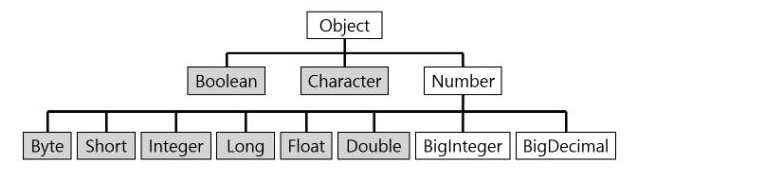
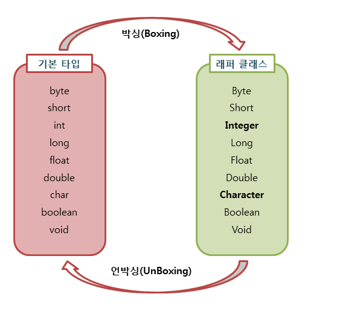

# Wrapper Class
Java의 자료형은 크게 기본타입(char, int, float, double, boolean)과 참조타입(class, interface)로 나누어집니다.  
프로그래밍을 하다보면 기본 타입의 데이터를 객체로 표현해야하는 경우가 있는데    
이 때 **기본 자료타입을 객체로 다루기 위해 사용하는 클래스들을 래퍼 클래스(Wrapper Class)**라고 합니다.

자바의 모든 기본타입은 값을 갖는 객체를 생성할 수 있습니다.  
이런 객체를 포장객체라고도 하는데  
그 이유는 기본 타입의 값을 내부에 두고 포장하기 때문이다.  
래퍼 클래스로 감싸고 있는 기본 타입 값은 외부에서 변경할 수 없습니다.  
만약 값을 변경하고싶다면 새로운 포장객체를 만들어야한다.

### Wrapper Class의 종류
|기본타입|래퍼클래스|
|:---:|:---:|
|byte|Byte|
|char|Character|
|int|Integer|
|float|Float|
|double|Double|
|boolean|Boolean|
|long|Long|
|short|Short|

> 래퍼 클래스는 `java.lang` 패키지에 포함되어있는데,
다음과 같이 기본 타입에 대응되는 래퍼 클래스들이 있습니다.
char타입과 int타입이 각각 Character와 Integer의 래퍼 클래스를 가지고 있고  
나머지는 기본 타입의 첫글자를 대문자로 바꾼 이름을 가지고 있다.

### Wrapper Class 구조도



### 박싱(Boxing), 언박싱(UnBoxing)

**기본 타입의 값을 포장객체로 만드는 과정을 박싱**이라고 하고 반대로  
**포장객체에서 기본 타입의 값을 얻어내는 과정을 언박싱**이라고 합니다.



```java
public class Wrapper_Ex {
    public static void main(String[] args)  {
        Integer num = new Integer(18); // 박싱
        int n = num.intValue(); //언박싱
        System.out.println(n);
    }
}
```

### 자동 박싱(AutoBoxing), 자동 언박싱(AutoBoxing)
기본 타입 값을 직접 박싱, 언박싱하지 않아도 자동적으로 박싱과 언박싱이 일어나는 경우가 있습니다.  
자동 박싱 포장 클래스 타입에 기본값이 대입될 경우에 발생합니다.  
예를 들어 int타입의 값을 Integer클래스 변수에 대입하면 자동 박싱이 일어나 힙 영역에 Integer객체가 생성됩니다.

```java
public class Wrapper_Ex {
    public static void main(String[] args)  {
        Integer num = 17; // 자동 박싱
        int n = num; //자동 언박싱
        System.out.println(n);
    }
}
```

### 값 비교
```java
public class Wrapper_Ex {
    public static void main(String[] args)  {
        Integer num = new Integer(10); //래퍼 클래스1
        Integer num2 = new Integer(10); //래퍼 클래스2
        int i = 10; //기본타입
		 
        System.out.println("래퍼클래스 == 기본타입 : "+(num == i)); //true
        System.out.println("래퍼클래스.equals(기본타입) : "+num.equals(i)); //true
        System.out.println("래퍼클래스 == 래퍼클래스 : "+(num == num2)); //false
        System.out.println("래퍼클래스.equals(래퍼클래스) : "+num.equals(num2)); //true
    }
}
```

래퍼 객체는 내부의 값을 비교하기 위해 `==` 연산자를 사용할 수 없습니다.  
이 연산자는 내부의 값을 비교하는 것이 아니라 래퍼 객체의 참조주소를 비교하기 때문입니다.  
비교 대상인 래퍼는 객체이므로 서로의 참조 주소가 다릅니다.   
객체끼리의 비교를 하려면 내부의 값만 얻어 비교해야 하기에 `equals`를 사용해야합니다.  
래퍼클래스와 기본자료형과의 비교는 `==` 연산과 `equals` 연산 모두 가능합니다.  
그 이유는 컴파일러가 자동으로 오토방싱과 언박싱을 해주기 때문입니다.

~~박싱 언박싱 항상 주의해서 사용해라 잘못쓰면 메모리 터진다~~