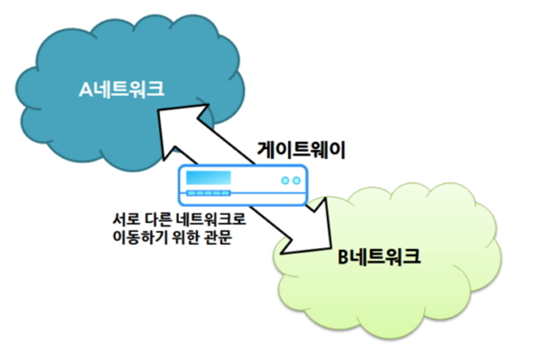
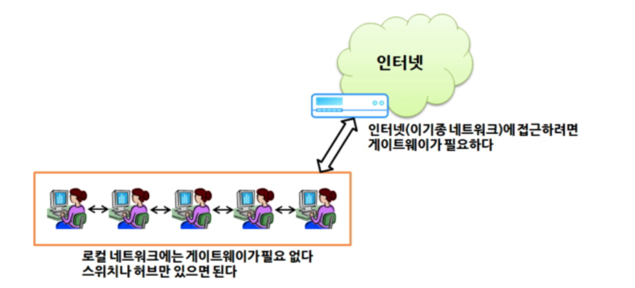

# Gateway란?
게이트웨이는 `관문`이나 `출입구`라는 의미로 다양한 분야에서 일반적으로 사용되는 용어입니다.  
컴퓨터 네트워크에서의 게이트웨이는 현재 사용자가 위치한 네트워크에서 다른 네트워크로 이동하기 위해 반드시 커쳐야하는 거점을 의미합니다.  
> 자동차가 고속도로로 진입하기 위해 통과하는 톨게이트와 유사한 개념입니다.  

두 컴퓨터가 네트워크 상에서 서로 연결되려면 동일한 통신 프로토콜을 사용해야합니다.  
따라서 프로토콜이 다른 네트워크 사으이 컴퓨터와 통신하려면 두 프로토콜을 적절히 변환해주는 변환기가 필요한데, 게이트웨이가 바로 이러한 변환기 역할을 합니다.  
> 한국인과 미국인 사이에 원활한 의사소통을 위해 통역사를 두는 것과 동일합니다.  

### 게이트웨이는 네트워크간 톨게이트

우리가 가깝게 사용하는 게이트웨이가 있습니다.  
인터넷 유무선 공유기가 예시가 될 수 있죠.  
공유기는 사용자 컴퓨터의 네트워크와 인터넷을 연결하여 사용자가 웹 사이트에 접근할 수 있도록 관문을 열어줍니다.  
사용자가 속해있는 로컬네트워크의 통신 프로토콜과 인터넷의 통신 프로토콜이 다르기 때문입니다.  
참고로 공유기는 게이트웨이의 역할과 라우터의 역할, 방화벽 역할 등을 동시에 제공하는 종합 네트워크 장비입니다.

### 인터넷을 위한 필수 조건
해당 컴퓨터가 속해있는 로컬 네트워크 구역 내에서는 IP주소와 서브넷 마스크만 있어도 주변 컴퓨터와 통신이 가능합니다.  
다른 네트워크 구역으로 나갈 필요가 없기 때문입니다.  
하지만 인터넷 등의 이기종 네트워크로 나가기 위해서는 게이트웨이(라우터 등)가 있어야 하고, IP주소, 서브넷 마스크와 함께 게이트웨이 주소까지 정확하게 설정해야 합니다.  

컴퓨터가 서로 통신하기 위해서는 모든 컴퓨터마다 유일한 IP주소를 할당해야 하듯. 게이트웨잉에도 중복되지 않는 IP주소가 필요합니다.  
이 IP주소를 토대로 각 컴퓨터가 다른 네트워크와 연결됩니다.  
일반적으로 게이트웨이의 IP주소는 해당 네트워크 내 컴퓨터에 할당된 IP주소 중 끝자리만 다른 형태입니다.  
보통 1을 지정합니다.  
이를테면 컴퓨터 IP주소가 `123.123.123.123`이라면 게이트웨이 주소는 `123.123.123.1`이 됩니다  
물론 게이트웨이 IP주소 설정이 잘못되면 외부 네트워크(인터넷) 연결이 불가능합니다.