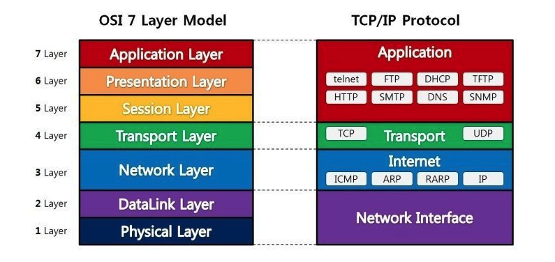

# OSI 7계층
### 개념
* 개방형 시스템 상호 연결 모델의 표준임
* 실제 인터넷에서 사용되는 TCP/IP는 OSI 참조 모델을 기반으로 상업적으로 실무적으로 이용될 수 있도록 단순화 한 것임

### 작동 원리
* OSI 7계층은 응용, 표현, 세션, 전송, 네트워크, 데이터링크, 물리계층으로 나뉜다.  
* 전송 시 7계층에서 1계층으로 각각의 층마다 인식할 수 있어야 하는 헤더를 붙인다.(캡슐화)  
* 수신 시 1계층에서 7계층으로 헤더를 떼어낸다.(디캡슐화)  
* 출발지에서 데이터가 전송될 때 헤더가 추가되는데 2계층에서만 오류제어를 위해 꼬리 부분에 추가된다.  
* 물리계층에서 1, 0의 신호가 되어 전송 매체(동축케이블, 광섬유 등)을 통해 전송된다.

### 물리계층 (Physical Layer)
* 7계층 중 최하위 계층
* 주로 전기적, 기계적, 기능적인 특성을 이용해 데이터를 전송
* 데이터는 0과 1의 비트열, 즉 On, Off의 전기적 신호 상태로 이루어져 해당 계층은 단지 데이터를 전달
* 단지 데이터 전달의 역할을 할 뿐이라 알고리즘, 오류제어 기능이 없음
* 장비로는 케이블, 리피터, 허브가 있음

### 데이터링크 계층 (Data-Link Layer)
* 물리적인 연결을 통하여 인접한 두 장치간의 신뢰성 있는 정보 전송을 담당(Point-To-Point 전송)
* 안전한 정보의 전달이라는 것은 오류나 재전송하는 기능이 존재
* MAC 주소를 통해서 통신
* 데이터 링크 계층에서 데이터 단위는 프레임(Frame)
* 장비로는 브리지, 스위치가 있다.

### 네트워크 계층 (Network Layer)
* 중계 노드를 통하여 전송하느 ㄴ경우 어떻게 중계할 것인가를 규정
* 라우팅 기능을 맡고 있는 계층으로 목적지까지 가장 안전하고 빠르게 데이터를 보내는 기능을 가지고 있음 (최적의 경로를 설정가능)
* 컴퓨터에게 데이터를 전송할지 주소를 갖고 있어서 통신가능(=우리가 자주 듣는 IP 주소가 바로 네트워크 계층 헤더에 속함)
* 네트워크 계층에서 데이터 단위는 패킷(Packet)
* 장비로는 라우터, L3 스위치가 있다.

### 전송 계층 (Transport Layer)
* 종단 간 신뢰성 있고 정확한 데이터 전송을 담당
* 송신자와 수신자 간의 신뢰성있고 효율적인 데이터를 전송하기 위하여 오류검출 및 복구, 흐름제어와 중복검사 등을 수행
* 데이터 전송을 위해서 port 번호를 사용함 (대표적인 프로토콜로 TCP와 UDP가 있다.)
* 전송 계층에서 데이터 단위는 세그먼트(Segment)

### 세션 계층 (Sesstion Layer)
* 통신 장치 간 상호작용 및 동기화를 제공
* 연결 세션에서 데이터 교환과 에러 발생 시의 복구를 관리

### 표현 계층 (Presentation Layer)
* 데이터를 어떻게 표현할지 정하는 역할을 하는 계층
* 표현 계층은 세가지의 기능을 갖고 있다.
    1. 송신자에서 온 데이터를 해석하기 위한 응용계층 데이터 부호화ㅡ 변화
    2. 수신자에서 데이터의 압축을 풀 수 있는 방식으로 된 데이터 압축
    3. 데이터의 암호화 복호화
        > MIME 인코딩이나 암호화 등의 동작이 표현계층에서 이루어진다.  
        EBCDIC로 인코딩된 파일을 ASCII로 인코딩된 파일로 바꿔주는 것이 한가지 예시이다.

### 응용 계층 (Application Layer)
* 사용자와 가장 밀접한 계층으로 인터페이스 역할
* 응용 프로세스 간의 정보 교환을 담당
* ex) 전자메일, 인터넷, 동영상 플레이어 등