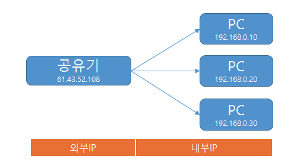
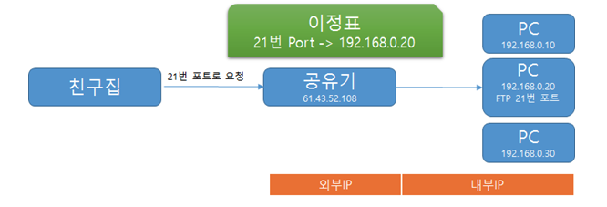

# 포트 포워딩이란 ? (포트 매핑)

포트 포워딩이란 컴퓨터 네트워크에서 패킷이 라우터나 방화벽 같은 네트워크 게이트웨이를 통과하는 동안 네트워크 주소를 변환해주는 것을 의미합니다.  
쉽게 말해 **외부에서 접속이 가능하도록 하는 것** 입니다.

예를 들어보겠습니다  
공유ㅜ기를 설치하게 되면 공유기와 연결된 PC들은 192.168~ 로 시작하는 IP를 공유기로부터 부여받게 됩니다.  
그리고 공유기는 ISP 업체로부터 할당받은 IP를 가지게 됩니다.  

공유기를 기점으로 공유기 뒤에 있는 PC들은 내부 IP라고 부르고, 공유기를 외부 IP라고 부르게 됩니다.  
그런데 만약 다른 영역에 있는 PC에서 내부 IP에 있는 192.168.0.20 PC에 접속하고자 하는 요청이 들어왔을 때 공유기는 어느 PC로 연결을 해주어야 할지 모르는 상태가 됩니다.

이러한 상황에서 공유기에게 해당 포트로 요청이 오면 192.168.0.20 PC로 연결하라는 이정표를 달아주는 것을 **포트 포워딩**이라고 합니다.

포트 포워딩은 공유기 뿐만 아니라 우리가 흔히 사용하는 클라우드 서비스에서도 동일하게 적용됩니다.  
> EC2 포트 범위