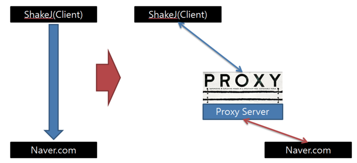
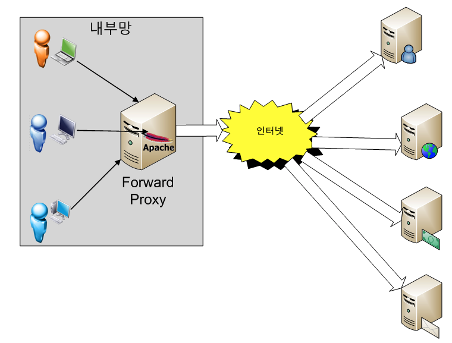
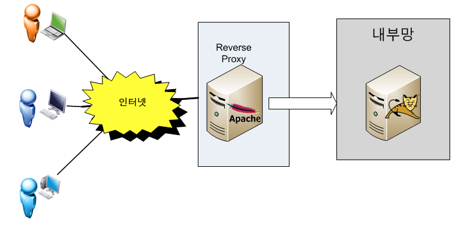

# 프록시란?
프록시란 `대리`라는 의미로, 네트워크 기술에서는 프로토콜에 있어서 대리 응답 등에서 친숙한 개념이다.

보안 분야에서는 주로 보안상의 이유로 직접 통신할 수 없는 두 점 사이에서 통신을 할 경우 그 사이에 있어서 중계기로서 대리로 통신을 수행하는 기능을 가리켜 `프록시` 그 중계기능을 하는 것을 프록시 서버라고 부른다.

### 프록시 서버의 특징
프록시 서버는 클라이언트 입장과 서버의 입장에서 볼 때 서로 상반되는 역할을 하는 것 처럼 인식된다.  
클라이언트 호스트에서의 입장에서 본다면 프록시 서버는 마치 원격서버처럼 동작하는 것이고, 원격 서버에서의 입장에서 본다면 마치 클라이언트처럼 동작한다는 것입니다.  

* 프록시 서버는 단순히 보안상의 이유만으로 설치하는 것은 아니다.   

물론 보안상의 목적으로 설치하는 경우가 많겠지만  
그렇다고 그렇게 단순하게 볼 수 만은 없을 것이다.  
우선 프록시 서버는 프록시 서버에 요청된 내용들을 캐시를 이용해 저장해둔다.  
이렇게 캐시를 해 두고 난 후에,  
**캐시 안에 있는 정보를 요구하는 요청에 대해서는 원격 서버에 접속하여 데이터를 가져올 필요가 없게 됨으로써 전송 시간을 절약**할 수 있게 됨과 동시에 **불필요하게 외부와의 연결을 하지 않아도 된다**는 장점을 갖게된다.  
또한 **외부와의 트래픽을 줄이게 됨으로써 네트워크 병목현상을 방지**하는 효과도 얻을 수 있게 된다.

### 프록시 서버의 종류
> 서버의 위치에 따라 분류하면 크게 두가지로 나눌 수 있다.

* Forward 프록시  

이 프록시 서버는 `프록시 서버를 클라이언트 호스트들과 접근하고자 하는 원격 리소스의 사이에 위치시키는 것` 이다.  
이 프록시 서버는 원격 서버로부터 요청된 리소스를 가져와서 요청한 사용자에서 돌려주는 역할을 수행하며,  
만일 캐시에 데이터가 남아있다면 다음 요청시 캐시된 데이터로부터 제공해주게된다.  
이 서버는 전형적으로 로컬 디스크에 데이터를 저장하며. 클라이언트 호스트들은 사용중인 웹 브라우저를 이용하여 프록시 서버 사용 설정을 해야하므로 프록시 서버를 사용하고 있다는 것을 인식할 수 있을것이다.  
이 방식은 대역폭 사용을 감소시킬 수 있다는 것과 접근 정책 구현에 있어 다루기 쉬우면서도 비용이 저렴하다는 장점을 갖습니다.  
또한 사용자의 정해진 사이트만 연결할 수 있는 등 웹 사용 환경을 제한할 수 있으므로 기업 환경등에서 많이 사용합니다.

* Reverse 프록시

이것은 프록시 서버를 `인터넷 리소스 또는 인트라넷 리소스 앞에 위치시키는 방식`이다.  
이 방식을 사용하면 클라이언트들이 프록시 서버에 연결되었다는것을 알지 못하게 되며, 마치 최종 사용자가 요청 리소스에 직접 접근하는 것과 같이 느끼게 된다.  
내부 서버가 직접 서비스를 제공해도되지만 이렇게 구성하는 이유는 보안때문이다.  
보통 기업의 네트워크 환경은 DMZ라고 하는 내부 네트워크와 외부 네트워크 사이에 위치하는 구간이 존재하며 이 구간에는 메일서버, 웹서버, FTP 서버등 외부 서비스를 제공하는 서버가 위치하게 된다.  
예를들어 태현테크는 서비스를 자바로 구현해서 WAS를 DMZ에 놓고 서비스 해도 되지만 WAS는 보통 DB서버와 연결되므로 WAS가 최전방에 있으면 WAS가 털릴 경우 DB서버까지 같이 털리는 심각한 문제가 발생할 수 있다.  
이 때문에 리버스 프록시 서버를 두고 실제 서비스 서버는 내부망에 위치시키고 프록시 서버만 내부에 있는 서비스 서버와 통신해서 결과를 클라이언트에게 제공하는 방식으로 서비스를 하게된다.  
특히 리눅스 환경에서 리버스 프록시로 아파치 웹 서버를 사용한다면 SELinux를 켜 놓으면 SELinux의 기본 정책이 웹 서버는 톰캣의 8080, 8009 포트만 접근할 수 있으므로 아파치 웹 서버가 해킹당해도 웹 서버 권한으로는 내부망으로 연결이 불가하다.  
또한 리버스 프록시 방식은 각 요청에 대한 데이터가 캐시되기 때문에 프록시 서버는 실제 서버들을 위한 부하조절 기능을 가질 수 있다

