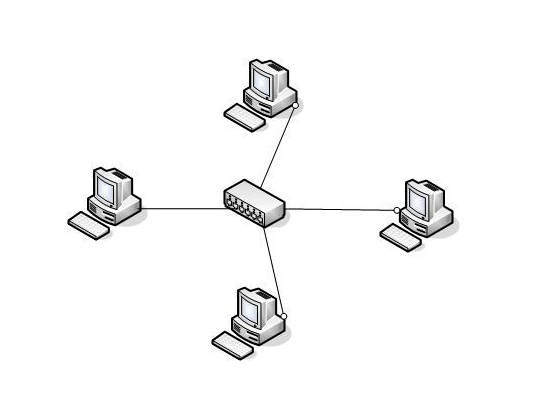
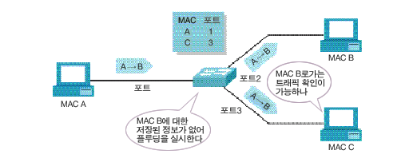
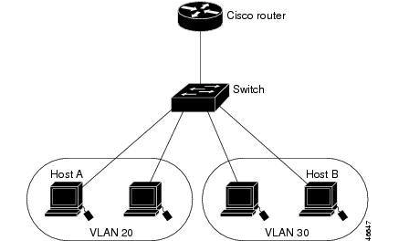
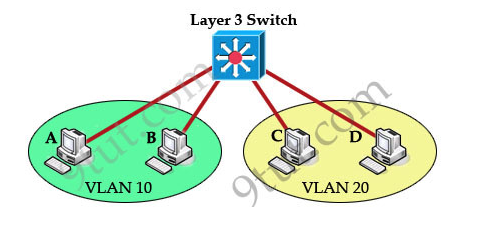

# 스위치, 라우터, 허브

### 리피터
상위계층에서 사용하는 MAC주소나 IP주소를 이해하지 못하고 단순히 전기적은 신호만 증폭시키는 역할을 한다.
* 전기적인 신호를 증폭시켜 먼 거리까지 도달할 수 있도록 하는 장비
* 전체 LAN에 접속할 수 있는 장비의 수 증가

### 허브
**전기적인 신호를 증폭시켜 LAN의 전송거리를 연장시키고 여러대의 장비를 LAN에 접속할 수 있도록 합니다.**  
UTP 케이블을 사용하는 환경헤서 장비들을 상호 연결시키는 콘센트레이터 역할도 함께 제공합니다.  
한 장비에서 전송된 데이터 프레임을 허브로 연결된 모든 장비에게 다 전송하는 플러딩이 발생 -> 프레임 충돌 발생 증가, 네트워크 성능 저하 (하프두플렉스때문)

### 브리지
허브와 마찬가지로 **이더넷 장비를 물리적으로 연결시키고 프레임의 전송거리를 연장**시켜준다.  
단순히 전기적인 신호를 증폭시키는 것이 아니라 프레임을 다시 만들어 전송합니다.   
지금은 쓰이지 않고 있으나 용어는 쓰입니다.

### 스위치
MAC주소와 포트번호가 기록된 MAC주소 테이블을 가지고있어 **목적지 MAC주소를 가진 장비가 연결된 포트로만 프레임을 전송합니다.**  
스위치는 각각의 포트가 하나의 충돌영역에 있습니다.  
프레임의 목적지 MAC주소가 브로드캐스트일 때 수신 프레임을 모든 포트로 전송하며 이것을 플러딩이라고 합니다.  
스위치에 접속된 장비가 많아질 수록 브로드 캐스트 트래픽도 증가하고 이로인한 네트워크 성능저하가 심각해집니다.  
이를 해결하기위해 Vlan이 도입됩니다.

### 라우터
**IP주소 등 레이어 3 헤더에 있는 주소를 참조하여 목적지와 연결되는 포트로 패킷을 전송합니다.**   
네트워크 주소가 서로 다른 장비들을 연결할 때 사용합니다.  
또 원격지에 위치한 네트워크들을 연결하는 경우가 많습니다.  
Vlan이 서로 다른 장비들간의 통신은 L3 스위치, 라우터 등 L3장비를 통해야만 가능합니다.

### L3 스위치
**Vlan간 라우팅을 위해 사용**합니다.  
Vlan 포트간 스위칭 기능을 제공하고, 서로 다른 Vlan 포트간에는 라우팅 기능을 제공합니다.  
라우터보다 라우팅 속도가 빠르지만 장거리 통신망을 연결하는 포트도 있습니다.

