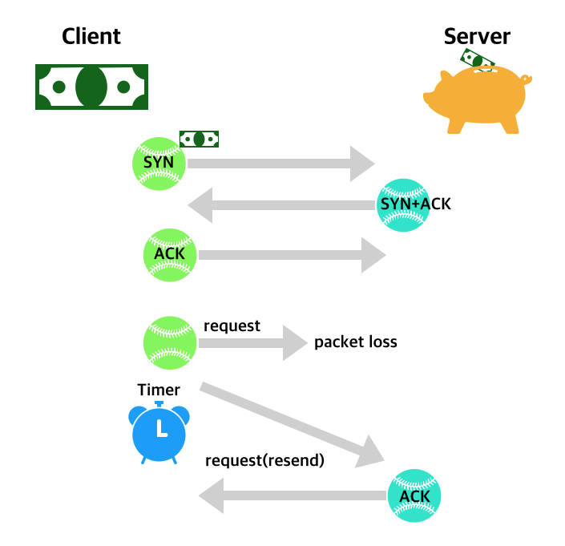
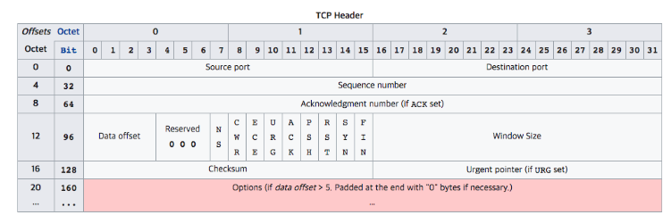

# TCP가 신뢰성을 보장하는 방법
TCP는 특성상 자신이 보낸 데이터에 대해서 상대방이 받았다는 의미의 응답 패킷을 다시 받아야 통신이 정상적으로 이뤄졌다고 생각합니다.  

그래서 만약 자신이 보낸 데이터에 대한 응답 패킷을 받지 못하면 패킷이 유실되었다고 판단하고 보냈던 패킷을 다시 한번 보냅니다.  

이 과정을 TCP 재전송이라고 합니다.  

TCP 재전송은 보냈던 패킷을 다시 한번 보내기 때문에 네트워크 성능 저하가 생길 수 밖에 없지만 TCP 통신의 특성상 반드시 필요한 과정입니다.  

이런한 TCP 재전송은 생각보다 자주 일어날 수 있으며,  
이를 대비할 수 있는 예외처리를 해두는 것이 서비스 품질 유지에 도움 됩니다.  

**TCP는 신뢰성있는 연결이라고 하죠.**  

`신뢰성있는` 이라는 표현을 통해 알 수 있는 것처럼 UDP와는 다르게 데이터를 주고 받는 두 종단 간에 데이터를 주고 받음이 확실해야합니다.  

보낸 쪽에선 내가 보낸 데이터를 상대방이 받았다는 응답을 보내야만 나머지를 보낼 수 있죠.   

이를 통해 TCP를 통해 주고 받은 데이터는 정확한 데이터라고 확신하게 됩니다.  

이러하여 TCP가 신뢰성이 있다고 말할 수 있는거죠.

위를 보면 3way handshake 과정 이후에 들어온 요청의 packet이 유실되어 time out이 발생되고, 재전송을 하며 수신지에서 받았다는 응답을 보내줍니다.

### 어떻게 요청을 받는 쪽에서는 TCP Segment에 오류가 있는지 알 수 있나요 ?
이를 확인하기에 앞서 TCP Segment의 Header 부분을 볼 필요가 있습니다.  

위 TCP Header에서 오류를 체크하는 부분은 128비트 부터 시작하는 Checksum 부분입니다.  
이 Checksum Error Detecting을 통해 수신자는 송신자가 보낸 데이터가 제대로 보내졌는지 확인 할 수 있으며 잘못보내졌을 경우 위 TCP Flag 중에서 ACK Flag를 reset(0)하여 보냅니다.  
제대로 보내졌을 경우에는 ACK Flag를 set(1)하고 Acknowlegment number에 수신자가 받았던 sequence number에 1을 더한 sequence number+1의 값을 넣어서 보내줍니다.

### 순서가 뒤바뀐 TCP Segment는 어떻게 처리하나요 ?
순서가 뒤바뀐 TCP 또한 잘 처리할 수 있습니다.  
왜냐하면 Sequence number가 있기 대문에 수신자 측에서 이러한 Sequence nember 순서대로 데이터 청크들을 잘 붙여주기만 하면 되기 때문입니다.  

### 만약 수신자가 송신자에게 ACK, NAK도 못 보낼 상황이라면 ?
이러한 경우에는 `timeout` 개념을 사용합니다.  
일정 시간동안 ACK 또는 NAK이 오지 않는다면 timeout된 시점에서 다시 TCP Segment를 보내주게 됩니다.  
timeout 주기를 너무 길게 생성하면 퍼포먼스의 하락을 가져오고 너무 짧게 설정해도 계속 다시 쓰기 때문에 역시 퍼포먼스의 하락을 가져옵니다.

최근 추이에 따라 `RTO(Retransmission Time Out)`을 사용하여 타이머의 작동 시간을 가져옵니다.