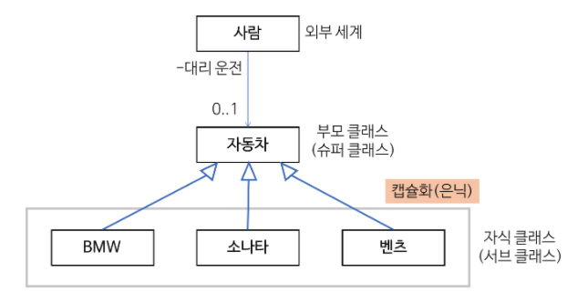

# OOP (객체지향 프로그래밍)

## 객체지향 프로그래밍이란?
: 컴퓨터 프로그램을 명령어의 목록으로 보는 시각에서 벗어나 여러개의 독립된 단위, 즉 **객체**들의 모임으로 보는 컴퓨터 프로그래밍 패러다임이다.
> 각각의 객체는 메세지를 주고받고 데이터를 처리 할 수 있다

## 객체지향 프로그래밍의 장점?
- 프로그램을 유연하고 변경을 용이하게 만든다
- 프로그램의 개발과 보수를 간편하게 만든다
- 직관적인 코드 분석이 가능하다
> 주로 대규모 소프트웨어 개발에 많이 사용됨   

: 하지만 지나친 프로그램의 객체화 경향은 실제 세계의 모습을 그대로 반영하지 못한다는 비판을 받기도 한다

### 응집력(Cohesion)
: 프로그램의 한 요소가 해당 기능을 수행하기 위해 얼마만큼의 연관된 책임과 아이디어가 뭉쳐있는지를 나타내는 정도
- 프로그램의 한 요소가 특정 목적을 위해 밀접하게 연관된 기능들이 모여서 구현되어있음
- 지나치게 많은 일을 하지않으면 그것을 응집력이 높다고 표현함

### 결합력(Coupling)
: 프로그램 코드의 한 요소가 다른것과 얼마나 강력하게 연결되어있는지 얼마나 의존적인지를 나타내는 정도
- 결합력이 낮다는 것은 한 요소가 다른 요소들과 관계를 크게 맺고있지 않은 상태를 의미한다

### **OOP의 경우 클래스에 하나의 문제 해결을 위해 데이터를 모아 놓은 객체를 활용한 프로그래밍을 지향하므로 응집력을 강화하며, 클래스 간에 독립적으로 디자인함으로써 결합력을 약하게 할 수 있다.**

## OOP의 기본 구성요소
- Class (클래스)
    - 같은 종류의 집단에 속하는 속성과 행위를 정의한 것
    - 다른 클래스와 독립적으로 디자인 해야한다
    - 필드, 메서드, 생성자로 이루어져있다
- Object (객체)
    - 클래스의 인스턴스(Instance)
    - 상위 클래스의 속성을 가지고있다
    - 개별적인 특성화 행위(Method)를 가지고있다
- Method (메서드)
    - 클래스로부터 생성된 객체를 사용하는 방법
    - 객체의 속성을 조작하는데 사용된다

## OOP의 특성
### 캡슐화 (Encapsulation)
: 캡슐화란 객체의 데이터를 외부에서 직접 접근하지 못하게 막고, 함수를 통해서만 조작이 가능하게 하는 작업이다
- 변수나 메서드를 하나로 묶는 것
- 자신이 가지고 있는 속성에 대해서 해당 상태를 변경하는 기능을 제공해야한다
- 각각의 메서드는 서로 연관성이 있어야 한다
- 객체의 데이터를 외부에서 직접접근을 막는다
- 함수를 통해서만 조작가능하다 (Ex) getter, setter, 생성자 등)
- 예시)public, private, protected, deault  
> 즉 캡슐화는 은닉성(중요한 데이터를 보존, 보호하기위해 사용한다고 보면된다)

### 추상화(Abstraction)
: 추상화는 객체들이 가진 공통의 특성들을 파악하고 불필요한 특성들을 제거하는 과정을 말한다
- 객체들이 가진 공통의 특성들을 파악하고 불필요한 특성들을 제거하는 과정
- 객체들이 가진 동작들을 기준으로 이용자들이 동작만 쉽게 구동할 수 있도록한다

### 일반화 관계(Generalization)
: 일반화는 여러개체들이 가진 공통된 특성을 부각시켜 하나의 개념이나 법칙으로 성립시키는 과정이다
> 객체지향 프로그래밍 관점에서는 상속관계라 한다
- 속성이나 기능의 재사용만 강조해서 사용하는 경우가 많다
- 하지만 이는 일반화관계를 극히 한정되게 바라보는 시각이다

#### 일반화는 또 다른 캡슐화
: 일반화 관계는 자식 클래스를 외부로부터 은닉하는 캡슐화의 일종이다

Ex

- '사람'클래스 관점에서는 구체적인 자동차의 종류가 숨겨져있다
- 즉 대리운전자가 자동차의 종류에 따라 운전에 영향을 받지는 않을 것
- 이렇게 새로운 자동차를 운전해야 하는 경우에도 '사람'클래스는 영향을 받지 않는다
> 일반화 관계는 한 클래스 안에 있는 속성 및 연산들의 캡슐화에 한정되지 않는다
- 즉 외부세계에 자식클래스 자체를 캡슐화(은닉)하는 것으로 확장된다
- 서브클래스의 캡슐화는 외부 클라이언트가 개별적인 클래스들과 무관하게 프로그래밍을 할 수 있게한다.

### 다형성(Polymorphism)
: 다형성은 서로다른 클래스의 객체가 같은 메시지를 바았을 때 각자의 방식으로 동작하는 능력이다
- 다형성은 상속과 연계되어 동작하면 매우 효과적이다
- 다형성과 일반화 관계는 코드를 간결하게 할 뿐만 아니라 변화에도 유연하게 대처할 수 있게한다
- Ex) @Overriding, Overloading
```java
// 부모 클래스
public abstract class Pet {
  public abstract void talk();
}

// 자식 클래스
public class Cat extends Pet {
  public void talk(){ System.out.println("야옹"); }
}
public class Dog extends Pet {
  public void talk(){ System.out.println("멍멍"); }
}
public class Parrot extends Pet {
  public void talk(){ System.out.println("안녕"); }
}
```