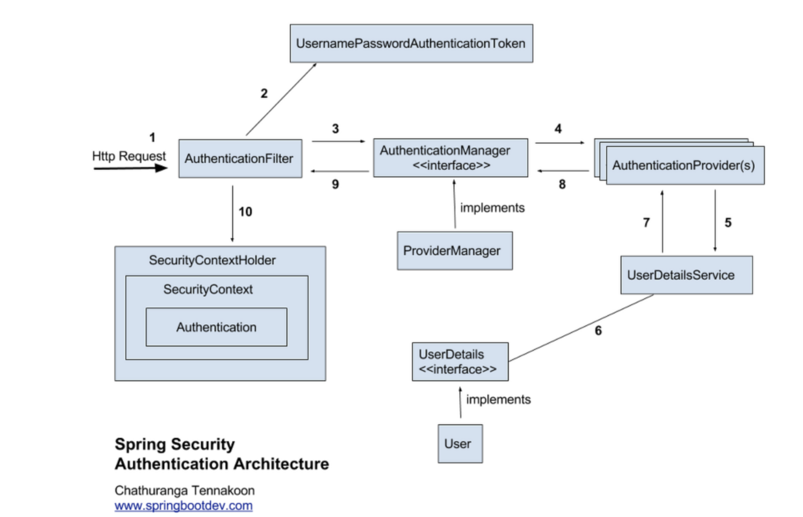
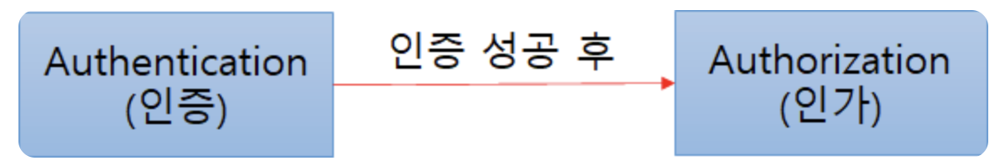

# Spring Security란?
: 스프링 시큐리티는 **스프링 기반의 애플리케이션 보안(인증과 권한, 인가 등)을 담당하는 스프링 하위 프레임워크**이다.

Spring Security는 **인증과 권한에 대한 부분을 Filter흐름에 따라 처리**하고있다.

> Filter는 Dispatcher Servlet으로 가기 전에 적용되므로 가장 먼저 URL 요청을 받지만, Interceptor는 Dispatcher와 Controller사이에 위치한다는 점에서 적용 시기의 차이가 있다.

Spring Security는 **보안과 관련해서 체계적으로 많은 옵션을 제공**해주기 때문에   
**개발자 입장에서는 일일이 보안관련 로직을 작성하지 않아도 된다**는 장점이 있다.

### Spring Security Architecture

### 인증(Authorizatoin)과 인가(Authentication)?
- 인증(Authorizatoin) : 해당 사용자가 본인이 맞는지를 확인하는 절차
- 인가(Authentication) : 인증된 사용자가 요청한 자원에 접근 가능한지를 결정하는 절차 

> Spring Security는 기본적으로 인증 절차를 거친 후에 인가 절차를 거치게 되며,   
인가 과정에서 해당 리소스에 대한 접근권한이 있는지 확인하게 된다.

Spring Security에서는 이러한 인증과 인가를 위해 `Principal`을 아이디로, `Credentia`l을 비밀번호로 사용하는 `Credential` 기반의 인증 방식을 사용한다.
- Principal(접근주체) : 보호받는 Resource에 접근하는 대상
- Credential(비밀번호) : Resource에 접근하는 대상의 비밀번호

### Spring Security Filter

### Spring Security 주요모듈
