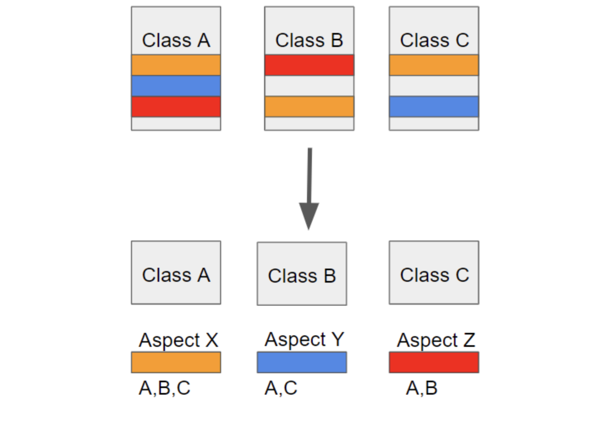

# AOP (Aspect Oriented Programming)

- AOP는 Aspect Oriented Programming의 약자로 관점 지향 프로그래밍이라고 불린다.

- 관점 지향은 쉽게 말해 **어떤 로직을 기준으로 핵심적인 관점, 부가적인 관점으로 나누어서 보고 그 관점을 기준으로 각각 모듈화하겠다는 것이다.** (여기서 모듈화란 어떤 공통된 로직이나 기능을 하나의 단위로 묶는 것을 말한다.)

- 예로들어 핵심적인 관점은 결국 우리가 적용하고자 하는 핵심 비즈니스 로직이 된다. 또한 부가적인 관점은 핵심 로직을 실행하기 위해서 행해지는 데이터베이스 연결, 로깅, 파일 입출력 등을 예로 들 수 있다.

- **AOP**에서 각 관점을 기준으로 로직을 모듈화한다는 것은 코드들을 부분적으로 나누어서 모듈화하겠다는 의미다. 이때, 소스 코드상에서 다른 부분에 계속 반복해서 쓰는 코드들을 발견할 수 있는 데 이것을 **흩어진 관심사 (Crosscutting Concerns)** 라 부른다.

- 위와 같이 흩어진 관심사를 **Aspect로 모듈화하고 핵심적인 비즈니스 로직에서 분리하여 재사용하겠다는 것이 AOP의 취지**다.

> AOP의 주요개념
- **Aspect** : 위에서 설명한 흩어진 관심사를 모듈화 한 것. 주로 부가기능을 모듈화함.
- **Target** : **Aspect**를 적용하는 곳 (클래스, 메서드 .. )
- **Advice** : 실질적으로 어떤 일을 해야할 지에 대한 것, 실질적인 부가기능을 담은 구현체
- **JointPoint** : **Advice**가 적용될 위치, 끼어들 수 있는 지점. 메서드 진입 지점, 생성자 호출 시점, 필드에서 값을 꺼내올 때 등 다양한 시점에 적용가능
- **PointCut** : **JointPoint**의 상세한 스펙을 정의한 것. 'A란 메서드의 진입 시점에 호출할 것'과 같이 더욱 구체적으로 **Advice**가 실행될 지점을 정할 수 있음.

> 스프링 AOP의 특징
- 프록시 패턴 기반의 AOP 구현체, 프록시 객체를 쓰는 이유는 접근 제어 및 부가기능을 추가하기 위해서이다.
- 스프링 빈에만 AOP를 적용 가능
- 모든 AOP 기능을 제공하는 것이 아닌 스프링 IoC와 연동하여 엔터프라이즈 애플리케이션에서 가장 흔한 문제(중복코드, 프록시 클래스 작성의 번거로움, 객체들 간 관계 복잡도 증가 ...)에 대한 해결책을 지원하는 것이 목적이다.