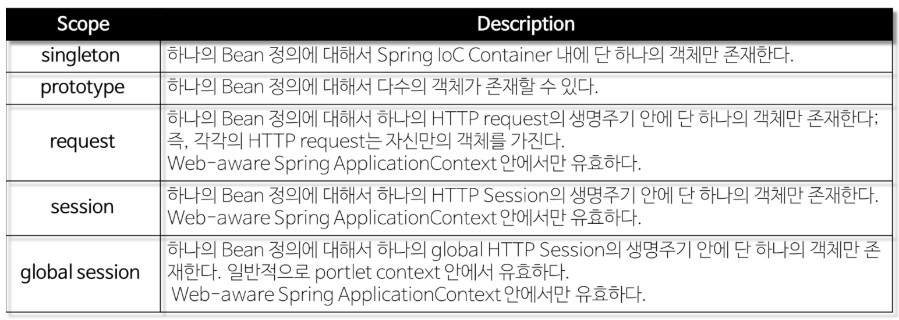

# Bean

**Bean**은 `Spring IoC Container가 관리하는 자바 객체`, _Spring Bean Container에 존재하는 객체_ 를 말한다.

**Spring IoC(Inversion of Control) Contatiner에 의해 인스턴스화, 관리, 생성**된다.

Bean Container는 `의존성 주입`[[DI]](./di.md)을/를 통해 Bean 객체를 사용할 수 있도록 해준다.

Spring에서 Bean은 보통 `Singleton`으로 존재한다.  

> Singleton : 어떤 Class가 최초 한번만 메모리를 할당하고(Static) 그 메모리에 객체를 만들어 사용하는 디자인 패턴

## POJO (Beans)

- (Plain Old Java Object)로 별 다른 뜻이 아닌 단순히 자바 객체를 사용하겠다는 뜻
- POJO : 본래 자바의 장점을 살리는 특정 '기술'에 종속되어 동작하는 것이 아닌 '오래된' 방식의 '순수한' 자바객체

> Beans : **Application의 핵심을 이루는 객체**이며, 대부분 Container에 공급하는 설정 메타 데이터(XML 파일)에 의해 생성된다.
>
> Container는 이 메타 데이터를 통해 Bean의 생성, Bean Life Cycle, Bean Dependency(종속성) 등을 알 수 있다.
>
> **new 연산자로 생성하는 객체는 Bean이 아니고**, `ApplicationContext.getBean()`**으로 얻어질 수 있는 객체는 Bean**이다.
>
> 즉, **Spring에서의 Bean은 ApplicationContext가 알고있는 객체, 즉 ApplicationContext가 만들어서 그 안에 담고있는 객체를 의미**한다.

## Bean Scope

- **Spring은 기본적으로 모든 Bean을 Singleton으로 생성하여 관리**한다.
- `Singleton Bean`은 ***Spring Container에서 한 번 생성 후, Container가 사라질 때 Bean도 제거.***
- 생성된 하나의 Instance는 Single Beans Cache에 저장되고, 해당 `Bean에 대한 요청과 참조가 있으면 캐시된 객체를 반환.`
- 하나만 생성되기 때문에 동일한 것을 참조, **기본적으로 모든 Bean은 Scope가 명시적으로 지정되지 않으면 Singleton.**

- 구체적으로는 Application 구동 시 JVM 안에서 스프링이 Bean마다 하나의 객체를 생성하는 것을 의미한다.

- 그래서 Spring을 통해서 Bean을 주입 받으면 언제나 주입받은 Bean은 동일한 객체라는 가정하에서 개발 한다.

`request`, `session`, `global session`의 Scope는 일반 **Spring Application이 아닌, Spring MVC Web Application에서만 사용**