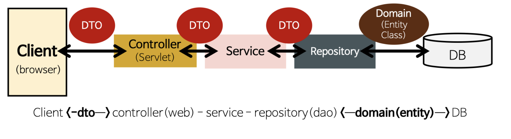

# Spring의 구조 (DAO, DTO, Entity, Controller, Service)
## 전체구조


## DAO (Data Access Object)
**repository package**
:DB를 사용해 데이터를 조회하거나 조작하는 기능을 전담하도록 만든 Object
> 사용자는 자신이 필요한 interface를 DAO에 던지고 DAO는 이 interface를 구현한 객체를 사용자에게 편리하게 사용할 수 있도록 반환
- 실제로 DB에 접근하는 객체
- Service와 DB를 연결하는 고리의 역할
- SQL을 사용 (개발자가 직접 코딩)하여 DB에 접근한 후 적잘한 CRUD API제공 
    - JPA 대부분의 기본적인 CURD method를 제공하고있다.
    - `extends JpaRepository<Domain(Entity) type,Pkey type>`
- ex)  
```java
public interface BoardRepository extends CrudRepository<Board, Long>{}
```
>Board라는 도메인타입의 PKey의 Tpye은 Long

## DTO (Data Transfer Object)
:Entity클래스는 실제 Database의 테이블과 1:1로 매핑되는 클래스로, DB에 테이블 내에 존재하는 컬럼을 속성(필드)로 가져야한다.
**DTO package**
:**계층간 데이테 교환을 위한 JAVABeans**를 말한다. 여기서 계층이란 컨트롤러, 뷰, 비즈니스계층, 퍼시스턴스계층을 말한다.
- **계층간 데이터교환을 위한 객체(JavaBeans)**이다.
- DB에서 데이터를 얻어  `Service`나 `Contriller`등으로 보내는 객체
- DB의 데이터가 Presentation Logic Tier로 넘어오게 될때는 DTO모습으로 바껴서 오고가는것이다.
- 로직을 갖고있지 않은 순수한 Object이다 getter/setter 메서드만 가지고있다.
- Request와 Response용 DTO는 View를 위한 클래스
    - 자주 변경이 필요한 클래스
    - Persentaion Model
    - `toEntity()` 메서드를 통해서 DTO에서 필요한 부분을 이용하여 Entity로 만든다.
    - 또한 Controller Layer에서 Response DTO 형태로 Client에 전달

## Entity class
**Domain package**
- 실제 DB테이블과 매칭될 클래스
    - 가장 core한 클래스라고 불림
    - `@Entity`, `@Column`, `@Id`등 사용
- 최대한 외부에서 Entity 클래스의 getter method를 사용하지 않도록 해당 클래스 안에서 필요한 로직 method을 구현

## Entity class 와 DTO class 를 분리하는 이유
- View Layer 와 DB Layer의 역활을 철저히 하기위해
- 테이블과 매핑되는 Entity 클래스가 변경되면 여러 클래스에 영향을 끼치게 되는 반면 View와 통신하는 DTO 클래스(Request / Response 클래스)는 자주 변경되므로 분리
- ex)
```java
import lombok.*;
import org.hibernate.annotations.CreationTimestamp;
import org.hibernate.annotations.UpdateTimestamp;

import javax.persistence.*;
import java.time.LocalDateTime;

@NoArgsConstructor(access= AccessLevel.PROTECTED)
@Getter
@Entity
@ToString
public class Board {
    @Id
    @GeneratedValue(strategy= GenerationType.SEQUENCE)
    private long id;

    @Column(nullable=false)
    private String title;

    @Column
    private String content;

    @Column(updatable=false)
    @CreationTimestamp
    private LocalDateTime regDatetime;

    @Column(nullable=false)
    private String regUserId;

    @UpdateTimestamp
    private LocalDateTime editDatetime;

    @Column
    private String editUserId;

    @Builder
    private Board(long id, String title, String content, String regUserId, String editUserId) {
        this.id = id;
        this.title = title;
        this.content = content;
        this.regUserId = regUserId;
        this.editUserId = editUserId;
    }

}
```

## controller (web)
- 해당 요청 url에 따라 적절한 view 와 mapping처리
- `@Autowired Service`를 통해 service 의 method 를 이용
- 적절한 ResponseEntity(DTO)를 body에 담아 Client에 반환

## service
- `@Autowried Repository` 를 통해 repository의 method를 이용
- 적절한 business Logic 처리
- DAO로 DB에 접근하고 DTO로 데이터를 전달받은 다음, 비지니스 로직을 처리해 적절한 데이터를 반환