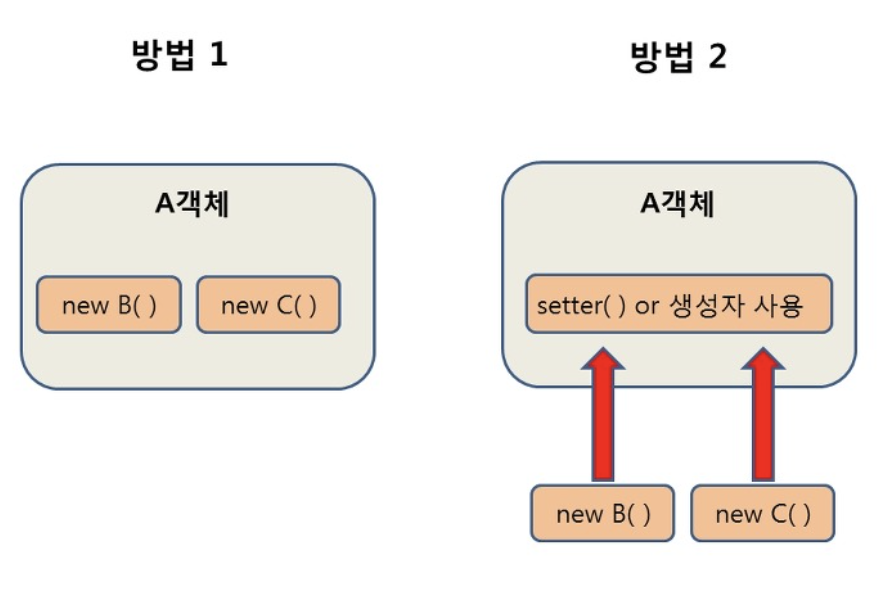
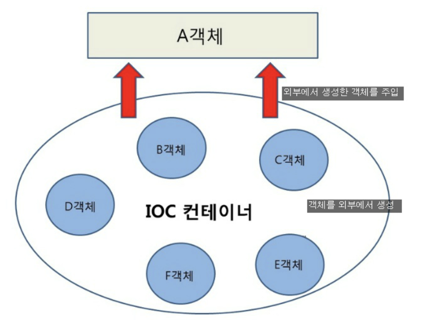

# DI (Dependency Injection : 의존성 주입)

 :어떤 객체가 사용하는 의존객체를 직접 만들어서 사용하는 것이 아니라 주입받아 사용하는 방법
 > 즉 클래스안에 new 연산자가 들어있지않고 외부에서 객체를 주입해주는 것
 - 의존 관계 설정이 컴파일시가 아닌 실행시에 이루어져 모듈들간의 결함도(coupling)를 낮출 수 있다.
 - 코드의 재사용성을 높여서 작성된 모듈을 여러곳에서 소스코드 수정없이 사용가능 하다.
 - 모의 객체등을 이용한 단위테스트의 편리성을 높여준다. 



- **일반적인 의존성**
    - 방법 1은 A객체가 B와 C객체를 New생성자를 통하여 직접 생성하는 방법
- **의존성 주입을 이용한 방법**
    - 방법 2는 **외부에서 생성된 객체를 setter() 나 생성자를 통해 사용하는 방법**

## DI방법
### 생성자 주입
>가장 권장하는 방식.
```java
public class BookController {
    private final BookRepository bookRepository;

    public BookController(BookRepository bookRepository) {
        this.bookRepository = bookRepository;
    }
}
```

- 필수적으로 사용해야 하는 레퍼런스 없이는 인스턴스를 만들지 못하도록 강제함
- Circular Dependency(순환 참조) 의존성을 알아 차릴 수 있다.
- 테스트 코드 작성시 생성자를 통해 의존성 주입이 용이하다.

### 필드주입
: member field에 `@Autowired`을 선언하여 주입받는 방법이다.
> 가장 간단한 방법이다.
```java
public class BookController {

    @Autowired
    private BookRepository bookRepository;
}
```
- **의존 관계가 눈에 잘 보이지 않아 추상적이고, 이로 인해 의존성 관계가 과도하게 복잡해질 수 있음**
- 즉, 단일 책임 원칙(SRP)에 반하는 안티 패턴이다.
- DI Container와 강한 결합을 가져 외부 사용이 용이하지 않음
- final 선언불가

### setter주입
:setter 메서드에 `@Autowired`을 선언하여 주입받는 방법
```java
public class BookController {
    private BookRepository bookRepository;

    @Autowired
    public void setBookRepository(BookRepository bookRepository) {
        this.bookRepository = bookRepository;
    }
}
```
- 생성자에 모든 의존성을 기술하면 과도하게 복잡해질 수 있는 것을 선택적으로 나눠 주입 할 수 있게 부담을 덜어줌
- 의존성이 선택적으로 필요한 경우 사용
- 생성자 주입 방법과 Setter 주입 방법을 적절하게 상황에 맞게 분배하여 사용
- final 선언 불가

## Spring에서의 DI


### IOC 컨테이너에서 DI를 자동으로 해준다.
> 스프링에서는 객체를 `Bean`이라고 부르며, 프로젝트가 실행될때 사용자가 Bean으로 관리하는 객체들의 생성과 소멸에 관련된 작업을 자동적으로 행하는데 객체가 생성되는 곳을 스프링에서 Bean 컨테이너 라고 부른다.