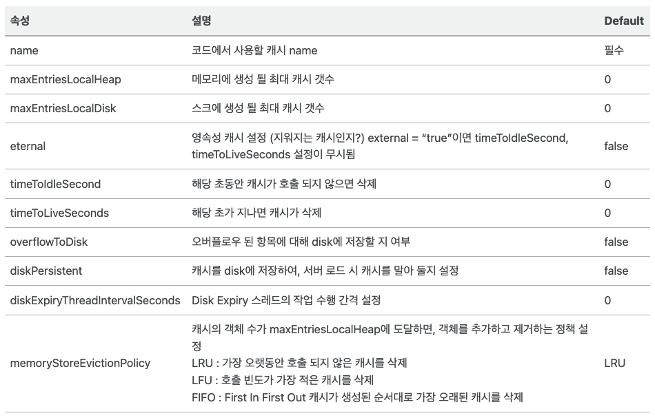
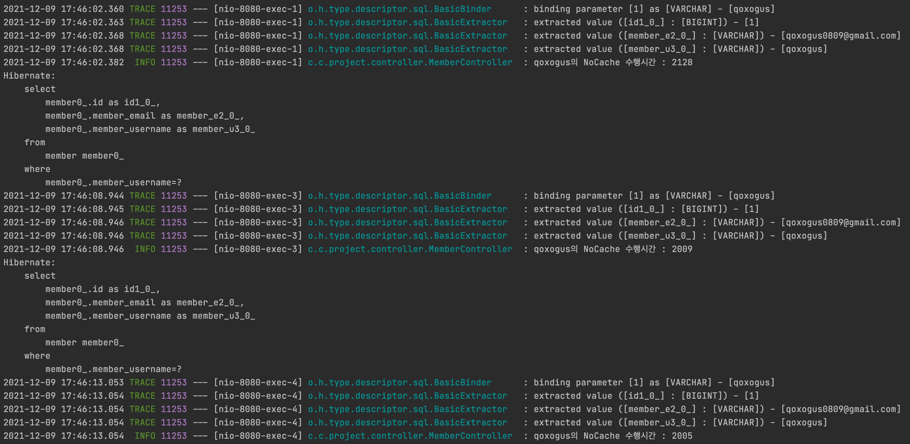
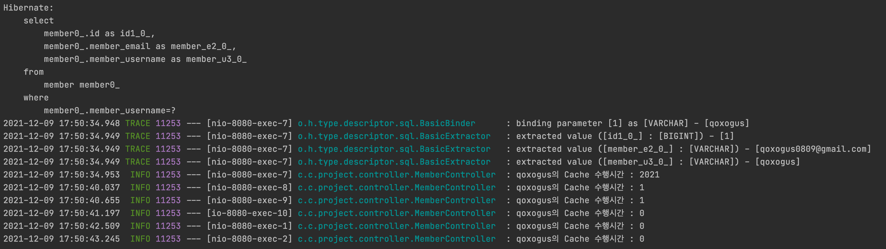
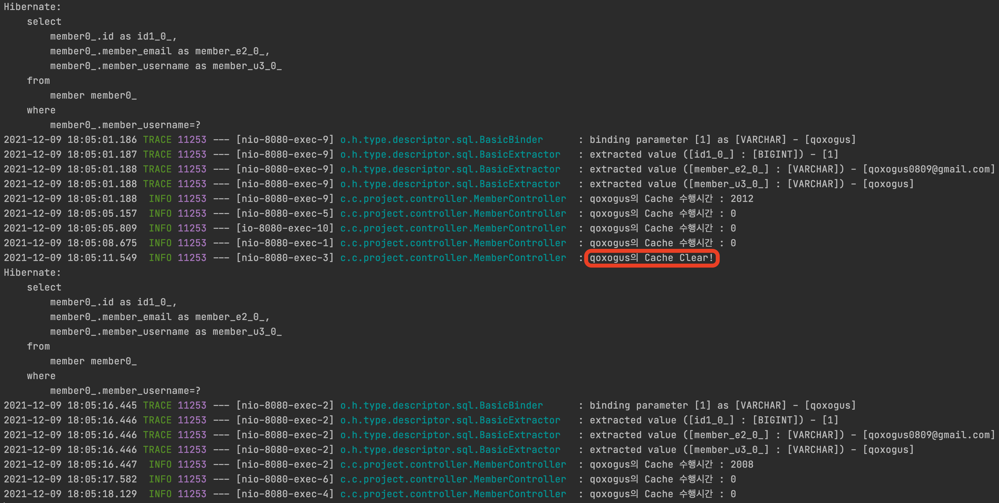
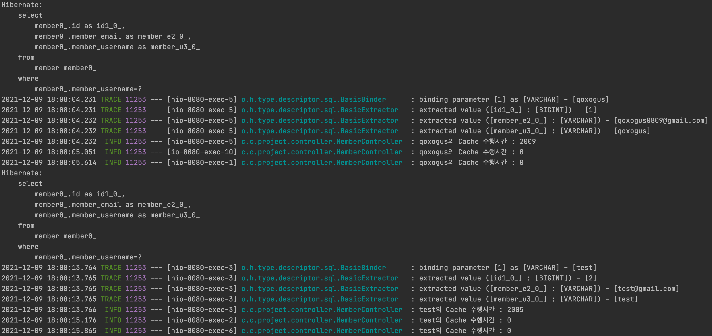

# SpringBoot에서 Ehcache 사용해보기

### [[velog 글]](https://velog.io/@qoxogus/SpringBoot%EC%97%90%EC%84%9C-Ehcache-%EC%82%AC%EC%9A%A9%ED%95%B4%EB%B3%B4%EA%B8%B0)

일단 Cache를 사용하여 데이터를 가져오는 이유를 모르는 사람들을 위해 간략하게 설명 해 보겠다.  

> 우리가 기본적으로 cache를 사용하여 데이터를 가져오는 이유는  
데이터베이스의 과부하를 줄임과 동시에 짧은 데이터 조회시간을 통해  
쾌적한 서비스를 제공함에 있다.

그러나 무분별하게 사용할 경우 원치 않는 데이터가 보여 신뢰성을 떨어트릴 수 있다.  
사용하게 된다면 신중하게 사용하도록 하자

### Gradle 의존성
```gradle
implementation 'org.springframework.boot:spring-boot-starter-cache'
implementation 'net.sf.ehcache:ehcache:2.10.3'
```

### ehcache.xml 설정
default로 classpath의 ehcache.xml을 찾아간다곤 하는데 난 확실히 명시하고 다음에 봤을 때에도 헷갈리지 않게 경로설정을 해 주었다.  
**yml파일은 main/resources 패키지에 위치**되어있다

```yml
# application.yml

spring:
    cache:
    ehcache:
      config: classpath:ehcache.xml
```

```xml
<!-- ehcache.xml -->

<?xml version="1.0" encoding="UTF-8"?>
<ehcache xmlns:xsi="http://www.w3.org/2001/XMLSchema-instance"
         xsi:noNamespaceSchemaLocation="http://ehcache.org/ehcache.xsd"
         updateCheck="false">

    <diskStore path="java.io.tmpdir" />

    <cache name="findMemberCache"
           maxEntriesLocalHeap="10000"
           maxEntriesLocalDisk="1000"
           eternal="false"
           diskSpoolBufferSizeMB="20"
           timeToIdleSeconds="300"
           timeToLiveSeconds="600"
           memoryStoreEvictionPolicy="LFU"
           transactionalMode="off">
        <persistence strategy="localTempSwap" />
    </cache>

</ehcache>
```



### Code

> 코드를 작성하기 전 Application(main) 부분에 `@EnableCaching` 어노테이션을 추가해야한다.  
이 어노테이션은 이 프로젝트에서 캐시 관련 어노테이션(`@Cacheable`, `@CacheEvict`)을 사용하겠다는 선언이다.

**MemberController.java**
```java
@GetMapping("/nocache/{username}")
    public Member getNocacheMember(@PathVariable String username) {
        long start = System.currentTimeMillis(); // 수행시간 측정
        Member member = memberService.findMemberNoCache(username);
        long end = System.currentTimeMillis();

        log.info(username+ "의 NoCache 수행시간 : "+ (end - start)); // 수행시간 logging

        return member;
    }

    @GetMapping("/cache/{username}")
    public Member getCacheMember(@PathVariable String username) {
        long start = System.currentTimeMillis(); // 수행시간 측정
        Member member = memberService.findMemberCache(username);
        long end = System.currentTimeMillis();

        log.info(username+ "의 Cache 수행시간 : "+ (end - start)); // 수행시간 logging

        return member;
    }

    @GetMapping("/cache/refresh/{username}")
    public String refresh(@PathVariable String username){
        memberService.refresh(username); // 캐시제거
        log.info(username+ "의 Cache Clear!");
        return username + " cache clear!";
    }
```

> 컨트롤러에서는 수행시간을 측정하고  
캐시, 노캐시, 캐시삭제 등을 테스트 할 메소드들이 존재한다.

**MemberService.java**
```java
public Member findMemberNoCache(String username) {
        slowQuery(2000);
        return memberRepository.findMemberByUsername(username);
    }

    @Cacheable(value="findMemberCache", key = "#username") // 해당 캐시 사용
    public Member findMemberCache(String username) {
        slowQuery(2000);
        return memberRepository.findMemberByUsername(username);
    }

    @CacheEvict(value = "findMemberCache", key="#username") //해당 캐시 삭제
    public String refresh(String username) {
        return username + "님의 Cache Clear !";
    }

    // 빅쿼리를 돌린다는 가정
    private void slowQuery(long seconds) {
        try {
            Thread.sleep(seconds);
        } catch (InterruptedException e) {
            throw new IllegalStateException(e);
        }
    }
```

> **@Cacheable(value="findMemberCache")** 은 `ehcache.xml`에서 지정한 **findMemberCache** 캐시를 사용하겠다는 의미이다.  
즉 캐시를 사용하여 데이터를 조회하겠다는 의미이다. 
여기서 key는 메소드 argument인 name을 사용하겠다는 의미이다.  
즉, name에 따라 별도로 캐시된다.   
그리고 캐시여부를 체크하여 캐시가 안되어있을 경우에는 데이터를 가져와 캐시를 하고,  
캐시가 되어있다면 캐시 되어있는 데이터를 반환하게된다.
> 
> **@CacheEvict(value = "findMemberCache", key="#username") 은 해당 캐시 내용을 지우겠다는 의미**이다.  
캐시 데이터가 갱신되어야 한다면 `@CacheEvict`가 선언된 메소드를 실행시키면 캐시 데이터는 삭제되고 새로운 데이터를 받아 캐시하게 된다.  
key에 따라 캐시를 선택해서 제거가 가능하다.

캐시로 조회하는 로직과 캐시가 없을 대 조회하는 로직들 간의 성능 비교를  하기 위해 slowQuery라는 메소드를 추가해주었다.  
엄청나게 많은 양의 데이터가 존재하여 한번 조회 할때마다 2초 이상의 시간이 필요하다고 가정 했다.  
**slowQuery가 2초간 thread를 sleep** 시키기 때문에 `findMemberNoCache`와 `findMemberCache` 메소드는 최소 2초 이상의 시간이 수행 된다.  
이 **상황에서 캐시에 따라 어떻게 수행속도에서 차이가 나는지 비교**해보자 !

### NoCache
```
http://localhost:8080/nocache/qoxogus
```
위의 주소로 3번의 요청을 보냈다.  
**모두 2초 이상의 수행시간이 걸렸고 (위에 쿼리 한개가 잘렸지만) 조회할 때 마다 쿼리가 나가는걸 확인**할 수 있다.



### Cache
```
http://localhost:8080/cache/qoxogus
```
위의 주소로 6번의 요청을 보냈다.   
**첫 조회에는 캐시된 데이터가 있지 않아 수행시간이 2초 이상이 걸리고 쿼리가 나갔으며**    
**첫 조회 이후에는 2초가 걸리지 않고 쿼리도 나가지 않으며 데이터를 가져오는 걸 확인**할 수 있다.



### Refresh
만약 DB에 저장된 데이터에 update가 일어나면 캐시 데이터도 다시 저장되어야 할 것이다.  
이럴 경우 기존에 저장된 캐시 데이터를 제거하면,  
이후 호출에 대해 다시 갱신된 데이터를 캐시하게 될 것이다.

```
http://localhost:8080/member/cache/qoxogus

http://localhost:8080/member/cache/refresh/qoxogus

http://localhost:8080/member/cache/qoxogus
```
위의 순서로 요청을 보냈다.  
**캐시 클리어 후 다시 캐시를 하기 위해 2초 이상의 시간이 소요되며 쿼리가 나가는 것을 확인**할 수 있다.  
**그 이후엔 다시 캐시된 데이터를 가져오는 것도 확인**할 수 있다.



### Cache-key
동일 Cache가 key에 따라 별도로 캐시되는지 확인해보자.

```
http://localhost:8080/member/cache/qoxogus

http://localhost:8080/member/cache/test
```

위의 순서로 요청을 보냈다.  
**qoxogus의 요청과 test의 요청이 별도로 캐시되고 관리됨을 확인**할 수 있다.



### 사용 시 고려사항
* 자주 변경되는 데이터일수록 Cache 적용 신중하게 선택해야 한다.
    * 데이터의 무결성이 깨질 염려가 있다.
* 데이터 조회 여러 곳에 Cache를 적용하려면 ImMemory에 쌓이는 Memory 양도 생각해야 한다.
    * 이 부분은 Cache의 생명주기를 어떻게 설정하느냐에 따라 극복할 수도 있다고 생각한다.