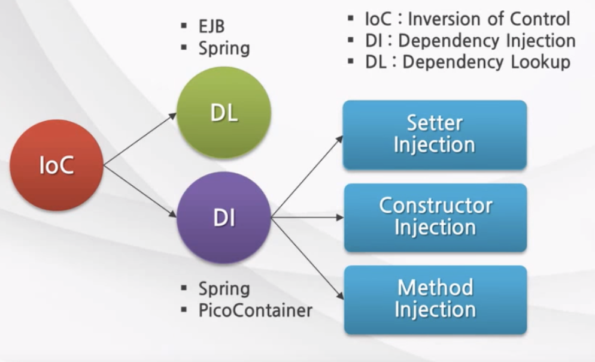
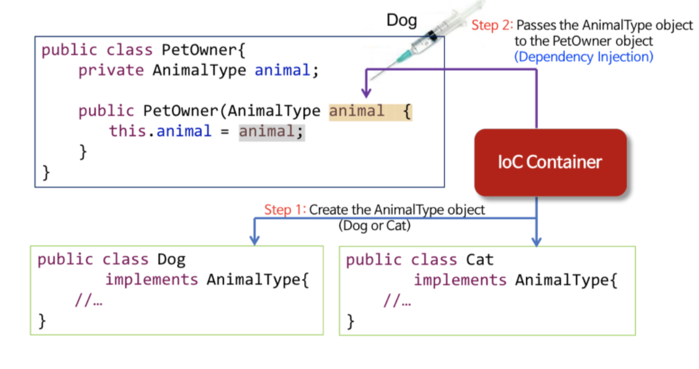

# Ioc (Inversion of Control : 제어의 역전)
: 객체의 생성, 생명주기의 관리까지 모든 객체에 대한 제어권이 바뀌었다는 것을 의미한다.
- 컴퓨넌트 의존관계 결정 (Component dependency resolution), 설정(configuration) 및 생명주기(lifecycle)를 해결하기 위한 디자인 패턴(Design Pattern)
>어떤 객체가 사용할 객체(의존관계인 객체)를 직접 선언하여 사용하는 것이 아니라,
>어떤 방법을 사용하여(ex.생성자 등..)사용하여 주입 받아 사용것 을 IoC의 일부라고 표현 할 수 있다.
- ### 일반적인 제어권 : 자기가 사용할 의존성은 자기가 만들어서 사용
```java
@Service
public class CarService {
	private CarRepository carRepository = new CarRepository();
}
```
### IOC 분류
DL(Dependency Lookup)  
: 저장소에 저장되어 있는 Bean에 접근하기 위해 컨테이너가 제공하는 API를 이용하여 Bean을 Lookup 하는 것  
DI(Dependency Injection)  
: 각 클래스간의 의존관계를 빈 설정(Bean Definition)정보를 바탕으로 컨테이너가 자동으로 연결해 주는것  
- Setter Injection
- Constructor Injection
- Method Injection




**필요한 클래스를 직접 생성하는 것이 아니라 주입함으로써 객체 간의 결합도를 줄이고 유연한 코드 작성 가능함.**

## DI(Dependency Injection)를 사용한 IOC
```java
@Service
public class CarService {
	
    // CarRepository를 사용은 하지만 만들지는 않는다.
	private CarRepository carRepository;
    /*
    생성자를 통해서 받아온다.
    따라서 의존성을 관리하는 일은 CarService가 하는 일이아니다. 누군가 밖에서 해주는 것이다.
    */
    //생성자를 통한 의존성 주입 
    public CarService(CarRepository carRepository){
    	this.carRepository = carRepository;
    }
}
```

### DI는 IOC를 구현하는 방법의 한 종류
**게임을 예시로 들어보자**

1. 플레이어가 게임 캐릭터를 조종한다.
2. 게임 캐릭터가 해야 할 일을 플레이어가 직접적으로 관여해 조종한다.
3. 게임 캐릭터의 제어권은 플레이어(외부)에게 넘어감 -> 제어권이 위임되었다 -> 제어의 역전(IoC)

### IoC Container
: Spring Framework는 객체에 대한 생성 및 생명주기를 관리 할 수 있는 기능을 제공한다.

- 객체의 생성을 책임지고, 의존성을 관리
- POJO의 생성, 초기화, 서비스, 소멸에 대한 권환을 가진다
- 개발자들이 직접 POJO를 생성할 수 있지만 컨테이너에게 맡긴다.

### BeanFactory
- Bean을 등록, 생성, 조회, 반환 관리
- IoC Container 최상위에 있는 interface
- 보통 BeanFactory를 바로 사용하지 않고, 이를 확장한 ApplicationContext를 사용함
- getBean() 메서드가 정의되어있다.
### ApplicationContext
- BeanFactory와 Bean을 등록, 생성, 조회, 반환 관리하는 기능은 같다.
- BeanFactory의 서브 인터페이스인 ListableBeanFactory, HierachicalBeanFactory라는 인터페이스를 상속하여 BeanFactory를 상속하고 있다.
- Spring의 각종 부가 서비스를 추가로 제공한다.
>리소스 로딩, 이벤트 발생, 다국어 등 추가적인 기능들을 갖고 있다.
>
>   - ResourceLoaderAware's setResourceLoader
>   - ApplicationEventPublisherAware's setApllicationEventPublicher
>   - MessageSourceAware's setMessageSource
>   - ApllicatonContextAware's setApllicationContext

- Spring이 제공하는 ApplicationContext 구현 클래스가 여러 종류가 있다.
### 결국 핵심?
- 개발자가 빈을 직접 만들지 않고 메타데이터(ex. xml)를 제공하면 프로그램(Spring framework)이 해당 메타데이터를 사용해 Bean객체를 제어 한다.


