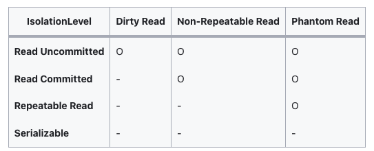

# @Transactional 옵션

## isolation (격리레벨)
> 트랜잭션에서 일관성 없는 데이터 허용 수준을 설정한다.  

### 적용 방법  
```java
@Transactional(isolation=Isolation.XXX)
```

* **DEFAULT** : **기본 격리 수준**
> 기본이며 사용하는 DB의 Isolation Level을 따른다.

* **READ_UNCOMMITED** (level 0) : **커밋되지 않는 데이터에 대한 읽기를 허용**
> 어떤 사용자가 A라는 데이터를 B라는 데이터로 변경하는 동안  
> 다른 사용자는 B라는 아직 완료되지 않은(Uncommitted 혹은 Dirty) 데이터 B를 읽을 수 있다.  
>
> (Dirty Read 발생)

* **READ_COMMITED** (level 1) : **커밋된 데이터에 대해 읽기 허용**
> 어떠한 사용자가 A라는 데이터를 B라는 데이터로 변경하는 동안  
> 다른 사용자는 해당 데이터에 접근할 수 없다.  
>
> (Dirty Read 방지)

* **REPEATEABLE_READ** (level 2) : **동일 필드에 대해 다중 접근 시 모두 동일한 결과를 보장**
> 트랜잭션이 완료될 때까지 SELECT 문장이 사용하는 모든 데이터에 shared lock이 걸리므로 다른 사용자는 그 영역에 해당되는 데이터에 대한 수정이 불가능하다.  
> 
> 선행 트랜잭션이 읽은 데이터는 트랜잭션이 종료될 때까지 후행 트랜잭션이 갱신하거나 삭제가 불가능 하기 때문에 같은 데이터를 두 번 쿼리했을 때 일관성 있는 결과를 리턴한다.  
>
> (Non-Repeatable Read 방지)

* **SERIALIZABLE** (level 3) : **가장 높은 격리, 성능 저하의 우려가 있음**
> 데이터의 일관성 및 동시성을 위해 MVCC(Multi Version Concurrency Control)를 사용하지 않음  
(MVCC는 다중 사용자 데이터베이스 성능을 위한 기술로 데이터 조회 시 LOCK을 사용하지 않고  
데이터의 버전을 관리해 데이터의 일관성 및 동시성을 높이는 기술이다)  
>
>트랜잭션이 완료될 때까지 SELECT 문장이 사용하는 모든 데이터에 shared lock이 걸리므로  
> 다른 사용자는 그 영역에 해당되는 데이터에 대한 수정 및 입력이 불가능하다.
>
> Phantom Read 방지



* Dirty Read
> 트랜잭션 1이 수정중인 데이터를 트랜잭션 2가 읽을 수 있다.  
> 만약 트랜잭션 1의 작업이 정상 커밋되지 않아 롤백되면,  
> 트랜잭션 2가 읽었던 데이터는 잘못된 데이터가 되는 것이다.
> 
> (데이터 정합성에 어긋남)

* Non-repeatable read
> 트랜잭션 1이 회원 A를 조회중에 트랜잭션 2가 회원 A의 정보를 수정하고 커밋한다면,  
> 트랜잭션 1이 다시 회원A를 조회했을 때는 수정된 데이터가 조회된다. (이전 정보를 다시 조회할 수 없음)  
> 이처럼 반복해서 같은 데이터를 읽을 수 없는 경우이다.

* Phantom read
>  트랜잭션 1이 10살 이하의 회원을 조회했는데 트랜잭션 2가 5살 회원을 추가하고 커밋하면  
> 트랜잭션 1이 다시 10살 이하 회원을 조회했을 때 회원 한명이 추가된 상태로 조회된다.  
> 이처럼 반복 조회시 결과집합이 달라지는 경우이다.

* 트랜잭션 격리 수준의 필요성
> 당연히 레벨이 높아질 수록 데이터 무결성을 유지할 수 있다.  
하지만, 무조건적인 상위 레벨을 사용할 시 **Locking**으로 동시에 수행되는 많은 트랜잭션들이 순차적으로 처리하게 되면서  
DB의 성능은 떨어지게 되고 비용이 높아진다.  
그렇다고 **Locking**의 범위를 줄이게 되면 잘못된 값이 처리될 여지도 발생한다.  
그러므로 최대한 효율적인 방안을 찾아 **상황에 맞게 사용하는 것이 중요**하다.  
그래서 트랜잭셔널 옵션을 익혀놓고 상황에 맞게 사용할 수 있도록 하자.

## propagation (전파속성)
> 트랜잭션 동작 도중 다른 트랜잭션을 호출할 때, 어떻게 할 것인지 지정하는 옵션이다.

### 적용 방법  
```java
@Transactional(propagation=Propagation.XXX)
```

* **REQUIRED (Defualt)**
> 이미 진행중인 트랜잭션이 이다면 해당 트랜잭션 속성을 따르고, 진행중이 아니라면 새로운 트랜잭션을 생성한다.

* **REQUIRES_NEW**
> 항상 새로운 트랜잭션을 생성한다.  
> 이미 진행중인 트랜잭션이 있다면 잠깐 보류하고 해당 트랜잭션 작업을 먼저 진행한다.

* **SUPPORT**
> 이미 진행중인 트랜잭션이 있다면 해당 트랜잭션 속성을 따르고,  
> 없다면 트랜잭션을 설정하지 않는다.

* **NOT_SUPPORT**
> 이미 진행중인 트랜잭션이 있다면 보류하고, 트랜잭션 없이 작업을 수행한다.

* **MANDATORY**
> 이미 진행중인 트랜잭션이 있어야만 작업을 수행한다.  
> 없다면 Exception을 발생시킨다.

* **NEVER**
> 트랜잭션이 진행중이지 않을 때 작업을 수행한다.  
> 트랜잭션이 있다면 Exception을 발생시킨다.

* **NESTED**
> 진행중인 트랜잭션이 있다면 중첩된 트랜잭션이 실행되며,  
> 존재하지 않으면 REQUIRED와 동일하게 실행된다.

## noRollbackFor (예외무시)
> 특정예외 발생시 Rollback하지 않음

### 적용 방법
```java
@Transactional(noRollbackFor=Exception.class)
```

## rollbackFor (예외추가)
> 특정 예외 발생시 강제로 Rollback

### 적용 방법
```java
@Transactional(rollbackFor=Exception.class)
```

**@Transactional** 은 기본적으로 **Unchecked Exception, Error 만을 rollback**하고 있다.  
그렇기 때문에 **모든 예외에 대해서 rollback을 진행하고 싶을 경우  
`(rollbackFor = Exception.class)` 를 붙여야 한다**.

## timeout (시간지정)
> 지정한 시간 내에 해당 메소드 수행이 완료되지 않을 경우 rollback 수행  
> **-1**일 경우 **no timeout**  
> **Default** 값은 **-1**이다.

### 적용 방법
```java
@Transactional(timeout=10)
```

## readOnly (읽기전용)
> **true**시 **insert, update, delete 실행시 예외 발생**  
> **Default = false**

### 적용 방법
```java
@Transactional(readonly = true)
```