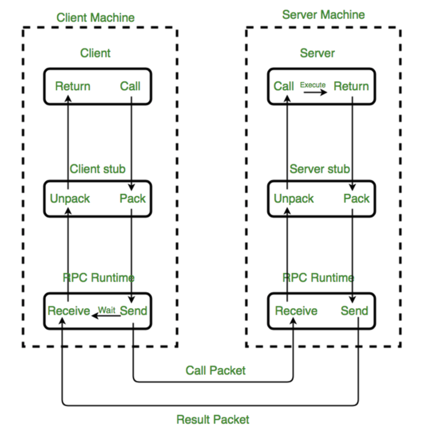
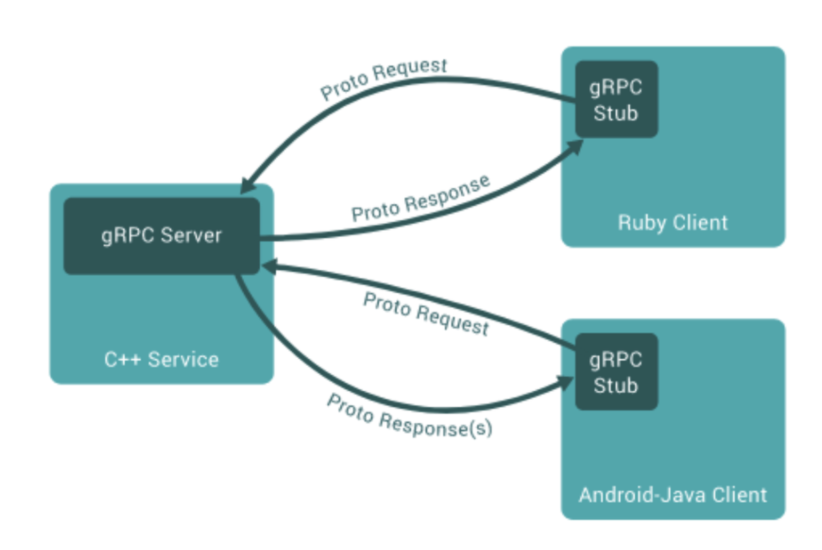

# RPC와 gRPC란 ?
> gRPC란 구글에서 만든 RPC 시스템입니다. gRPC를 설명하기에 앞서 RPC가 무엇인지 알아보자.

### RPC란 ?
RPC는 Remote Procedure Call로 프로세스간 통신 기법 중 하나이다.  
다른 프로세스에 있는 함수를 호출할 때, 마치 같은 프로세스 내에 있는 것 처럼 호출할 수 있습니다.  
클라이언트는 일반 로컬 메소드를 호출하는 것처럼 사용하면 되는거죠.  
RPC는 다양한 환경, 플랫폼에 제약없이 사용할 수 있어 분산 시스템 기법에 효과적입니다.  



### Caller/Callee
Client(Caller)와 Server(Callee)는 사용자가 필요한 비지니스 로직을 작성하는 레이어  
IDL(Interface Definition Language)을 사용하여 서로의 인터페이스를 명시

### Stub
StubCompiler가 IDL을 기반으로 언어에 맞는 코드를 생성
Parameter 객체를 Message로 Marshalling/UnMmarshalling하는 레이어
> Stub은 RPC의 핵심 개념이라고 볼 수 있다.  
> 서**버와 클라이언트는 서로 다른 주소공간을 사용하므로 함수 호출에 사용된 매개변수를 꼭 변환**해줘야한다.  
> **그렇지 않으면 메모리 매개변수에 대한 포인터가 다른 데이터를 가리키게 된다.**  
> client의 stub은 함수 호출에 사용된 파라미터의 변환(Marshalling) 및 함수 실행 후 서버에서 전달 된 결과의 변환을 담당  
> server stub은 클라이언트가 전달한 매개변수의 역변환(Unmarshalling) 및 함수 실행 결과 변환을 담당

### RPC Runtime
Client와 Server를 연결하는 레이어  
통신을 담당하면 에러 처리도 진행

### gRPC란 ?
구글에서 개발한 RPC 시스템이며,  
기본적인 개념은 RPC와 동일하지만 특징적으로 HTTP/2 기반으로 양방향 스트리밍을 지원하고   
HTTP/2를 사용함으로써 메세지의 압축률과 성능이 좋습니다.  

### gPRC 특징
**높은 생산성과 다양한 언어 및 플랫폼 지원**  
gRPC는 서비스와 메시지를 정의하기 위해서 Protocol Buffers를 사용합니다.  
아래와 같은 프로토콜 버퍼의 IDL만 정의하면 서비스와 메세지에 대한 소스코드가 자동으로 생성하고 데이터를 주고받을 수 있습니다.

```js
service Grpc {
 // 서비스의 RPC 정의
 rpc CallTest (Request) returns (Response) {}
}

// 요청 메시지
message Request {
 string name = 0;
}

// 응답 메시지
message Response {
 string message = 1;
}
```

위의 예제코드와 같이 프로토콜 버퍼의 IDL을 정의하면 아래와 같이 다양한 언어와 플랫폼에서 사용할 수 있습니다.



### HTTP/2 기반의 양방향 스트리밍
gRPC는 HTTP/2 기반으로 통신한다.  
HTTP/2는 일반적인 요청/응답 방식이 아니고 서버와 클라이언트가 서로 동시에 데이터를 스트리밍으로 주고받을 수 있다.

### 높은 메시지 압축률과 성능
HTTP/2를 기반으로 하면서 또 하나의 장점으로는 HTTP 기반 전송보다 높은 헤더 압축률을 보장한다.  
또한 프로토콜 버퍼의 데이터는 바이너리(이진 형태)이기 때문에 변환 작업 없이 빠르게 처리할 수 있고  
JSON, XML과 다르게 메서드, 클래스와 같은 데이터 구조를 표현할 수 있다.  

이와같이, 더 많이 압축이 된다는 것은 전송할 데이터의 크기가 줄어든다는 것이므로 네트워크 트래픽이 줄어들고 시스템 리소스를 절약하여 성능을 높일 수 있다.

### 결론
gRPC는 대부분 아키텍쳐에 사용할 수 있지만 MSA에 가장 적합한 기술인 것 같다.  
gRPC를 활용하면 비즈니스 로직에 집중하여 빠른 서비스 개발이 가능하고,  
간단한 설치와 빠른 배포가 가능하다.  
또한 다양한 언어와 플랫폼 지원으로 ployglot(여러 개의 언어를 사용하는 것)한 언어와 기술스택을 지향하는 MSA의 철학과 동일히다.  
프로토클 버퍼의 IDL을 활용한 서비스 및 메시지 정의는 MSA의 다양한 기술 스택으로 인해 발생하는 단점을 보완하고 많은 서비스간의 API 호출로 인한 성능 저하를 개선할 수 있다.  
MSA를 기반으로 하면서 분산처리를 위해서 필요한 보안, API Gateway, 로그 추적, 모니터링, 상태체크 등의 기능들을 추가 개발할 수도 있다.  